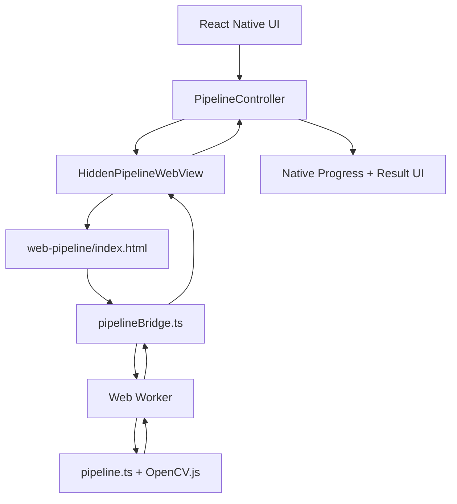

# React Native Basti - Hybrid-Migrationsplan

## Ziel

`React Native Basti` soll eine neue Expo/React-Native-App werden, bei der die sichtbare App vollstaendig native React Native UI ist. Die rechenintensive Paint-by-Numbers-Pipeline bleibt im Browser-Kontext, laeuft aber in einer unsichtbaren WebView. Die WebView ist also kein sichtbarer App-Screen, sondern ein interner Pipeline-Worker.

Das Zielbild:

- Native RN UI fuer Bildauswahl, Einstellungen, Fortschritt, Vorschauen und Ergebnisgalerie.
- Unsichtbare WebView fuer OpenCV.js, Canvas, OffscreenCanvas und die bestehende Pipeline-Performance.
- Kommunikation ueber ein typisiertes `postMessage`-Protokoll zwischen RN und WebView.
- Fortschrittsanzeige in RN pro Pipeline-Schritt.
- Ergebnisbilder werden aus der WebView zurueckgegeben und nativ angezeigt.

## Ausgangslage

### Web-Referenz

Die aktuelle Browser-App liegt in:

- `react-app/src/App.tsx`
- `react-app/src/lib/worker.ts`
- `react-app/src/lib/pipeline.ts`

Aktueller Flow:

1. Bild wird im Browser geladen.
2. `ImageData` wird an einen Web Worker gesendet.
3. Worker laedt OpenCV.js.
4. Worker cached Stage-Artefakte.
5. UI ruft einzelne Schritte per `RUN_STEP` auf.
6. Worker gibt `ImageData` und Template-Ergebnisse zurueck.
7. Browser-UI rendert die Ergebnisse als Canvas/Blob URLs.

### Bisheriger Native-Test

`react-app-native-expo_2` nutzt bereits:

- `react-native-webview`
- native Shell
- WebView auf `http://192.168.178.186:5175/`

Das ist gut fuer Performance-Tests, aber noch kein sauberer Produktaufbau, weil die sichtbare UI weiterhin die Web-App ist.

## Kernentscheidung

Nicht die ganze Web-App in der WebView anzeigen.

Stattdessen:

1. Eine kleine interne Web-Pipeline-Seite bauen.
2. Diese Seite laedt `pipeline.ts`/Worker/OpenCV.
3. Die Seite hat keine sichtbare UI.
4. RN startet Jobs ueber `window.ReactNativeWebView.postMessage`.
5. WebView sendet Progress, Preview-Bilder und finale Templates zurueck.

Damit bleibt die Performance des Browser-Kontexts erhalten, aber die App fuehlt sich wie eine echte native App an.

## Zielstruktur

```text
React Native Basti/
  app.json
  package.json
  tsconfig.json
  index.ts
  src/
    app/
      App.tsx
    features/
      image-picker/
      pipeline/
        PipelineController.ts
        PipelineTypes.ts
        HiddenPipelineWebView.tsx
      results/
      settings/
    ui/
      Button.tsx
      ProgressStepper.tsx
      PreviewCard.tsx
      TemplateGallery.tsx
  web-pipeline/
    index.html
    src/
      pipelineBridge.ts
      workerBridge.ts
      lib/
        pipeline.ts
        worker.ts
        opencv.ts
```

`web-pipeline/src/lib/*` kann am Anfang aus `react-app/src/lib/*` kopiert werden. Spaeter kann man daraus ein gemeinsames Package machen, aber fuer den ersten stabilen Stand ist eine Kopie pragmatischer.

## Architektur



## Native UI

Die native App uebernimmt:

- Bildauswahl ueber `expo-image-picker`.
- Beispielbilder wie `eagle.png`.
- Einstellungsformular:
  - `resizeMax`
  - `targetColorCount`
  - `minRegionSize`
  - `protectHighContrast`
  - `highContrastMinPx`
  - `pruneRadius`
- Start/Stop/Reset Buttons.
- Fortschrittsanzeige pro Schritt.
- Ergebnisvorschau:
  - Normalize
  - Smooth
  - Quantize
  - Protrusions
  - Region Merge
  - Render Templates
- Template-Galerie:
  - Bright Color Circles
  - Color Circles
  - Circles Only
  - Numbers
  - Classic
  - Debug Unlabeled

Die native UI darf nie direkt OpenCV oder Canvas brauchen.

## Hidden WebView

Die Hidden WebView wird in RN gerendert, aber visuell versteckt:

- absolute Position
- `width: 1`
- `height: 1`
- `opacity: 0`
- `pointerEvents: "none"`

Wichtig: Nicht komplett unmounten und nicht `display: none`, weil WebViews dann je nach Plattform anders throttlen koennen.

Beispiel:

```tsx
<View style={styles.hiddenWebViewHost} pointerEvents="none">
  <WebView
    ref={webViewRef}
    source={{ uri: pipelineHtmlUri }}
    javaScriptEnabled
    domStorageEnabled
    originWhitelist={["*"]}
    onMessage={handlePipelineMessage}
  />
</View>
```

## Web-Pipeline-Seite

`web-pipeline/index.html` ist keine echte UI. Sie initialisiert nur den Bridge-Code.

Aufgaben:

1. OpenCV/Worker initialisieren.
2. Auf Commands aus RN warten.
3. Bilddaten entgegennehmen.
4. Pipeline-Schritte ausfuehren.
5. Progress und Ergebnisse an RN senden.

Die Web-Seite sollte direkt beim Laden melden:

```ts
{ type: "READY" }
```

## Message-Protokoll

### RN -> WebView

```ts
type PipelineCommand =
  | {
      type: "INIT";
      requestId: string;
    }
  | {
      type: "LOAD_IMAGE";
      requestId: string;
      image: {
        uri: string;
        base64: string;
        mimeType: string;
      };
    }
  | {
      type: "RUN_ALL";
      requestId: string;
      options: PipelineOptions;
    }
  | {
      type: "RUN_STEP";
      requestId: string;
      stepId: PipelineStepId;
      options: PipelineOptions;
    }
  | {
      type: "RESET";
      requestId: string;
    };
```

### WebView -> RN

```ts
type PipelineEvent =
  | {
      type: "READY";
    }
  | {
      type: "PROGRESS";
      requestId: string;
      stepId: PipelineStepId;
      stepIndex: number;
      stepCount: number;
      message: string;
      progress: number;
    }
  | {
      type: "STEP_RESULT";
      requestId: string;
      stepId: PipelineStepId;
      image: PipelineImageResult;
      timingMs: number;
    }
  | {
      type: "FINAL_RESULT";
      requestId: string;
      templates: PipelineTemplateResult[];
      stats: {
        regionCount: number;
        placementCount: number;
      };
      timings: Record<string, number>;
    }
  | {
      type: "ERROR";
      requestId?: string;
      message: string;
      stack?: string;
    };
```

### Bildtransport

Start pragmatisch:

- RN liest Bild als Base64 via `expo-file-system`.
- RN sendet Base64 an WebView.
- WebView erzeugt `Blob`, `ImageBitmap`, `Canvas`, `ImageData`.
- Ergebnisse kommen als PNG Base64 oder Data URL zurueck.
- RN speichert Ergebnisbilder als Cache-Dateien und zeigt sie mit `<Image />`.

Spaeter optimieren:

- Nur finale Templates als Base64 senden.
- Zwischenstufen optional machen.
- Sehr grosse Bilder vor dem Senden in RN oder WebView verkleinern.

## Progressbar

Die WebView kann Fortschritt zurueckgeben.

Minimal:

- Vor jedem Pipeline-Schritt ein `PROGRESS` Event.
- Nach jedem Schritt ein `STEP_RESULT`.
- RN zeigt Stepper plus Prozent.

Beispiel-Schritte:

```ts
const PIPELINE_STEPS = [
  "load",
  "normalize",
  "smooth",
  "quantize",
  "protrusions",
  "region-merge",
  "render",
];
```

Feiner spaeter:

- K-Means Iterationen melden.
- Region-Merge Fortschritt melden.
- Render-Template Fortschritt melden.

Dafuer muessten in `pipeline.ts` optionale Progress-Callbacks eingezogen werden.

## Implementierungsphasen

### Phase 1: Projekt anlegen

1. Ordner `React Native Basti/` erstellen.
2. Expo-App initialisieren.
3. Dependencies:
   - `expo`
   - `react`
   - `react-native`
   - `react-native-webview`
   - `expo-image-picker`
   - `expo-file-system`
   - `expo-status-bar`
4. iOS Development Build vorbereiten.

Ergebnis: Leere native App startet auf dem iPhone.

### Phase 2: Native UI-Skelett

1. App-Shell bauen.
2. Bildauswahl.
3. Beispielbild `eagle.png`.
4. Settings-Screen.
5. Progress-Stepper.
6. Ergebnisbereich mit Platzhaltern.

Ergebnis: Native UI ist bedienbar, aber Pipeline noch mock.

### Phase 3: Hidden WebView Bridge

1. `HiddenPipelineWebView.tsx` bauen.
2. WebView versteckt mounten.
3. `READY` Event empfangen.
4. RN -> WebView `postMessage` testen.
5. WebView -> RN `postMessage` testen.

Ergebnis: Native App kann mit unsichtbarer WebView sprechen.

### Phase 4: Pipeline-Web-App extrahieren

1. `react-app/src/lib/pipeline.ts` kopieren.
2. `react-app/src/lib/worker.ts` kopieren/anpassen.
3. `pipelineBridge.ts` schreiben.
4. OpenCV-Ladepfad uebernehmen.
5. `LOAD_IMAGE` und `RUN_STEP` implementieren.

Ergebnis: WebView kann ein Bild laden und einen Schritt ausfuehren.

### Phase 5: End-to-End RUN_ALL

1. RN waehlt Bild.
2. RN sendet Bild an WebView.
3. WebView laedt Bild in Worker.
4. WebView fuehrt alle Schritte aus.
5. WebView sendet Progress.
6. WebView sendet finale Templates.
7. RN zeigt Ergebnisbilder nativ an.

Ergebnis: Erste echte Hybrid-Version.

### Phase 6: UX und Stabilitaet

1. Cancel/Reset implementieren.
2. Fehler sauber anzeigen.
3. Loading States.
4. Ergebnisbilder lokal cachen.
5. Speicherbereinigung:
   - WebView Object URLs revoken.
   - RN Cache-Dateien bei Reset loeschen.
6. Grosse Bilder begrenzen.

Ergebnis: Alltagstauglicher MVP.

### Phase 7: Performance-Messung

1. Timings pro Schritt erfassen.
2. RN zeigt:
   - Gesamtzeit
   - Zeit pro Step
   - Bildgroesse
   - Anzahl Regionen
3. Vergleich:
   - sichtbare Web-App auf iPhone Safari
   - RN WebView hidden
   - bisherige native Port-Version

Ergebnis: Klarer Beweis, ob WebView schnell genug ist.

### Phase 8: Build ohne lokalen Dev-Server

Fuer echte Nutzung darf die WebView nicht von `http://192.168...` abhaengen.

Optionen:

1. Web-Pipeline als lokale HTML/JS Assets bundlen.
2. Assets in die native App einbetten.
3. WebView laedt lokale Datei statt Dev-Server.

Das ist wichtig fuer TestFlight/App Store.

## Wichtige technische Entscheidungen

### Nicht `react-app` direkt komplett in WebView laden

Das waere einfach, fuehlt sich aber nicht nativ an.

Besser:

- Pipeline-WebView unsichtbar.
- RN UI kontrolliert alles.

### Nicht sofort gemeinsames Package bauen

Ein gemeinsames Package waere sauber, aber am Anfang bremst es.

Pragmatisch:

- Pipeline-Dateien kopieren.
- Stabilisieren.
- Danach deduplizieren.

### Ergebnisse als PNG transportieren

`ImageData` direkt nach RN zu senden ist gross und unpraktisch.

Besser:

- WebView rendert Canvas zu PNG.
- Sendet Base64/Data URL.
- RN speichert/zeigt PNG.

## Hauptrisiken

1. Base64 kann bei grossen Bildern Speicher kosten.
2. iOS kann versteckte WebViews throttlen, wenn sie zu aggressiv versteckt werden.
3. OpenCV.js aus CDN ist fuer Offline/TestFlight schlecht.
4. WebView/Worker/OffscreenCanvas Support muss auf iPhone real getestet werden.
5. Lange Jobs brauchen Cancel/Reset, sonst wirkt die App eingefroren.

## Akzeptanzkriterien fuer den MVP

- App startet als native iOS-App.
- UI ist React Native, nicht WebView.
- Eagle-Beispiel laedt ohne Upload.
- Eigenes Bild laedt ueber Image Picker.
- Progressbar zeigt aktuellen Pipeline-Schritt.
- Pipeline laeuft in unsichtbarer WebView.
- Ergebnisbilder erscheinen in nativer UI.
- Finales Render enthaelt mindestens:
  - Bright Color Circles
  - Color Circles
  - Numbers
  - Classic
- Performance auf iPhone ist messbar und besser als reine RN-Pipeline.

## Erste konkrete Umsetzungsschritte

1. `React Native Basti` als Expo-Projekt scaffolden.
2. `react-app-native-expo_2` nicht weiter als Ziel-App verwenden, sondern nur als Referenz.
3. Minimal native UI bauen:
   - Beispielbild laden
   - Start Button
   - Progressbar
   - Ergebnisbild
4. Hidden WebView mit Mock-Bridge bauen.
5. Danach echte Pipeline-WebView anbinden.

