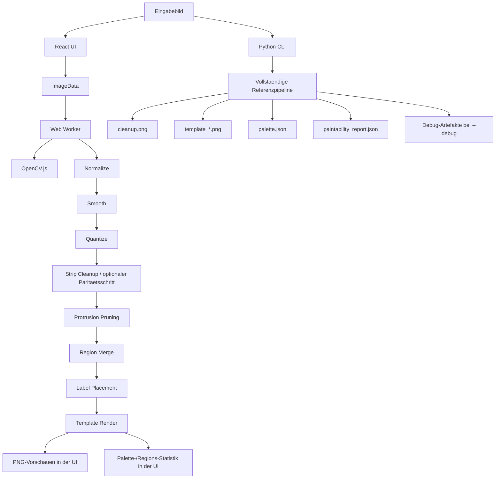

# Pipeline-Uebersicht

## Ziel dieses Dokuments

Dieses Dokument beschreibt die aktuelle Paint-by-Numbers-Pipeline im Repository so, wie sie heute implementiert ist. Es trennt sauber zwischen:

- dem interaktiven Browser-Pfad in `react-app`
- dem Python-Referenzpfad in `paint_by_numbers.py`
- den Paritaetszielen aus `react-app/src/lib/parityPlan.ts`
- den derzeit tatsächlich erzeugten Artefakten in `output/`

Wichtig: Im Repository existieren im Moment nicht nur unterschiedliche Laufzeitumgebungen, sondern auch unterschiedliche fachliche Zuschnitte derselben Pipeline. Der Python-CLI-Pfad ist die vollstaendige Referenz fuer den Batch-Export. Die React-App ist ein interaktiver, schrittweiser Debug- und Visualisierungspfad. Beide ueberlappen stark, sind aber nicht pixelgenau identisch.

## Executive Summary

Die Pipeline wandelt ein Eingabebild in eine begrenzte Farbpalette, bereinigt unguenstige Mini-Regionen und erzeugt daraus mehrere Paint-by-Numbers-Templates. Konzeptionell besteht die Pipeline aus acht Stufen:

1. Bild laden, Alpha auf Weiss abflachen, skalieren
2. Bilateral glätten
3. Farben in Lab per K-Means quantisieren
4. Schmale Pixelstreifen bereinigen und Labels kompakt neu nummerieren
5. Duenne Auslaeufer entfernen
6. Kleine Regionen mit aehnlichen Nachbarfarben verschmelzen
7. Label-Positionen in Regionen bestimmen
8. Finale Templates rendern

Die aktuelle React-UI exponiert davon nur sechs sichtbare Schritte. Der explizite Strip-Cleanup-Schritt ist in der UI aktuell nicht als eigener Schritt verdrahtet, obwohl er in `parityPlan.ts` und in `runCurrentStage()` weiterhin als vollwertige Paritaetsstufe existiert.

## Repository-Landkarte

### Primäre Laufzeitpfade

- `react-app/src/App.tsx`
  Browser-UI, Parametersteuerung, Bildupload, Worker-Orchestrierung, Ergebnisanzeige.
- `react-app/src/lib/worker.ts`
  Web-Worker, OpenCV-Initialisierung, Zustands-Cache zwischen Schritten, schrittweises Ausführen der Pipeline.
- `react-app/src/lib/pipeline.ts`
  Bildverarbeitung, Regionensegmentierung, Merge-Logik, Label-Platzierung, Template-Rendering.
- `react-app/src/lib/parityPlan.ts`
  Soll-Abbildung Browser gegen Python-Referenz in acht Stufen.
- `paint_by_numbers.py`
  Python-Referenzpipeline inklusive CLI, Debug-Outputs, JSON-Reports und Template-Export.

### Historischer/sekundärer Pfad

- `paintbynumbersgenerator-master/`
  Historische TypeScript-Implementierung. Dient nicht als primäre Laufzeit, ist aber relevant als Herkunft einzelner Ideen, vor allem der Facet-/Region-Merge-Logik.

## Architektur im Gesamtablauf

## Die drei Pipeline-Sichten im Repo

| Sicht | Quelle | Zweck | Tatsaechlicher Zuschnitt |
| --- | --- | --- | --- |
| Interaktive UI-Pipeline | `App.tsx` + `worker.ts` | Schrittweise Analyse im Browser | 6 Schritte |
| Monolithische Browser-Referenz | `runCurrentStage()` in `pipeline.ts` | Vollstaendige 8-Stufen-Abfolge mit Debug-Captures | 8 Schritte, derzeit nicht verdrahtet |
| Python-Referenz | `paint_by_numbers.py` | Batch-Erzeugung der finalen Outputs | Vollstaendige Referenz |

## Steuerfluss in der React-App

### 1. Initialisierung

Beim Mounten von `App.tsx` wird ein Modul-Worker erstellt. Die UI sendet sofort `INIT` an den Worker. Der Worker laedt OpenCV nicht aus dem installierten npm-Paket, sondern per `fetch()` direkt von einem CDN und evaluiert das Script im Worker-Global-Scope.

Das ist eine bewusste Architekturentscheidung mit zwei Folgen:

- Der erste Start haengt von der Netzwerkverbindung ab.
- Die Version in `package.json` und die im CDN geladene Version koennen voneinander abweichen.

### 2. Bildladepfad

Nach Dateiauswahl wird das Bild in der UI in ein Canvas gezeichnet und als `ImageData` an den Worker gesendet. Der Worker speichert dieses Rohbild in `sourceImageData` und invalidiert alle spaeteren Pipeline-Caches.

### 3. Nachrichtenprotokoll

Die UI arbeitet mit drei Nachrichtenarten:

- `INIT`
- `LOAD_IMAGE`
- `RUN_STEP`

Der Worker antwortet mit:

- `READY`
- `STEP_SUCCESS`
- `ERROR`

Die UI fuehrt immer nur genau einen Schritt gleichzeitig aus. Das ist wichtig, weil `sendWorkerMessage()` die Antwort nicht ueber eine robuste Request-ID-Multiplexing-Logik aufloest, sondern praktisch von serieller Ausfuehrung ausgeht. Die UI verhindert parallele Schrittstarts deshalb ueber den Status `runningStep`.

### 4. Zustand und Cache im Worker

Der Worker merkt sich Zwischenstufen persistent:

- `sourceImageData`
- `normalizedResult`
- `smoothCanvas`
- `quantizedResult`
- `protrusionResult`
- `regionMergeResult`

Mit `clearFrom(stage)` werden bei einem erneuten Ausführen frueherer Schritte alle abhaengigen Spaetstufen geloescht. Beispiel: Ein erneutes Quantisieren loescht Protrusion-, Region-Merge- und Render-Caches.

Das ist genau richtig fuer interaktives Debugging: Fruhere Schritte muessen nicht unnoetig neu gerechnet werden, aber keine Folge-Stufe darf auf alten Daten weiterlaufen.

## Detaillierte Stufenbeschreibung

## Stufe 1: Laden, Alpha-Handling, Resize

### Zweck

Das Eingabebild wird in ein verarbeitbares RGB-Bild ueberfuehrt, transparente Bereiche werden weiss aufgefuellt, und die groesste Kante wird bei Bedarf auf eine Maximalgroesse skaliert.

### Browser

- Eingang: `ImageData`
- Funktion: `loadAndNormalizeImage(imageData, resizeMax)`
- Ausgabe: `OffscreenCanvas`, `width`, `height`
- Verhalten:
  - weisser Hintergrund
  - High-Quality-Canvas-Skalierung
  - Groesste Kante standardmaessig `1200`

### Python

- Funktion: `load_image(path, resize_max)`
- Verhalten:
  - EXIF-Orientierung wird korrigiert
  - RGBA wird auf weissem Hintergrund alpha-komponiert
  - Resize mit `Image.Resampling.LANCZOS`

### Relevante Unterschiede

- Python korrigiert EXIF explizit.
- Browser arbeitet auf Basis des bereits dekodierten Bildes via Canvas/ImageBitmap.

## Stufe 2: Bilateral Smoothing

### Zweck

Die Pipeline reduziert lokales Bildrauschen, ohne harte Kanten so stark zu zerstören wie ein normaler Gaussian Blur.

### Browser

- Funktion: `applyBilateralSmoothing()`
- OpenCV-Schritte:
  - RGBA -> RGB
  - `bilateralFilter`
  - RGB -> RGBA
- Konstanten:
  - `d = 9`
  - `sigmaColor = 50`
  - `sigmaSpace = 50`

### Python

- Funktion: `smooth_image()`
- Gleiche fachliche Parameter:
  - `DEFAULT_SMOOTH_D = 9`
  - `DEFAULT_SMOOTH_SIGMA_COLOR = 50.0`
  - `DEFAULT_SMOOTH_SIGMA_SPACE = 50.0`

### Wirkung im Gesamtsystem

Diese Stufe ist die Grundlage dafuer, dass K-Means spaeter nicht auf zufaelligen Mikrovariationen segmentiert, sondern auf groberen, malbaren Flaechen.

## Stufe 3: K-Means-Quantisierung im Lab-Farbraum

### Zweck

Das Bild wird auf eine begrenzte Farbpalette abgebildet. Jede Pixelposition erhaelt ein Label, das auf einen Paletteneintrag zeigt.

### Browser-Implementierung

Die Browser-Pipeline geht hier aggressiver und heuristischer vor als Python:

1. RGB -> Lab
2. Alle Pixel werden als `Float32Array` in einen OpenCV-Matrixvektor ueberfuehrt
3. Es wird nicht direkt mit `requestedColorCount` geklustert, sondern mit `overK`
4. `overK` wird aus dem Ziel-K plus Ueberabtastung gebildet
5. Danach werden die naechsten Clusterpaare greedily zusammengelegt
6. Anschliessend wird jedes Pixel noch einmal brute-force dem wirklich naechsten finalen Zentrum zugeordnet
7. Sehr aehnliche Farben werden zusaetzlich ueber `mergeNearDuplicateColors()` zusammengefaltet

### Wichtige Browser-Heuristiken

- `KMEANS_TERM_MAX_ITER = 100`
- `KMEANS_TERM_EPSILON = 0.2`
- `KMEANS_MERGE_SIMILAR_LAB_DISTANCE = 8`
- Zufallsseed wird, wenn verfuegbar, via `cv.setRNGSeed(0)` gesetzt
- `overK = colorCount + max(4, ceil(colorCount * 0.5))`, gedeckelt durch Pixelzahl

### Python-Implementierung

Python verwendet `MiniBatchKMeans` aus scikit-learn direkt im Lab-Raum:

1. RGB -> Lab
2. `MiniBatchKMeans(n_clusters=k, random_state=0, batch_size=4096)`
3. Labels werden direkt aus `kmeans.labels_` uebernommen
4. Palette wird aus den Lab-Zentren zurueck nach RGB gerechnet

### Wichtige Python-Heuristiken

- `KMEANS_BATCH_SIZE = 4096`
- `KMEANS_RANDOM_STATE = 0`
- optional `--auto-color-count` mit vorgeschaltetem Sample-basiertem Hauptfarbendetektor

### Kritische fachliche Konsequenz

Diese Stufe ist die groesste bekannte Abweichung zwischen Browser und Python. Selbst bei identischem Zufallsseed sind OpenCV-K-Means plus Oversampling/Merge nicht gleichbedeutend mit `MiniBatchKMeans`. Unterschiede in Stufe 3 propagieren in alle Folge-Stufen.

## Stufe 4: Narrow Strip Cleanup und Label Compaction

### Zweck

Extrem schmale 1-Pixel- oder kreuzfoermige Artefakte werden entfernt. Danach werden unbenutzte Labels entfernt und die Palette neu kompakt durchnummeriert.

### Python

Im Python-Pfad ist diese Stufe fest eingebaut:

1. `cleanup_narrow_pixel_strips()`
2. `compact_labels_by_palette()`

`cleanup_narrow_pixel_strips()` sucht lokale Muster wie:

- links == rechts != center
- oben == unten != center
- diagonale Gegenecken gleich
- Kreuzmuster mit dominanter Umgebungsfarbe

Eine Ersetzung erfolgt nur, wenn die Ziel-Farbe farblich nah genug liegt. Die harte Schutzkante ist:

- `HARD_EDGE_PROTECTION_LAB_DISTANCE = 26.0`

Die Ersetzungsstaerke wird ueber die Pixelhaeufigkeit der Ziel-Farbe priorisiert.

### Browser

Die gleiche Logik existiert in `pipeline.ts` als `applyStripCleanupAndCompaction()`. Dort werden im Regelfall `PYTHON_PRE_REGION_STRIP_CLEANUP_RUNS = 8` Durchlaeufe verwendet.

### Wichtige Realitaet im aktuellen UI-Pfad

Obwohl die Stufe fachlich implementiert ist, wird sie im Worker-Pfad der interaktiven React-UI derzeit nicht zwischen `quantize` und `protrusions` ausgefuehrt. Die UI springt aktuell direkt von Quantisierung zu Protrusion Pruning.

Das bedeutet:

- `parityPlan.ts` beschreibt eine 8-Stufen-Pipeline
- `runCurrentStage()` fuehrt diese 8 Stufen auch aus
- die produktiv genutzte Worker-UI zeigt aber nur 6 Schritte und ueberspringt den expliziten Strip-Cleanup als eigenen Durchlauf

## Stufe 5: Protrusion Pruning

### Zweck

Duenne, schlecht malbare Auslaeufer an ansonsten grossen Regionen sollen entfernt oder umverteilt werden.

### Python-Strategie

Python nutzt eine morphologische Sicht auf das Problem:

1. pro Farbe wird eine Binärmaske erzeugt
2. darauf wird ein morphologisches Opening mit elliptischem Kernel angewendet
3. dabei entfernte Pixel werden auf `-1` gesetzt
4. diese unbekannten Pixel werden iterativ per 4er-Nachbarschaft mit gueltigen Nachbarlabels aufgefuellt

Konstanten:

- `THIN_PROTRUSION_KERNEL_RADIUS = 1`
- `THIN_PROTRUSION_MAX_FILL_STEPS = 12`

### Browser-Strategie

Der Browser implementiert hier derzeit keine morphologische Opening-Variante. Stattdessen wird pixelweise geprueft, ob ein Pixel in mindestens einer von vier Richtungen eine zu kleine Querschnittsbreite hat:

- horizontal
- vertikal
- diagonal links oben nach rechts unten
- diagonal rechts oben nach links unten

Wenn der minimale Spannweiten-Test ergibt, dass ein Pixel zu duenn ist, wird das farblich aehnlichste Nachbarlabel aus der 8er-Nachbarschaft gesucht. Ein Wechsel passiert nur, wenn die Farbdistanz unter dem High-Contrast-Schutzschwellwert bleibt.

### Bedeutende Abweichung

Stufe 5 ist fachlich zwischen Browser und Python derzeit nicht identisch. Beide Systeme verfolgen denselben Zweck, aber die Algorithmen unterscheiden sich fundamental:

- Python: Morphologie plus nachtraegliches Fuellen
- Browser: lokaler Richtungs-/Span-Test plus farbaehnlichster Nachbar

Diese Stufe ist damit neben K-Means eine zweite echte Paritaetsrisikostelle.

## Stufe 6: Region Merging

### Zweck

Sehr kleine oder sehr duenne Regionen werden in benachbarte, farblich passende Regionen ueberfuehrt, damit die Vorlage besser malbar wird.

### Python

Python arbeitet regionenbasiert:

1. `connected_regions()` erzeugt eine Connected-Components-Zerlegung pro Farbe
2. `build_region_adjacency()` baut Region-Nachbarschaften auf
3. `collect_merge_candidate_region_ids()` sammelt:
   - Regionen unterhalb der Mindestflaeche
   - duenne Regionen bis zum 2x-Flaechenlimit mit geringer durchschnittlicher Dicke
4. `plan_region_merges()` waehlt fuer jede Kandidatenregion das beste Ziel
5. `apply_region_merges()` ueberfuehrt die Regionen
6. danach folgt erneut Strip Cleanup
7. das Ganze laeuft bis zu `SMALL_REGION_MAX_PASSES = 3`

Wichtige Python-Heuristiken:

- `THIN_REGION_MAX_AREA_MULTIPLIER = 2`
- `THIN_REGION_MAX_AVERAGE_THICKNESS = 5.5`
- harte Detailschutzkante: `HARD_EDGE_PROTECTION_LAB_DISTANCE = 26.0`
- trotzdem darf Mikrokram bis `TINY_HARD_EDGE_MERGE_MAX_AREA = 8` ueber harte Kanten zusammenfallen

### Browser

Der Browser nutzt aktuell den Facet-/Voronoi-inspirierten Pfad `applyRegionMergingVoronoi()`.

Die Begriffe sind etwas historisch: Im aktuellen Code wird eine Facet-Loeschung mit farbaehnlichster Nachbarfarbe durchgefuehrt, ohne echte geometrische Voronoi-Neuzuordnung der Pixel. Die Region behaelt ihre Form, uebernimmt aber die Farbe des besten Nachbarn.

Der Ablauf:

1. `facetGetAll()` erzeugt aus dem Label-Raster zusammenhaengende Facets
2. `facetBuildNeighbour()` baut Nachbarschaften
3. `facetReduce()` entfernt Facets unterhalb des Schwellwerts
4. `facetDelete()` weist alle Pixel des geloeschten Facets der farblich aehnlichsten Nachbar-Facetfarbe zu
5. danach `compactLabelsByPalette()`
6. dann ein zweiter kompletter Durchlauf, um neu entstandene Mini-Fragmente zu entsorgen

### Browser-spezifische Konstanten

- `FACET_SMALL_THRESHOLD = 20`
- `FACET_DETAIL_PROTECT_LAB_DISTANCE = 25`
- `FACET_FORCE_MERGE_BELOW = 20`
- optionaler Schutz kleiner High-Contrast-Regionen ueber `protectHighContrast` und `highContrastMinPx`

### Wichtige Laufzeitrealitaet

In der React-UI ist der Default fuer `minRegionSize` derzeit `200`, nicht `20`. Der Konstantenwert `20` ist nur der interne Fallback, falls die UI keinen expliziten Wert sendet.

## Stufe 7: Label Placement

### Zweck

Fuer jede beschriftbare Region wird ein sinnvoller Mittelpunkt samt Radius bestimmt, damit Zahl oder Farbkreis stabil in die Region passen.

### Python-Referenz

Python nutzt die sauberste und referenznaechste Variante:

1. Regionmaske innerhalb der Bounding Box erzeugen
2. um 1 Pixel padden
3. `cv2.distanceTransform(..., DIST_L2, 5)` aufrufen
4. globales Maximum als Labelzentrum verwenden
5. Radius aus dem Maximalwert ableiten

Das ist auch in den Repository-Notizen explizit als Referenzformel festgehalten.

### Browser: zwei vorhandene Implementierungen

Im Browser gibt es zwei Varianten:

1. `regionLabelPointForBBox(...)`
   - verwendet ebenfalls OpenCV `distanceTransform`
   - waere eng an Python dran
2. `precomputeLabelPlacementsFast(...)`
   - verwendet eine chamferartige 2-Pass-Distanzapproximation in reinem TypeScript
   - diese schnelle Variante wird derzeit in `applyAllTemplateRenders()` tatsaechlich verwendet

### Konsequenz

Der Browser besitzt bereits eine referenznahe Implementierung, nutzt sie fuer die finale Render-Pipeline aber momentan nicht. Das ist ein konkreter Grund, warum Stage-7-Paritaet im Browser trotz vorhandener Infrastruktur noch abweichen kann.

## Stufe 8: Template Rendering

### Zweck

Aus dem finalen Label- und Regionszustand werden mehrere Ausgabeformen fuer den Nutzer erzeugt.

### Browser-Outputs

Die React-App zeigt nach `render` insgesamt sechs Bildvarianten:

1. `Bright Color Circles` als Primärresultat
2. `Color Circles`
3. `Circles Only`
4. `Numbers`
5. `Classic`
6. `Debug: Unlabeled (red)`

Wichtig: Die Schrittbeschreibung in der UI spricht von fuenf Template-Stilen, die tatsächliche Render-Logik liefert aber sechs Vorschauen.

### Python-Outputs

Python schreibt standardmaessig:

1. `template_classic.png`
2. `template_numbers.png`
3. `template_color_circles.png`
4. `template_circles_only.png`
5. `template_bright_color_circles.png`
6. optional `template_colored_edges.png`

### Rendering-Bausteine

- Boundary/Outline-Maske aus Regiongrenzen
- ggf. aufgehellte oder normalisierte Palette
- Zahlenfarben adaptiv nach Helligkeit
- Kreisradien begrenzt durch Canvas-Groesse und Regionradius

## Farbnormalisierung und Template-Look

### Paint-Palette-Normalisierung

Beide Pfade besitzen eine Logik, um sehr helle und sehr dunkle Farben fuer reale Malsets etwas zu normalisieren:

- sehr helle, fast neutrale Farben werden auf `LIGHT_PAINT_RGB = (238, 232, 218)` gemappt
- sehr dunkle Farben werden auf Mindesthelligkeit angehoben

### Helle Template-Hintergruende

Hier gibt es eine konkrete visuelle Abweichung zwischen Browser und Python:

- Browser `brightTemplateColor()`: mischt mit `alpha = 0.08` Richtung Weiss
- Python `bright_template_color()`: mischt mit `alpha = 0.16` Richtung Weiss

Damit sind die hellen Flaechen im Browser staerker Richtung Weiss aufgehellt als in Python.

### Outline-Farbe

Auch die Outline-Farbe ist derzeit nicht identisch:

- Browser: `OUTLINE_RGB = [200, 200, 200]`
- Python: `OUTLINE_RGB = (32, 32, 32)`

Das ist keine kleine numerische Differenz, sondern eine klar sichtbare Stilabweichung.

## Label- und Merge-Schwellwerte

### Browser-Defaultwerte in der UI

| Parameter | Default |
| --- | --- |
| Resize max | `1200` |
| K-Means color count | `24` |
| Min region size | `200` |
| Protect high-contrast small regions | `false` |
| High-contrast min size | `20` |
| Prune kernel radius | `1` |

### Python-CLI-Defaults

| Parameter | Default |
| --- | --- |
| `--color-count` | `48` |
| `--max-colors` | `48` |
| `--min-label-area` | `260` |
| `--resize-max` | `1200` |
| `--smooth-d` | `9` |
| `--smooth-sigma-color` | `50.0` |
| `--smooth-sigma-space` | `50.0` |
| `--auto-color-count` | aus |

### Python-abgeleitete Grenzwerte

Python leitet zwei effektive Werte aus Bildgroesse und CLI-Parametern ab:

- `effective_min_label_area = max(min_label_area, round(total_pixels * 0.00025))`
- `effective_merge_area = effective_min_label_area`

Das ist wichtig, weil Python Beschriftung und Small-Region-Merging an denselben effektiven Schwellwert koppelt.

### Browser-Besonderheit bei Labeln

Die Browser-Renderlogik verwendet aktuell fuer Label-Platzierung nicht den UI-Wert `minRegionSize`, sondern intern `FACET_FORCE_MERGE_BELOW = 20` als minimale Labelschwelle fuer ueberlebende Regionen. Dadurch koennen im Browser deutlich mehr Regionen einen Marker bekommen als im Python-Referenzpfad mit `effective_min_label_area = 260`.

## Ausgabeartefakte

## Python-Hauptartefakte in `output/`

- `cleanup.png`
- `template_classic.png`
- `template_numbers.png`
- `template_color_circles.png`
- `template_circles_only.png`
- `template_bright_color_circles.png`
- `palette.png`
- `palette.json`
- `paintability_report.json`
- optional `template_colored_edges.png`

## Python-Debug-Artefakte bei `--debug`

- `debug.png`
- `boundary_mask.png`
- `step_normalized.png`
- `step_smooth.png`
- `step_quantized.png`
- `step_strip_cleanup.png`
- `step_protrusion_prune.png`
- `auto_color_debug.json`

Diese Debug-Dateien sind entscheidend fuer die Paritaetsarbeit, weil sie genau die Zwischenstufen sichtbar machen, die die Browser-Implementierung Schritt fuer Schritt nachbauen soll.

## Beispiel: Aktueller Report in `output/`

Der aktuell vorliegende `paintability_report.json` beschreibt fuer das Beispielbild folgende Kennzahlen:

- Groesse: `1200 x 750`
- Farben nach Cleanup: `45`
- Regionen gesamt: `319`
- nummerierte Regionen: `276`
- zu klein fuer Nummer: `43`
- kleinste Region: `10`
- groesste Region: `39440`
- Median der Regionsflaeche: `856.0`

Im aktuellen `palette.json` ist ausserdem erkennbar, dass:

- `color_count_used = 48`
- `exact_cleanup_unique_colors = 45`
- `exact_cleanup_matches_detected_main_colors = false`

Das zeigt, dass die Pipeline nach K-Means und spaeteren Cleanup-Schritten effektive Farbcluster wieder zusammenfuehrt.

## JSON-Ausgaben und ihre Bedeutung

### `palette.json`

Enthaelt:

- Quelldatei
- Bildgroesse
- effektive Settings
- jede finale Farbe mit:
  - Nummer
  - exakter Farbe vor Paint-Normalisierung
  - normalisierter Paint-Farbe
  - Pixelhaeufigkeit
  - Flaechenanteil
- Pfade zu erzeugten Outputs

### `paintability_report.json`

Enthaelt:

- Bildgroesse
- Farbanzahl
- Regionsanzahl gesamt
- wie viele Regionen labelbar sind
- wie viele zu klein sind
- Min-/Max-/Median-Groessen
- Small-Region-Merge-Status
- Auto-Color-Status
- Vergleich zwischen Ziel-Farbenzahlen und effektivem Cleanup-Ergebnis

## Paritaetsplan und Ist-Zustand

`react-app/src/lib/parityPlan.ts` definiert die gewuenschte Browser-vs-Python-Abnahme in acht Stufen. Fachlich ist das die sauberste Soll-Sicht im Frontend-Code.

Die wichtigsten Validierungsziele sind:

1. Normalize gegen `output/step_normalized.png`
2. Smooth gegen `output/step_smooth.png`
3. Quantize gegen `output/step_quantized.png`
4. Strip Cleanup gegen `output/step_strip_cleanup.png`
5. Protrusion Prune gegen `output/step_protrusion_prune.png`
6. Region Merge gegen `output/cleanup.png` plus Reportdaten
7. Label Placement gegen `output/template_bright_color_circles.png`
8. Final Render gegen `output/template_bright_color_circles.png`

### Was heute bereits gut deckungsgleich ist

- Normalize- und Resize-Logik
- Bilateral-Parameter
- Grundidee von Strip Cleanup und Label Compaction
- Connected-Components-basierte Regionsicht
- Mehrere Template-Arten

### Wo heute echte Differenzen liegen

1. Browser-Stufe 3 nutzt OpenCV-K-Means plus Oversampling/Merge, Python nutzt `MiniBatchKMeans`
2. Browser-UI fuehrt Strip Cleanup nicht als eigenen verdrahteten Schritt aus
3. Browser-Protrusion-Pruning ist algorithmisch anders als Python
4. Browser-Renderlogik verwendet die schnelle Label-Platzierung statt der referenznahen OpenCV-Distance-Transform-Variante
5. Browser-Template-Look unterscheidet sich sichtbar in Outline-Farbe und Brightening-Mischung
6. Browser und Python verwenden unterschiedliche Defaultwerte fuer Farbanzahl und Label-/Merge-Schwellwerte

## Wichtige technische Nuancen

### 1. `runCurrentStage()` ist eine Art vollständiger Browser-Referenzlauf

Diese Funktion in `pipeline.ts` fuehrt die konzeptionellen acht Stufen in Serie aus, erstellt Debug-Stages und liefert sogar einen Validierungs-Hinweistext gegen die Python-Ausgabe. Sie ist fachlich sehr wertvoll, wird derzeit aber nicht von der React-UI verwendet.

### 2. Die Browser-App ist vor allem ein Debugger und Step-Inspector

Die UI ist weniger ein finaler Exportpfad als ein interaktives Labor fuer jeden Zwischenschritt:

- pro Schritt PNG-Vorschau
- Timing je Stufe
- Palette-Debug in der UI
- Render-Stats wie `regionCount` und `placementCount`

### 3. Python ist der authoritative Exportpfad

Nur Python schreibt heute das komplette Output-Set samt JSON-Berichten und Debug-Dateien reproduzierbar auf die Platte.

### 4. Das Python-Output-Verzeichnis wird geleert

`prepare_output_dir()` loescht den kompletten Zielordner vor jedem Lauf. Das ist operational wichtig, weil dort keine persistente Historie angenommen werden darf.

## Empfohlene mentale Modellierung der Pipeline

Die Pipeline laesst sich am besten als Kette aus drei Schichten denken:

### A. Farbmodellierung

- Glättung
- Quantisierung
- Farbzusammenfuehrung
- Paint-Palette-Normalisierung

### B. Malbarkeitsbereinigung

- Strip Cleanup
- Protrusion Pruning
- Small-Region Merging
- High-Contrast-Schutzregeln

### C. Praesentationsschicht

- Regionengrenzen
- Labelplatzierung
- Zahlen-/Kreis-Rendering
- Template-Stilvarianten
- Reports und Debug-Artefakte

## Fazit

Das Repository enthaelt keine einzelne, monolithische Pipeline, sondern drei uebereinanderliegende Pipeline-Perspektiven:

- eine interaktive Browser-Debug-Pipeline
- eine im Browser vorhandene, aber derzeit nicht verdrahtete 8-Stufen-Referenzfunktion
- eine Python-Referenzpipeline mit den massgeblichen Ausgabe-Artefakten

Wenn man das System weiterentwickeln oder auf Paritaet trimmen will, sollte man nicht von der UI-Schrittliste ausgehen, sondern von der Python-Referenz und dem 8-Stufen-Paritaetsplan. Die groessten offenen technischen Hebel fuer echte Browser-vs-Python-Naehe liegen derzeit in:

1. Stage 3 K-Means-Paritaet
2. Stage 4 echte Einbindung des Strip-Cleanup-Schritts in den Worker-Pfad
3. Stage 5 algorithmische Vereinheitlichung des Protrusion-Prunings
4. Stage 7 Nutzung der referenznahen Distance-Transform-Platzierung im finalen Browser-Renderpfad
5. Vereinheitlichung von Rendering-Konstanten wie Outline und Brightening