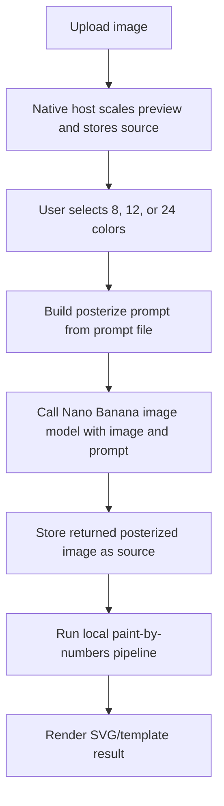

# Redesign-Plan: Upload-only Paint-by-Numbers Flow

## Aktueller Stand

- Es gibt bereits einen echten KI-Call, aber nur im bisherigen `Create`-/Ideenbild-Flow.
- Der Upload-Flow macht aktuell keinen KI-Call. Er nimmt das hochgeladene Bild und startet danach die lokale algorithmische Pipeline.
- Die Detailauswahl wirkt bereits auf die lokale Pipeline, aber noch nicht in der gewuenschten Form:
  - aktuell: `low` = 10 Cluster, `medium` = 16 Cluster, `high` = 20 Cluster plus Cleanup-Tuning
  - Ziel: feste Komplexitaeten mit 8, 12 und 24 Farben, die sowohl Prompt als auch Pipeline-Settings steuern
- Die native App ist eine Expo-Shell mit lokaler WebView-UI. Die UI liegt in `react-app/` und wird ueber `App/scripts/sync-local-webview.mjs` in die App gebundelt.

## Zielbild

Der erste nutzbare Screen ist kein Hub mehr, sondern direkt der Upload-Flow:

1. Bild hochladen
2. Komplexitaet waehlen: Einfach 8 Farben, Mittel 12 Farben, Detailreich 24 Farben
3. KI-Posterisierung aus dem Upload erzeugen
4. Das KI-Ergebnis durch die lokale Paint-by-Numbers-Pipeline schicken
5. Ergebnis anzeigen und exportierbar machen

Es gibt keine Erstellung aus einem Textprompt mehr. Der Nutzer kann nur ein eigenes Bild hochladen.

## Ziel-Datenfluss



## Dateien und geplante Aenderungen

### `react-app/src/ui/App.tsx`

- `idea`-Screen und `generateIdeaImage`-Pfad entfernen.
- Hub durch upload-first Screen ersetzen.
- State vereinfachen:
  - `idle`
  - `config`
  - `aiPosterizing`
  - `processing`
  - `result`
- Nur noch `pickImage`, neuer `posterizeUploadedImage` Request und danach `runPaintByNumbers`.
- Complexity-Auswahl als feste Option statt frei interpretierter Detail-Presets.

### `react-app/src/lib/settings.ts`

- `DetailPreset` durch `ComplexityPreset` ersetzen:
  - `simple`: 8 Farben
  - `medium`: 12 Farben
  - `detailed`: 24 Farben
- `settingsForComplexity()` soll `kMeansNrOfClusters` exakt auf 8, 12 oder 24 setzen.
- Optional kann Cleanup je nach Komplexitaet mitlaufen:
  - 8 Farben: groessere Mindestregionen, staerkere Vereinfachung
  - 12 Farben: Default-Mittelweg
  - 24 Farben: kleinere Mindestregionen, mehr Details erhalten

### `react-app/src/prompts/paintByNumbersPosterizePrompt.ts`

- Neue Prompt-Datei fuer den KI-Schritt.
- Prompt bekommt mindestens:
  - `colorCount`
  - `complexityLabel`
  - optional `maxEdge`
- Der Prompt soll verlangen:
  - genau die gewaehlte Anzahl flacher Farben
  - klare Kanten und grosse zusammenhaengende Flaechen
  - keine Zahlen, keinen Text, keine Labels, kein Wasserzeichen
  - keine feinen Texturen, kein Rauschen, keine Fotokoernung
  - Ausgabe als normales Bild, noch nicht als nummerierte Vorlage

### `react-app/src/lib/promptBuilder.ts`

- Bestehenden Ideenbild-Prompt durch `buildPosterizePrompt()` ersetzen.
- Die Komplexitaet geht direkt in den Prompt.

### `App/src/features/webview/appWebViewBridgeTypes.ts`

- `generateIdeaImage` entfernen.
- `WebImageSource.kind` von `uploaded | generated` auf `uploaded | posterized` umstellen.
- Neuen Request einfuehren:
  - `posterizeUploadedImage`
  - Payload: `sourceToken`, `complexity`, `colorCount`, `prompt`
- Progress-Phase erweitern:
  - `posterizeImage`
  - `paintByNumbers`

### `App/App.tsx`

- `handleGenerateIdeaImage()` entfernen oder durch `handlePosterizeUploadedImage()` ersetzen.
- Der neue Handler:
  - liest das bereits hochgeladene Bild aus `sourceStoreRef`
  - sendet Bild plus Prompt an den Nano-Banana-Client
  - speichert das Modell-Ergebnis als neues Asset
  - registriert es als `kind: 'posterized'`
- Danach startet die WebView-UI den vorhandenen `runPaintByNumbers`-Flow mit den Complexity-Settings.

### `App/src/features/ideaGeneration/`

- Entweder umbenennen zu `App/src/features/imagePosterization/` oder neue Struktur daneben anlegen.
- Empfohlene Dateien:
  - `posterizeImageWithNanoBanana.ts`
  - `imageModelResponse.ts`
  - `imageAssetWriter.ts`
- Bestehende Hilfen wie Base64-Extraktion, Cache-Datei schreiben und Preview-Erstellung koennen wiederverwendet werden.

### `App/.env.example`

- Vorlage fuer lokale Konfiguration.
- Der echte Key gehoert in `App/.env`, nicht in Git.

## Env-Plan

Empfohlen fuer lokale Entwicklung:

```bash
EXPO_PUBLIC_NANO_BANANA_API_KEY=
EXPO_PUBLIC_NANO_BANANA_MODEL=
EXPO_PUBLIC_IMAGE_POSTERIZE_ENDPOINT=
```

Wichtiger Hinweis: `EXPO_PUBLIC_*` wird in Expo-Clients gebundelt und ist damit nicht geheim. Fuer echte Distribution sollte der Key ueber einen eigenen Proxy laufen. Dann steht im Client nur `EXPO_PUBLIC_IMAGE_POSTERIZE_ENDPOINT`, und der API-Key bleibt serverseitig.

## UI-Redesign

- Bestehende freundliche visuelle Richtung behalten, aber weniger ueberlagern.
- Keine konkurrierenden grossen Feature-Karten mehr.
- Ein klarer, linearer Flow:
  - grosser Upload-Bereich
  - darunter kompakte Complexity-Auswahl
  - danach Bildvorschau und primarer Start-Button
- Kontrastprobleme reduzieren:
  - weniger transparente Panels auf Bildhintergruenden
  - Text primaer auf solidem hellen Hintergrund
  - Buttons mit stabilen Farben statt mehrschichtiger Gradients
- Recent Creations nur nach dem ersten Ergebnis zeigen, nicht als Startscreen-Ballast.

## React-Umsetzung

- Die grosse `react-app/src/ui/App.tsx` in kleinere Komponenten aufteilen:
  - `UploadScreen`
  - `ComplexitySelector`
  - `ProcessingScreen`
  - `ResultScreen`
  - `StatusBanner`
- Teure SVG/Data-URL-Erzeugung weiter mit `useMemo` kapseln.
- Bridge-Requests typisiert halten und keine losen String-Payloads einfuehren.
- Keine dynamischen Imports fuer den App-Flow, weil die WebView-Bundling-Kette und Metro/Hermes dabei empfindlich sind.

## Validierung

1. `npm run typecheck --prefix ./react-app`
2. `npm run typecheck` in `App/`
3. `npm run sync:webview-local` in `App/`
4. Expo Development Build starten, nicht Expo Go.
5. Auf iPhone testen:
   - erster Screen erlaubt nur Upload
   - keine Text-zu-Bild-Erstellung sichtbar
   - 8/12/24 aendern den Prompt und `kMeansNrOfClusters`
   - AI-Posterisierung liefert ein Bild
   - lokale Pipeline verarbeitet dieses Bild
   - Ergebnis ist nicht weiss/leer
   - Fehlermeldungen sind lesbar und konkret

## Offene Entscheidung

Noch unklar ist, welches API-Format der gewuenschte "Nano Banana"-Model-Call exakt hat:

- Gemini-kompatibler Endpoint?
- eigener Proxy?
- anderer Provider mit Bild-Edit-API?
- erwartetes Response-Schema fuer das erzeugte Bild?

Sobald diese API-Form klar ist, kann der Client sauber implementiert werden. Fuer eine echte App-Distribution ist der Proxy-Weg die bessere Architektur, weil der Key dann nicht im iPhone-Bundle liegt.
