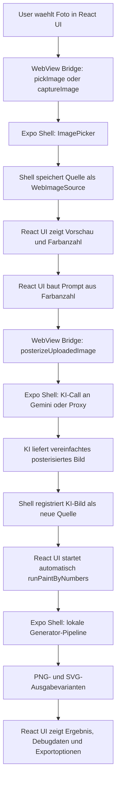

# Technische Architektur: Happy Numbers Paint-by-Numbers

Stand: 2026-07-16

Dieses Dokument beschreibt den aktuellen technischen Aufbau des Projekts, den KI-gestuetzten Bildvorbereitungsschritt, die drei Prompt-Varianten und die lokale Paint-by-Numbers-Pipeline. Es ist als Arbeitsdokument fuer Entwicklung, Agenten und Projektverstaendnis gedacht. Wenn sich Architektur, KI-Call, Prompting, Pipeline-Stufen, Komplexitaetslogik oder Exportvarianten aendern, muss dieses Dokument mit aktualisiert werden.

## 1. Kurzueberblick

Happy Numbers erzeugt aus einem Foto eine ausmalbare Paint-by-Numbers-Vorlage.

Der aktuelle installierte App-Pfad besteht aus zwei Schichten:

1. `react-app/`
   Eine React-Weboberflaeche. Sie rendert Upload-, Konfigurations-, Fortschritts- und Ergebnisansichten. Diese UI laeuft im Browser direkt zur Vorschau oder eingebettet in einer React-Native-WebView.

2. `App/`
   Eine Expo/React-Native-Shell. Sie laedt die lokal gebaute React-App in `react-native-webview`, stellt native Funktionen bereit und fuehrt die rechenintensiven Schritte aus:
   - Fotoauswahl
   - Kameraaufnahme
   - KI-Posterisierung ueber Gemini/Nano Banana oder Proxy
   - lokale Paint-by-Numbers-Generierung
   - Dateisystempersistenz
   - Teilen/Export

Der wichtigste Gesamtfluss lautet:



Wichtig: Die aktuelle iPhone-App ist kein reiner Browser und keine reine native OpenCV-App. Sie ist eine React-Web-UI in einer Expo-WebView-Shell. Die UI sitzt in `react-app/`, der Host und die Pipeline sitzen in `App/`.

## 2. Repository-Landkarte

### Aktueller Produktivpfad

- `react-app/src/ui/App.tsx`
  UI-State-Machine, Screens, Farbanzahl/Komplexitaet, Bridge-Kommunikation, Ergebnisanzeige, Exportbuttons.

- `react-app/src/lib/settings.ts`
  UI-nahe Generator-Settings, Farbanzahlgrenzen und Mapping von Farbanzahl zu Komplexitaet.

- `react-app/src/lib/promptBuilder.ts`
  Baut aus Farbanzahl und Maximalgroesse den finalen Prompt.

- `react-app/src/prompts/paintByNumbersPosterizePrompt.ts`
  Enthalten sind die drei aktuellen Prompt-Varianten: Easy, Medium, Expert.

- `App/App.tsx`
  Expo-Shell, WebView-Lifecycle, native Bridge-Requests, Bildauswahl, Kamera, KI-Posterisierung, lokaler Generatorlauf, Persistenz und Sharing.

- `App/src/features/webview/appWebViewBridgeTypes.ts`
  Gemeinsame Typen fuer Nachrichten zwischen React-WebView-UI und Expo-Shell.

- `App/src/features/imagePosterization/posterizeImageWithNanoBanana.ts`
  KI-Aufruf, Bildvorbereitung, Proxy-Fallback, Gemini-Direktaufruf, Antwortauswertung, Cache-Datei fuer das KI-Bild.

- `App/src/features/imagePosterization/geminiImageRequest.ts`
  Gemini-Request-Body und Extraktion von Inline-Bilddaten aus der Gemini-Antwort.

- `App/src/features/generator/generatePaintByNumbers.ts`
  Einstiegspunkt der bisherigen lokalen Paint-by-Numbers-Pipeline fuer ein `ImagePickerAsset`. Dieser Pfad bleibt als Legacy-Fallback im Repository und kann ueber `EXPO_PUBLIC_GENERATOR_PIPELINE=legacy` als aktiver Generator ausgewaehlt werden.

- `App/src/features/generator/fresh/generatePaintByNumbersFresh.ts`
  Plattformneutraler TypeScript-Kern der Region-First-Fresh-Pipeline. Er akzeptiert bereits vorbereitete RGBA-Bilddaten und kann deshalb sowohl in der App als auch direkt im Node-basierten Pipeline-Lab und in Regressionstests ausgefuehrt werden.

- `App/src/features/generator/fresh/generatePaintByNumbersFreshNative.ts`
  Native App-Huelle des Fresh-Kerns. Sie bereitet das `ImagePickerAsset` mit dem Fresh-Arbeitslimit vor und uebergibt es danach an den plattformneutralen Kern. `App/App.tsx` importiert diese Huelle standardmaessig, wenn `EXPO_PUBLIC_GENERATOR_PIPELINE` leer ist oder auf `fresh` steht.

- `App/src/features/generator/prepareImage.ts`
  Resize, PNG-Normalisierung, Alpha-Flattening auf Weiss und Umwandlung in `ImageData`.

- `App/src/features/generator/pipelineCore.ts`
  Leere ImageData-Erzeugung und Palette-Merge fuer redundante Farben.

- `App/src/features/generator/rasterPaintByNumbers.ts`
  Kern der aktuellen lokalen Raster-/Region-/Render-Pipeline.

- `App/src/vendor/paintbynumbersgenerator/`
  Vendored TypeScript-Code aus dem externen Paint-by-Numbers-Generator, vor allem K-Means, Farbkonvertierung, Facet-Datenstrukturen und Settings.

### Build- und Einbettungspfad

- `react-app/scripts/build-webview-local.mjs`
  Baut die React-WebView-App ohne Vite-Bundle-Runtime in `react-app/dist`. Dabei werden React, React-DOM, CSS und Assets in einfache lokale Dateien gepackt.

- `App/scripts/sync-local-webview.mjs`
  Baut `react-app/dist`, wandelt alle Dateien in Base64-Chunks und schreibt sie in `App/src/features/generator/localWebViewManifest.generated.ts`.

- `App/src/features/generator/localWebViewLoader.ts`
  Materialisiert dieses generierte Manifest beim App-Start in den Expo-Cache und liefert `indexUri` und `rootUri` fuer die WebView.

### Referenz- und Analysepfade

- `reference/python-pipeline/paint_by_numbers.py`
  Python-Referenzpipeline und Batch-Exporter. Relevant fuer algorithmische Paritaet, Debug-Artefakte und Vergleichsbilder.

- `docs/pipeline-uebersicht-de.md`
  Aeltere, pipelinefokussierte Uebersicht. Sie beschreibt besonders den Python/Web-Referenzkontext und ist nicht vollstaendig identisch mit dem aktuellen `App/`-Produktivpfad.

- `reference/python-pipeline/output/`
  Referenz- und Debugbilder der Python-Pipeline.

- `prompt-lab/`
  Historie und Vergleichsmaterial fuer Prompt-Experimente.

- `pipeline-lab/`
  Analysen zur Pipeline-Verbesserung.

- `test-assets/source-photos/`
  Kuratierte Original-Testfotos fuer Prompt- und Pipeline-Suites.

- `test-assets/ai-posterized/`
  Lokal erzeugte KI-Zwischenbilder fuer alle aktuell enthaltenen Source-Fotos in Easy 8, Medium 12 und Expert 24. Diese Bilder dienen als stabiler Testkorpus fuer weitere Pipeline-Refinements.

- `test-assets/legacy-samples/`
  Aeltere Einzelbilder, die frueher lose im Repository-Root lagen.

## 3. Laufzeitarchitektur

### 3.1 React-App als WebView-Inhalt

Die React-App in `react-app/` ist die sichtbare Anwendung. Sie laeuft in zwei Modi:

1. Browser-Vorschau
   Wenn `window.ReactNativeWebView` nicht existiert, aktiviert die UI einen eingeschraenkten Browser-Modus. Datei-Auswahl funktioniert ueber `<input type="file">`, aber KI-Posterisierung, Kamera, lokaler Generator und nativer Export funktionieren dort nicht vollstaendig.

2. Native WebView
   In der installierten Expo-App existiert `window.ReactNativeWebView.postMessage`. Die UI sendet JSON-Nachrichten an die Shell und empfaengt Host-Events ueber `message`-Listener.

Die UI-State-Machine hat diese Screen-Zustaende:

- `splash`
- `upload`
- `config`
- `processing`
- `result`

Der normale Ablauf ist:

1. Splash wartet auf `hostReady`.
2. Upload-Screen fordert Galerie oder Kamera an.
3. Config-Screen zeigt Bildvorschau und Farbanzahl-Slider.
4. Processing-Screen zeigt zuerst KI-Posterisierung, danach lokale Pipeline.
5. Result-Screen zeigt Ergebnisvorschau, eine Dropdown-Auswahl fuer Ausgabevarianten, Debugdaten, Timing und Exportoptionen.

### 3.2 Expo-Shell als nativer Host

`App/App.tsx` laedt beim Start das lokale WebView-Bundle:

1. `ensureLocalWebViewBundle()` liest das generierte Manifest.
2. Das Manifest wird in `Paths.cache/local-webview/<buildId>/` materialisiert.
3. Die WebView oeffnet `index.html` aus diesem Cache.
4. `allowingReadAccessToURL` zeigt auf den Build-Ordner, damit CSS, JS und Assets geladen werden koennen.

Die Shell verwaltet intern eine `Map<string, StoredSource>`. Jedes Bild bekommt einen `sourceToken`:

- Originalfoto: `kind: 'uploaded'`
- KI-Bild: `kind: 'posterized'`

Das ist wichtig, weil die WebView aus Sicherheits- und Plattformgruenden nicht direkt mit allen nativen Datei-URIs und Asset-Objekten arbeiten soll. Die UI bekommt eine Vorschau und einen Token. Die Shell behaelt das echte `ImagePickerAsset`.

### 3.3 Bridge-Protokoll

Die WebView sendet `WebViewAppRequest` an die Shell:

- `webAppReady`
  UI ist geladen und erwartet Host-Bereitschaft.

- `webRuntimeError`
  WebView meldet JS-Fehler oder unhandled promise rejection.

- `pickImage`
  Bild aus der Galerie waehlen.

- `captureImage`
  Kamera oeffnen.

- `posterizeUploadedImage`
  Aus einer vorhandenen Quelle ein KI-posterisiertes Bild erzeugen.

- `runPaintByNumbers`
  Lokale Generator-Pipeline auf einer Quelle ausfuehren. Optional kann der Request `debugMode` und `debugStartStage` enthalten. In diesem Fall erzeugt die Shell pro Pipeline-Schritt Debug-Snapshots und versucht, vorhandene native Zwischendaten aus dem Debug-Cache wiederzuverwenden.

- `shareResultSvg`
  SVG-Datei teilen.

- `shareResultFile`
  PNG/SVG-Datei teilen.

- `shareResultSvgFromPng`
  PNG in ein SVG mit eingebettetem PNG verpacken und teilen.

Die Shell sendet `WebViewHostEvent` zurueck:

- `hostReady`
- `sourceReady`
- `processingProgress`

  Enthaelt Phase, Prozentwert und Statusmeldung. Bei Debug-Laeufen kann die lokale Pipeline zusaetzlich `preview` liefern. Dieses `preview` ist ein kompakter PNG-Snapshot des zuletzt fertiggestellten Pipeline-Schritts mit Stage, Label, Beschreibung und Metriken. Normale Produktlaeufe senden keine Pipeline-PNGs ueber die Bridge, damit die iPhone-Laufzeit nicht durch Snapshot-Kodierung und grosse JSON-Payloads belastet wird.

- `runCompleted`

  Enthaelt bei normalen Laeufen das Generatorergebnis mit allen Ausgabevarianten. Bei Debug-Laeufen enthaelt `result.debug` zusaetzlich pro Stage Parameter, Metriken, Timing, Cache-Hit-Status und ein PNG-Snapshot-Bild.

- `shareCompleted`
- `error`

Die Bridge ist request-ID-basiert. Die UI merkt sich aktive Request-IDs fuer Pick, Posterize, Run und Share, damit nur relevante Events den aktuellen Screen veraendern.

## 4. KI-Call und KI-Bildvorbereitung

### 4.1 Wo der KI-Call gestartet wird

Der KI-Call startet in der React-UI, aber ausgefuehrt wird er in der Expo-Shell:

1. User waehlt Farbanzahl im Slider.
2. `react-app/src/lib/settings.ts` mappt Farbanzahl auf Komplexitaet.
3. `react-app/src/lib/promptBuilder.ts` baut den finalen Prompt.
4. `react-app/src/ui/App.tsx` sendet `posterizeUploadedImage` an die Shell.
5. `App/App.tsx` ruft `posterizeImageWithNanoBanana()` auf.

Der Request an die Shell enthaelt:

- `sourceToken`
- `complexity`: `simple`, `medium` oder `detailed`
- `colorCount`
- `prompt`

### 4.2 Bildvorbereitung fuer das Modell

`posterizeImageWithNanoBanana.ts` bereitet das Originalbild so vor:

- Maximale Modell-Eingabekante: `1024 px`
- Resize nur, wenn Breite oder Hoehe groesser als 1024 ist
- Format fuer den KI-Input: JPEG
- JPEG-Kompression: `0.92`
- Base64 wird aus `expo-image-manipulator` gelesen
- MIME-Type fuer den Request: `image/jpeg`

Beispiel:

- Foto: `3024 x 4032`
- Ziel: laengste Kante 1024
- Ergebnis: ca. `768 x 1024`
- Dieses JPEG wird zusammen mit dem Prompt ans Modell gesendet.

Wichtig: Diese Begrenzung betrifft nur den KI-Call. Die lokale Generator-Pipeline arbeitet danach mit einer separaten Zielgroesse und kann das KI-Ergebnis lokal hochskalieren, ohne die Modellkosten zu erhoehen.

### 4.3 Modellwahl und Umgebungsvariablen

Das Modell wird mit `getNanoBananaModel()` bestimmt:

1. `EXPO_PUBLIC_NANO_BANANA_MODEL`
2. `EXPO_PUBLIC_GEMINI_IMAGE_MODEL`
3. Fallback: `gemini-3.1-flash-lite-image`

Der API-Key wird so gesucht:

1. `EXPO_PUBLIC_NANO_BANANA_API_KEY`
2. `EXPO_PUBLIC_GEMINI_API_KEY`

Wenn kein API-Key gesetzt ist, wird ein Proxy-Endpunkt verwendet:

- `EXPO_PUBLIC_IMAGE_POSTERIZE_ENDPOINT`

Optionale Seed-Konfiguration:

1. expliziter `seed` im Request
2. `EXPO_PUBLIC_GEMINI_IMAGE_SEED`
3. `EXPO_PUBLIC_NANO_BANANA_SEED`

Seeds werden auf Integer gekuerzt, wenn sie numerisch sind.

### 4.4 Direkter Gemini-Request

Wenn ein API-Key vorhanden ist, geht der Request direkt an:

```text
https://generativelanguage.googleapis.com/v1beta/models/<model>:generateContent
```

Header:

```http
Content-Type: application/json
x-goog-api-key: <api-key>
```

Body-Struktur:

```json
{
  "contents": [
    {
      "parts": [
        { "text": "<finaler Prompt>" },
        {
          "inline_data": {
            "mime_type": "image/jpeg",
            "data": "<base64 ohne data-url-prefix>"
          }
        }
      ]
    }
  ],
  "generationConfig": {
    "responseModalities": ["IMAGE"],
    "temperature": 0.2,
    "seed": 7707
  }
}
```

`seed` ist nur enthalten, wenn ein Seed konfiguriert wurde.

Die Antwort wird in `extractGeminiImage()` gesucht. Akzeptiert werden beide Feldstile:

- `inlineData`
- `inline_data`

Das erste Bild mit `data` wird extrahiert. Falls kein Bild gefunden wird, bricht der Flow mit einem Fehler ab.

### 4.5 Proxy-Request

Wenn kein API-Key vorhanden ist, sendet die App an `EXPO_PUBLIC_IMAGE_POSTERIZE_ENDPOINT`.

Body:

```json
{
  "prompt": "<finaler Prompt>",
  "model": "gemini-3.1-flash-lite-image",
  "colorCount": 12,
  "complexity": "medium",
  "image": {
    "mimeType": "image/jpeg",
    "base64": "<base64>",
    "width": 768,
    "height": 1024
  },
  "seed": 7707
}
```

Akzeptierte Proxy-Antwortformate:

```json
{
  "imageBase64": "<base64>",
  "mimeType": "image/png"
}
```

oder:

```json
{
  "image": {
    "base64": "<base64>",
    "mimeType": "image/png"
  }
}
```

### 4.6 Was nach der KI-Antwort passiert

Nach erfolgreichem KI-Call:

1. Das ausgegebene Bild wird in `Paths.cache/posterized-images/` geschrieben.
2. Dateiname: `posterized-<timestamp>.png` oder `.jpg`.
3. `expo-image-manipulator` normalisiert die Datei und liest Breite/Hoehe.
4. Eine JPEG-Vorschau mit maximaler Kante 1024 wird als Data-URL erzeugt.
5. Die Shell registriert das KI-Bild als neue `WebImageSource`.
6. Die UI startet automatisch `runPaintByNumbers` auf diesem KI-Bild.

Das lokale Paint-by-Numbers-Verfahren arbeitet also nicht auf dem Originalfoto, sondern auf dem durch KI vereinfachten/posterisierten Zwischenbild.

## 5. Die drei aktuellen Prompt-Varianten

Die Prompt-Quelle ist `react-app/src/prompts/paintByNumbersPosterizePrompt.ts`.

Die Prompts sind bewusst nicht nur als einfache Posterisierung formuliert. Das Ziel ist ein unnummeriertes Paint-by-Numbers-Farbplattenbild: ein sauberes farbiges Referenzbild aus geschlossenen, spaeter trace- und nummerierbaren Malflaechen. Nummern, Buchstaben, Labels und schwarze Konturen bleiben weiterhin verboten, weil die lokale Generator-Pipeline danach selbst Grenzen, Labels und Ausgabevarianten erzeugt.

Die UI bietet keinen separaten Difficulty-Dropdown. Die Difficulty ergibt sich aus der Farbanzahl:

| Farbanzahl | Preset in UI | Prompt-Difficulty | Label im Prompt-Code |
| --- | --- | --- | --- |
| 8 bis 11 | `simple` | `easy` | `Easy / preschool-friendly large-area version` |
| 12 bis 17 | `medium` | `medium` | `Medium / teenager-level structured posterized version` |
| 18 bis 24 | `detailed` | `expert` | `Expert / high-fidelity 24-color posterized version` |

Der finale Prompt besteht immer aus:

1. Positive Prompt der gewaehlten Variante
2. Abschnitt `Negative prompt:`
3. Negative Prompt der Variante
4. zusaetzlich: `numbers, labels, text, logos, watermarks`
5. Abschnitt `Output constraints:`
6. Bild muss als unnummerierte Paint-by-Numbers-Farbplatte mit geschlossenen, fuellbaren Malregionen gedacht sein
7. tracebare Paint-Cell-Struktur hat Vorrang vor normaler Poster-Art, malerischem Stil oder fotografischer Glaettung
8. Bild darf keine Nummern, Buchstaben, Labels oder Wasserzeichen enthalten
9. laengste nutzbare Bildkante soll ungefaehr innerhalb von `1024 px` bleiben

Gemeinsame Meaning-first-Regel seit 2026-07-07:

Alle drei Prompt-Varianten verlangen jetzt explizit, dass die KI zuerst erkennt, welche Bildteile die Wiedererkennbarkeit tragen: Hauptmotiv, Silhouette, Pose, strukturelle Teile, charakteristische Markierungen sowie Kontakt-, Ueberlappungs- und Stuetzbereiche zur Umgebung. Wenn ein klares Hauptmotiv von grossen einfachen Flaechen wie Himmel, Boden, Strasse, Wasser, Wand oder Bodenflaeche umgeben ist, sollen diese grossen Freiflaechen zwar ruhig und breit vereinfacht werden, duerfen aber keine wichtigen Motivteile verschlucken. Wiederholte oder gepaarte Strukturteile, die Identitaet, Haltung, Stuetzung, Bewegung oder Funktion eines Motivs erklaeren, sollen in Anzahl, Position und lesbarer Trennung erhalten bleiben. Die Regel ist bewusst motivneutral formuliert; sie soll nicht einzelne Objektklassen hart kodieren, sondern die KI dazu bringen, die semantisch wichtigen Teile des jeweiligen Bildes vor der Flaechenvereinfachung zu schuetzen.

### 5.1 Easy

Default:

- Difficulty: `easy`
- Default-Farbanzahl: `8`
- Empfohlener Bereich: `8`
- Default-Zielgruppe: `a young child around 4 years old`
- UI-Bereich: 8 bis 11 Farben

Ziel:

Easy soll aus dem Foto eine stark vereinfachte, kinderfreundliche, wiedererkennbare Illustration machen. Das Bild soll nicht wie ein Fotofilter aussehen, sondern wie eine einfache Zeichnung mit grossen Flaechen.

Wichtige positive Anforderungen:

- Foto als semantisches Szenenbriefing statt als nachzuzeichnende Linienkarte behandeln
- Hauptmotiv, grobe Pose/Richtung, ungefaehre Groesse und Platzierung, Tiefenreihenfolge, Blickrichtung sowie notwendige Kontakte als Szenenanker erhalten
- dieselbe grobe visuelle Geschichte und Zahl klar fokussierter Hauptmotive erhalten, aber nicht jedes fotografierte Objekt als Hauptmotiv behandeln
- Szenen ohne einzelnes Fokusmotiv nur ueber Szenenkategorie, dominante Blickrichtung, grobe Tiefenordnung und drei bis fuenf grosse visuelle Anker binden; uebrige Nebenstrukturen duerfen reduziert, ersetzt, neu gruppiert oder verschoben werden
- ein semantischer Anker schuetzt nur Rolle und ungefaehre Lage, niemals die exakte interne Konstruktion oder wiederholte Fototeile
- keine exakten Fotokonturen oder Neben-Geometrien kopieren
- Konturen, unregelmaessige Silhouetten, Abstaende, innere Unterteilungen, wiederholte Strukturen, Objektzahlen in komplexen Gruppen und unwichtige Perspektivlinien aktiv neu entwerfen
- dichte oder durchgehende Fotomassen durch wenige klar benennbare, kindgerechte Szenenformen ersetzen, die natuerlich in dieselbe Art von Umgebung passen
- weniger stellvertretende Szenenobjekte als im Foto waehlen, wenn die kindliche Erzaehlung dadurch klarer wird; Nebenobjekte benoetigen keine Eins-zu-eins-Entsprechung
- breite Kurven, einfache geometrische Silhouetten, freundliche Uebertreibung, charmante Proportionen und lebendige Rhythmik mit grosszuegigem Freiraum als gemeinsame Bilderbuch-Formensprache verwenden
- ein bis zwei definierende Formen des Fokusmotivs und der wichtigsten Umgebungselemente sanft uebertreiben, damit sie ikonisch, freundlich und einpraegsam wirken
- runde, schwungvolle und leicht verspielte Silhouetten sowie angenehme Asymmetrie gegenueber steifen Fotoproportionen bevorzugen
- helle, optimistische, quellbezogene Farbbeziehungen innerhalb des bestehenden Farbplans bevorzugen, ohne Neon- oder Zufallsfarben einzufuehren
- Ausgabe als unnummerierte Paint-by-Numbers-Farbplatte priorisieren
- alle sichtbaren Formen als geschlossene, fuellbare Malflaechen mit klaren Farbkanten anlegen
- Bedeutung tragende Motivteile vor grossen Freiflaechen schuetzen
- sichtbare Augen und andere identitaetskritische Gesichtsmerkmale als kompakte geschlossene Formen erhalten
- wiederholte/gepaarte Strukturteile erhalten, wenn sie fuer Identitaet, Haltung, Stuetzung, Bewegung oder Funktion wichtig sind
- Perspektive und Tiefe vereinfachen, wenn das Bild dadurch freundlicher und leichter lesbar wird
- realistische Textur, Licht, Schatten und Reflexionen entfernen
- die gesamte Szene zuerst als ungefaehr 20 bis 35 grosse Farbformen planen; sichtbare Augen bleiben die einzige ausdruecklich kleine Ausnahme
- jedes Nebenobjekt nach Moeglichkeit aus nur einer oder zwei grossen Formen bauen
- wenige grosse Regionen pro Material oder Objekt
- wiederholte Details ausserhalb des Fokusmotivs vor dem Zeichnen semantisch klassifizieren: eigenstaendige Szenenobjekte oder blosse Konstruktions-/Oberflaecheneinheiten
- eine fotografierte Gruppe eigenstaendiger Szenenobjekte durch nur zwei bis fuenf grosse, frei neu gestaltete Symbolobjekte ersetzen
- Wiederholungseinheiten, die nur ein groesseres Objekt oder eine Oberflaeche konstruieren, bedecken, dekorieren oder texturieren, vollstaendig in eine glatte einfarbige Gesamtform ohne sichtbare Einheiten oder Muster ueberfuehren
- diese Gruppenvereinfachung hat auch bei prominenten visuellen Ankern Vorrang vor Fototreue; verlorene interne Fotodetails sind fuer Easy ausdruecklich beabsichtigt
- Nebenobjekte nach Moeglichkeit ohne innere Farbgrenze, hoechstens aber mit einer fuer die Erkennbarkeit notwendigen inneren Grenze bauen
- notwendige schmale Strukturteile zu malbaren Baendern verbreitern und unwichtige schmale Teile weglassen
- keine duennen Splitter, Inseln, Speckles oder Detailmuster; pro sichtbarem Auge ist genau eine kleine geschlossene Landmark-Flaeche ausdruecklich erlaubt
- kindgerecht erkennbare Formen statt abstrakter Farbflecken
- nach Moeglichkeit ein grosses, einfaches, szenenpassendes Nebendetail aus vorhandenen Palettenfarben ergaenzen; nur weglassen, wenn es die Szene verzerren oder ablenken wuerde; mehrere Dekorationen und beliebige Fantasieobjekte bleiben verboten
- keine schwarzen Outlines
- keine Zahlen, Labels, Buchstaben oder textartigen Markierungen

Generische Bedeutungssicherung:

- Die Regeln nennen bewusst keine feste Liste von Landschafts-, Architektur-, Pflanzen- oder Tierobjekten. Das Modell soll aus der jeweiligen Szene selbst ableiten, welche Formen fuer Erkennbarkeit und kindliche Lesbarkeit notwendig sind.
- Grosse Freiflaechen duerfen stark vereinfacht und neu gestaltet werden, duerfen aber wichtige Motivteile nicht verschlucken.
- Nur Kontakt-, Stuetz-, Oeffnungs-, Ueberlappungs- und Unterkantenbeziehungen, die das Motiv erklaeren, muessen erhalten bleiben.
- Der Offen-/Geschlossen-Zustand jedes sichtbaren Tier- oder Vogelauges bleibt wie in der Quelle. Ein offenes Auge wird als kleine, proportionale, gefuellte ovale oder runde Form in der dunkelsten passenden, bereits vorhandenen Palettenfarbe klar vom Gesicht getrennt; es darf weder zu einem geschlossenen Laechel-Lidstrich werden, uebergross ausfallen noch eine zusaetzliche Farbe erzeugen.

Negative Prompt verhindert insbesondere:

- unveraendertes Foto oder Fotofilter
- exaktes Nachzeichnen von Fotokonturen, Silhouetten, Kantenpfaden, Neben-Geometrien oder Objektzahlen komplexer Gruppen
- normale Poster-Art oder malerische Illustration ohne klare Malregionen
- Fotorealismus
- realistische Beleuchtung/Schatten
- weiche Schattierung, glatte Gradienten und ungeschlossene/unmalbare Regionen
- kleine Texturen wie Gras, Blaetter, Federn, Fell, Bluetensamen
- viele kleine Regionen und wiederholte Patches
- einzeln dargestellte Konstruktions- oder Oberflaecheneinheiten dichter Wiederholungsgruppen sowie Konturstriche in beliebigen Farben
- anonyme Hintergrundwaende und amorphe Farbflecken statt erkennbarer Formen
- abstrakte bedeutungslose Facetten
- verlorene Bedeutungstraeger, Motivteile, Kontaktbereiche, Stuetzdetails oder wichtige Oeffnungen
- fehlende, ausgelassene oder mit Fell/Federn verschmolzene Augen bei sichtbaren Tier- und Vogelkoepfen
- schwarze Konturen
- Coloring-Book-Lineart
- mehrere dekorative Ergaenzungen, beliebige Dekoration, unpassende Fantasieobjekte und Clutter
- Text, Nummern, Logos, Wasserzeichen

Beispielwirkung:

Eine komplexe reale Szene wird nicht in ihre vielen fotografischen Kanten und Texturen zerlegt. Easy behaelt, worum es in der Szene geht und wie Hauptmotiv und Tiefenzonen grob zueinander liegen, gestaltet die einzelnen Konturen und Hintergrundgruppen aber mit wenigen einfachen Bilderbuchformen neu. Dadurch bleiben semantisch lesbare Objekte statt einer anonymen Farbwand erhalten, ohne dass das Ergebnis die exakten Linien des Fotos kopiert.

Ausgewaehlte Prompt-Lab-Synthese vom 2026-07-10:

Die fuenf generischen Alternativen in `prompt-lab/2026-07-10-easy-childlike-composition-iterations.md` wurden auf See, Hirsch und Friesenwall unter identischen Easy-8-Bedingungen getestet. Ausgewaehlt wurde eine Synthese aus Iteration 3, 4 und 5: Bilderbuch-Neuinterpretation als Basis, bewusste Formfreiheit bei Konturen und komplexen Massen sowie klare Guardrails fuer Szenenanker und Wiedererkennbarkeit. Nach der ersten Produktionsvalidierung wurde die Mischung auf Nutzerwunsch einen Tick weiter Richtung Iteration 4 verschoben: mutigere Bilderbuchformen, sanfte ikonische Uebertreibung, lebendigere Rhythmik und bevorzugt genau ein passendes grosses Nebendetail. Die Flaechen-, Augen- und Clutter-Grenzen bleiben bestehen. Diese Synthese ist jetzt die produktive Easy-Variante in `react-app/src/prompts/paintByNumbersPosterizePrompt.ts`.

### 5.2 Medium

Default:

- Difficulty: `medium`
- Default-Farbanzahl: `12`
- Empfohlener Bereich: `12`
- Default-Zielgruppe: `teenagers`
- UI-Bereich: 12 bis 17 Farben

Ziel:

Medium soll eine sichtbar stilisierte, flache, posterisierte Illustration erzeugen. Sie soll mehr Struktur als Easy behalten, aber deutlich einfacher als das Originalfoto sein.

Wichtige positive Anforderungen:

- Bild als klare flache Farbregionen neu zeichnen
- Ausgabe als unnummerierte Paint-by-Numbers-Farbplatte statt als normale Poster-Art anlegen
- wichtige Objekte und Hintergrundbereiche als geschlossene, fuellbare Paint-Cells aufbauen
- klare Farbkanten fuer die spaetere lokale Tracing- und Nummerierungsstufe erzeugen
- Hauptmotiv, Crop und Komposition wiedererkennbar erhalten
- semantisch wichtige Motivteile, Kontaktbereiche und Ueberlappungen vor Freiflaechen-Vereinfachung schuetzen
- wiederholte/gepaarte Strukturteile in Anzahl, Position und Trennung erhalten, wenn sie fuer das Motiv wichtig sind
- Originale Farbidentitaet und wichtige Kontraste erhalten
- natuerliche Hintergrundmassen als erkennbare stilisierte Objekte vereinfachen
- lebendige, quellbasierte Farben mit staerkerem Kontrast
- Schatten und Highlights als einzelne flache Regionen statt matschiger Tonwerte
- mittlere Regionengroesse
- keine dekorativen Symbole, Sterne, Icons oder neue irrelevante Elemente
- keine schwarzen Outlines
- keine Zahlen oder Labels

Negative Prompt verhindert insbesondere:

- leicht gefiltertes Foto
- normale Poster-Art oder malerische Illustration ohne Paint-Cell-Struktur
- photorealistische Oberflaechen
- weiche Schattierung, glatte Gradienten und ungeschlossene/unmalbare Regionen
- Gras-/Blatt-/Feder-/Fell-Mikrodetails
- winzige Zellen und duenne Splitter
- graue, blasse, pastellige oder kontrastarme Palette
- abstrakte bedeutungslose Farbfelder
- Motivteile, Kontaktbereiche, Stuetzdetails oder wichtige Oeffnungen, die im Hintergrund verschwinden
- schwarze Konturen und Skizzenlook
- Text, Nummern, Logos, Wasserzeichen

Beispielwirkung:

Ein Vogel auf einem Ast kann in Medium noch wichtige Feder- und Kopfmarkierungen behalten. Der Hintergrund soll aber als gruppierte Blatt- oder Himmelsbereiche erscheinen, nicht als fotografisches Rauschen. Das passt zur lokalen Pipeline, weil K-Means danach nicht aus jedem Blattpixel eine eigene Kleinstregion machen muss.

### 5.3 Expert

Default:

- Difficulty: `expert`
- Default-Farbanzahl: `24`
- Empfohlener Bereich: `24`
- Default-Zielgruppe: `advanced users or expert-level coloring`
- UI-Bereich: 18 bis 24 Farben

Ziel:

Expert soll ein detailliertes flaches Zellbild erzeugen. Es soll mehr lokale Struktur als Medium behalten, aber weiterhin komplett nicht-fotografisch und aus geschlossenen malbaren Regionen bestehen. Die Detaildichte wird bewusst, aber ausgewogen nach Bedeutung verteilt: Das Hauptmotiv und wichtige Vordergrundstrukturen erhalten die meisten Zellen; auch Mittel- und Hintergrund muessen jedoch mehrere repraesentative Farbwechsel, Tiefenebenen, Silhouettenvariationen und interne Formgruppen behalten. Nur fotografische Mikrotextur wird stark konsolidiert.

Wichtige positive Anforderungen:

- ganzes Bild als detaillierte flache posterisierte Illustration neu aufbauen
- Ergebnis als unnummerierte Expert-Paint-by-Numbers-Farbplatte aus tracebaren, geschlossenen Malzellen erzeugen
- Detail nur behalten, wenn es als klar begrenzte Paint-Cell-Struktur praktisch malbar bleibt
- Transformation vollstaendig auf Hauptmotiv und Hintergrund anwenden; das Hauptmotiv darf die hoechste Detaildichte haben, der Hintergrund muss aber klar detailreicher als Medium bleiben
- Mund/Ruessel, Schnauze, Augen, Kopfgrenze, Fuehler, Geweih, Schnabel und charakteristische Markierungen als getrennte malbare Zellen erhalten
- bei wichtigen konstruierten Vordergrundobjekten eine lesbare Auswahl repraesentativer Einheiten erhalten, etwa grosse Steine einer Feldsteinmauer
- homogenen Rasen, entfernte Buesche, dichte Hintergrundblaetter und aehnlichen visuellen Fuellstoff nur moderat gruppieren: keine Einzelblaetter oder Grashalme, aber mehrere lesbare Farb-, Tiefen- und Formgruppen
- groessere Hintergrundbereiche wie Busch, Baumkrone, Rasen oder Boden niemals auf nur ein bis zwei flache Grossformen reduzieren
- viele geschlossene malbare Regionen
- mehr Detail und mehr Regionen als Medium
- keine Fototextur, keine Gradienten, keine Rohfoto-Pixel
- Schatten, Highlights, Reflexionen und lokale Strukturen in abgestufte Farbzellen umwandeln
- wichtige Markierungen und Strukturdaten erhalten
- Meaning-first-Regel anwenden: wichtige Motivteile, Kontakt-/Stuetzbereiche, Ueberlappungen, untere Kanten und relevante Oeffnungen als geschlossene Zellen erhalten, bevor grosse ruhige Flaechen vereinfacht werden
- wiederholte/gepaarte Strukturteile nicht verlieren, wenn sie Identitaet, Haltung, Stuetzung, Bewegung oder Funktion erklaeren
- keine schwarzen Outlines
- keine Zahlen, Labels oder Text

Negative Prompt verhindert insbesondere:

- Photo enhancement
- unveraendertes oder leicht gefiltertes Foto
- normale Poster-Art oder malerische Illustration ohne Paint-Cell-Struktur
- raw photo pixels
- kontinuierliche Gradienten
- weiche Schattierung und ungeschlossene/unmalbare Regionen
- realistische Texturen
- Mikrodetails wie Grasblaetter, Fellhaare, Federn, Samen, Rindenrauschen und mikroskopische Blatt-fuer-Blatt-Segmentierung
- uebermaessig vereinfachte Hintergruende, fehlende Hintergrundtiefe sowie auf nur ein bis zwei Flaechen kollabierte Buesche, Belaubung oder Rasenbereiche
- in Boden oder Hintergrund verschmolzene Mund-, Kopf-, Gesichts- oder Schnauzenbereiche
- eine zu einer anonymen Flaeche kollabierte Feldsteinmauer
- unmalbare Mikrofragmente
- verlorene Bedeutungstraeger, wichtige Motivteile oder Kontakt-/Stuetzdetails, die in einfachen Freiflaechen verschwinden
- generischen Cartoon- oder Preschool-Stil
- Text, Nummern, Logos, Wasserzeichen

Beispielwirkung:

Ein Tier- oder Insektenfoto darf im Expert-Modus mehr Identitaetsdetail am Hauptmotiv behalten. Rasen und Buesche werden gegenueber dem Foto von Mikrotextur befreit, behalten aber mehrere repraesentative Farbgruppen, Tiefenebenen und Formwechsel. Bei einer Feldsteinmauer sollen einige grosse repraesentative Steine lesbar bleiben, ohne jeden Kiesel nachzuzeichnen. Die lokale Pipeline bekommt dadurch mehr semantisch plausible Regionen, reduziert aber weiterhin zu kleine oder zu duenne Flaechen.

Der End-to-End-Lauf unter `prompt-lab/runs/2026-07-15T21-19-40-783Z_2026-07-15-all-11-current-prompts-easy-medium-expert/` dokumentiert die unmittelbar vorherige, staerker vereinfachende Zwischenfassung. Alle elf Originalfotos wurden darin als Easy 8, Medium 12 und Expert 24 neu erzeugt; 33 von 33 Gemini-Requests waren erfolgreich. Feldsteinmauer, Elchkopf und Fliegen-Kopf-/Mundbereich profitierten sichtbar von der Bedeutungsgewichtung. In weiteren visuellen Ergebnissen reduzierte diese Fassung homogene Hintergruende jedoch teilweise auf nur zwei Flaechen. Die aktuelle Promptkorrektur behaelt deshalb den Schutz semantischer Motivdetails, fordert fuer Expert im Hintergrund aber wieder mehrere repraesentative Farb-, Tiefen- und Formgruppen.

Die korrigierte Expert-Fassung wurde am 2026-07-16 auf denselben elf Originalfotos mit identischem Modell, 24 Farben, Seed `1234` und Temperatur `0.2` validiert. 11 von 11 Gemini-Requests waren erfolgreich. Mit derselben Fresh-Expert-Konfiguration steigt die Gesamtzahl der finalen Regionen von 2385 auf 3005 (`+26.0 %`) und der Classic-Grenz-Footprint von `14.03 %` auf `17.06 %`. Niedrig kontrastierende R5-coreless Regionen sinken zugleich von 53 auf 42 und der niedrig kontrastierende Doppelkontur-Anteil von `4.55 %` auf `4.16 %`. Alle elf Ausgaben verwenden exakt 24 Farben und enthalten keine Region ohne Cross-Core. Sieben Motive gewinnen klar Hintergrund- oder Materialstruktur, drei bleiben stabil; die Fliege wird trotz weniger finaler Regionen sauberer als Paint-Cell-Motiv aufgebaut. Kein Motiv kollabiert erneut in einen Hintergrund aus nur ein bis zwei anonymen Grossflaechen. `img-1644` und besonders `img-1704` markieren die obere Expert-Detailgrenze. Der direkte Vergleich liegt unter `prompt-lab/comparisons/2026-07-16-expert-background-detail-restoration/`.

### 5.4 Warum die KI vor der lokalen Pipeline steht

Die lokale Pipeline kann Farben quantisieren und Regionen zusammenfuehren, sie versteht aber keine Semantik. Ein Foto mit Gras, Fell, Blaettern oder Wasser enthaelt oft tausende kleine Texturvariationen. Reines K-Means wuerde diese Variationen zwar farblich reduzieren, aber haeufig bleiben viele unruhige Mini-Regionen.

Der KI-Schritt soll deshalb vorher semantisch vereinfachen:

- "Das ist ein Baum" bleibt als Baum erhalten.
- "Diese tausend Blaetter" werden zu wenigen Baumkronen- oder Blattgruppen.
- "Dieses Wasserrauschen" wird zu groesseren Reflexionsformen.
- "Dieses Fell" wird zu einigen Koerper- und Markierungsflaechen.

Danach kann die algorithmische Pipeline besser arbeiten, weil das Eingabebild schon aus malbaren, absichtlich vereinfachten Flaechen besteht.

## 6. Komplexitaetsgrade und Generator-Settings

Die Komplexitaet wird vollstaendig aus der Farbanzahl abgeleitet.

### 6.1 UI-Grenzen

- Minimum: `8`
- Maximum: `24`
- Default: `12`

### 6.2 Presets

| Preset | Farben | UI-Beschreibung | Pipeline-Absicht |
| --- | ---: | --- | --- |
| Easy | 8-11 | grosse Malflaechen, sehr niedriger Detailgrad | wenige Farben, groessere Mindestregionen, starke KI-Vereinfachung |
| Medium | 12-17 | klare Formen, mittlerer Detailgrad | ausgewogener Standardmodus |
| Expert | 18-24 | mehr Struktur und feinere Flaechen | mehr Farben, kleinere erlaubte Regionen, detailreicherer KI-Prompt |

### 6.3 Settings pro Preset

Alle Presets setzen:

- `kMeansNrOfClusters = colorCount`
- `kMeansMinDeltaDifference = 1`
- `mergeSimilarAdjacentRegions = false`
- `removeFacetsFromLargeToSmall = true`
- `resizeImageWidth = 2048`
- `resizeImageHeight = 2048`
- `randomSeed = 7707`
- `narrowPixelStripCleanupRuns = 0`
- `nrOfTimesToHalveBorderSegments = 0`

Die wichtigsten Unterschiede:

| Preset | `nearIdenticalPaletteMergeLabDistance` | `removeFacetsSmallerThanImageRatio` | `maximumNumberOfFacets` | Beispiel bei 2048 x 2048 |
| --- | ---: | ---: | ---: | ---: |
| Easy | `4.25` | `0.00012` | `0` | Regionen unter ca. 503 Pixeln werden Kandidaten fuer Merge |
| Medium | `4.25` | `0.00006` | `0` | Regionen unter ca. 252 Pixeln werden Kandidaten fuer Merge |
| Expert | `2` | `0.000012` | `2600` | Regionen unter ca. 50 Pixeln werden Kandidaten fuer Merge, 3000+-Ausreisser werden budgetiert |

Wichtige Konsequenz:

Die bisherige Raster-Pipeline besitzt Schritte fuer schmale Pixelstreifen und duenne Auslaeufer, aber die aktuellen UI-Defaults setzen beide Durchlaufzahlen auf `0`. Diese Stufen werden dort also durchlaufen, veraendern mit den aktuellen Settings aber normalerweise nichts. Die Region-Merge-Stufe bleibt aktiv und ist in diesem Pfad der wichtigste lokale Saeuberungsschritt nach K-Means und Palette-Merge.

Expert wurde am 2026-07-07 nach einem Detailerhalt-Vergleich auf acht KI-posterisierten Expert-24-Beispielbildern angepasst. Die erste Vergleichsseite liegt unter `pipeline-lab/runs/2026-07-07-expert24-detail-preservation-report/index.html`. Ergebnis: Eine niedrigere Expert-Mindestflaeche (`0.000012`) erhaelt wichtige lokale Struktur naeher am KI-Bild, ohne die Farbanzahl zu erhoehen. Reaktivierte Narrow-/Protrusion-Cleanup-Runs waren im Vergleich nicht ueberzeugend und bleiben fuer Expert deaktiviert.

Am selben Tag wurde die Expert-Reduktion um adaptives Merging erweitert. Die neue Vergleichsseite liegt unter `pipeline-lab/runs/2026-07-07-adaptive-merge-report/index.html` und enthaelt auch die historische Drake-Referenz. Ergebnis: Expert nutzt jetzt `maximumNumberOfFacets = 2600`. Das Budget verhindert 3000+-Flaechen-Ausreisser, waehrend die Merge-Logik kompakte kontrastreiche Motivdetails schuetzt und ruhige farbnahe Flaechen bevorzugt zusammenlegt.

Fresh-Port-Zusatz:

Der aktive TypeScript-Fresh-Port in `App/src/features/generator/fresh/generatePaintByNumbersFresh.ts` liest weiterhin `kMeansNrOfClusters`, `randomSeed` und `maximumNumberOfFacets` aus den UI-Settings, validiert und begrenzt alle numerischen Eingaben am Core-Einstieg und nutzt fuer seine Region-First-Geometrie eigene farbanzahlabhaengige Mindestflaechen:

| Farbanzahl | Fresh-Basis-Min-Ratio | Fresh-Basis-Min-Pixel | produktives Merge-Kandidaten-Ratio | Detailschutz ab |
| ---: | ---: | ---: | ---: | ---: |
| 8-11 | `0.00022` | `220 px` | wie Basis | `80 px` |
| 12-17 | `0.00014` | `130 px` | wie Basis | `64 px` |
| 18-24 | `0.00012` | `72 px` | `0.0003` im Profil `classic-production` | `56 px` |

Diese Werte ersetzen im Fresh-Port nicht die UI-Komplexitaetslogik, sondern uebersetzen sie in eine fuer Region-First passende Merge-Policy. `removeFacetsSmallerThanImageRatio` kann die wirksame Fresh-Mindestflaeche im Debug oder durch Settings nur anheben. Easy und Medium verwenden weiterhin das Profil `current` und damit ihre bisherigen Basiswerte. Ab 18 Farben wird ohne expliziten Lab-Override automatisch `classic-production` aufgeloest. Dieses Expert-Profil hebt die Flaeche, unterhalb derer eine Region Merge-Kandidat ist, auf `0.0003` der vorbereiteten Bildflaeche an. Der niedrigere Expert-Basiswert `0.00012` beziehungsweise `72 px` bleibt getrennt davon als Referenz fuer den Soft-thin-Schutz erhalten; dadurch wird die hoehere Merge-Kandidatenschwelle nicht automatisch zu einem aggressiven Duennheitszwang fuer alle Regionen. Die frueheren `0.0005`-, `0.0006`- und `0.0008`-Staende waren ruhiger, verloren im Nutzervergleich aber sichtbar zu viel Motiv- und Schattierungsdetail; sie bleiben als direkte Referenzen im Pipeline-Lab erhalten.

Expert respektiert zusaetzlich `maximumNumberOfFacets = 2600` als hartes Flaechenbudget. Nach dem normalen source-aware Cleanup fuehrt der Fresh-Kern bei Bedarf stabile Least-Cost-Merge-Batches aus, bis das Budget erreicht ist. Hochkontrast-Details bekommen dabei einen hohen Merge-Preis, koennen bei einem expliziten harten Budget aber nicht unbegrenzt alle Reduktion blockieren. Im aktuellen Expert-Korpus liegt `classic-production` bereits deutlich unter diesem Notfallbudget.

Historischer Kontext: Eine am 2026-07-14 getestete Absenkung des Expert-Floors auf `0.000012` beziehungsweise `18 px` erhoehte die mittlere Regionenzahl von 864,1 auf 1504,7 (`+74 %`) und den Anteil duenn bewerteter Regionen stark, waehrend RGB-MAE nur rund `3,1 %` besser wurde. Auch der danach entwickelte terminale attached-protrusion-Fixpunkt loeste die im `classic`-Bild sichtbaren Gradienten-Doppelkonturen nicht ausreichend. Beide Zustaende sind deshalb keine produktiven Expert-Ziele mehr. Die aktuelle Semantik traegt Fresh-Cache-Version `10`; alle Profil-, Opening-, Gradientenband-, Soft-thin-, Expert-Detailrestaurations- und Palettennutzungsparameter sind Bestandteil der kumulativen Cache-Signaturen.

Seit 2026-07-09 nutzt die Fresh-Tokenisierung kein festes `4 x 4 x 4`-RGB-Raster mehr. Dieses Raster konnte mehrere benachbarte, niedrig kontrastierende KI-Facets schon vor dem Palettenlernen zu einer einzigen Startregion verbinden. Stattdessen quantisiert der Kern getrennt nach Helligkeit und zwei Chroma-Achsen. Die Aufloesung waechst mit der angeforderten Detailstufe:

| Farbanzahl | Helligkeits-Bins | Chroma-Bins je Achse | moegliche Token |
| ---: | ---: | ---: | ---: |
| 8-11 | 10 | 5 | 250 |
| 12-17 | 14 | 7 | 686 |
| 18-24 | 18 | 9 | 1458 |

Die Tokenzahl ist nur eine Uebersegmentierung fuer die Connected Components und keine Ausgabefarbzahl. Das nachfolgende regionengewichtete K-Means bleibt strikt auf `kMeansNrOfClusters` begrenzt. Unterschiedliche Quellfacets koennen dadurch passende Farben derselben vorhandenen Zielpalette wiederverwenden, statt bereits in `colorMap` untrennbar zu verschmelzen.

Easy besitzt seit 2026-07-10 zusaetzlich eine begrenzte Landmark-Restaurierung am Ende von `facetReduce`. Sie betrachtet die Token-Components des KI-Quellbilds vor dem Merge und waehlt hoechstens zwoelf kleine, vollstaendig eingebettete Hochkontrastformen aus. Kandidaten muessen kompakt sein (`fill ratio >= 0.28`, Seitenverhaeltnis hoechstens `3.2`, Compactness mindestens `0.08`), zu mindestens `55 %` von derselben Nachbarregion umschlossen sein und zur Quellumgebung mindestens `20 LAB` Abstand besitzen. Hard-unpaintable Quellkomponenten sind ausgeschlossen. Wenn ein gueltiger Kandidat im normalen Cleanup verschwunden ist, wird seine Quellform mit der naechsten bereits vorhandenen Easy-Palettenfarbe restauriert. Die Palettendistanz ist auf `32 LAB` begrenzt und die restaurierte Farbe muss zur finalen Umgebung mindestens `12 LAB` Kontrast haben. Dadurch koennen Augen und vergleichbare Identitaets-Landmarks unterhalb der normalen Easy-Mindestflaeche erhalten bleiben, ohne mehr als acht Farben zu verwenden. Ein explizites `maximumNumberOfFacets` bleibt anschliessend ein hartes Postcondition-Budget.

Fresh nutzt im `narrowCleanup` zwei feste source-aware Majority-Basisdurchlaeufe. `narrowPixelStripCleanupRuns` addiert optionale weitere Durchlaeufe. `nrOfTimesToHalveBorderSegments` steuert im Fresh-Port keinen Legacy-Endpoint-Peel, sondern zusaetzliche source-aware Radius-1-Cross-Openings mit gleichzeitigem richtungsweisendem Refill vor `facetBuild`; der UI-Default bleibt `0`.

Das produktive Expert-Profil fuehrt unabhaengig vom UI-Wert genau einen solchen fruehen, geometrisch unbeschraenkten Cross-Opening-Durchlauf aus. „Unbeschraenkt“ bezeichnet hier nur die Kandidatenform; der Refill bleibt source-aware und darf Source-Fit nicht fuer reine Paintability erzwingen. Post-Merge- und terminale Openings sind fuer dieses Profil deaktiviert. Stattdessen werden hard-unpaintable Whole Regions weiterhin gemerged und lange, niedrig kontrastierende Zwischenbaender in zwei getrennten, jeweils auf einen Pass begrenzten Phasen erkannt. Easy und Medium behalten dagegen die bisherige `current`-Policy mit attached Post-Merge-Opening und terminaler Stabilitaetspruefung.

## 7. Lokale Paint-by-Numbers-Pipeline nach der KI

Die lokale Pipeline startet mit dem KI-posterisierten Bild.

Im bisherigen Raster-Pfad ist der Einstieg:

- `generatePaintByNumbers()`
- danach `buildRasterPaintByNumbers()`

Der aktive App-Einstieg wird in `App/App.tsx` ueber `EXPO_PUBLIC_GENERATOR_PIPELINE` gewaehlt:

- unset oder `fresh`: `App/src/features/generator/fresh/generatePaintByNumbersFreshNative.ts`, danach plattformneutraler Kern in `generatePaintByNumbersFresh.ts`
- `legacy`: `App/src/features/generator/generatePaintByNumbers.ts`

Damit kann `main` die neue Fresh-Pipeline standardmaessig nutzen, ohne den bisherigen Raster-Pfad zu verlieren. Beide Generatoren bleiben statisch importiert, damit der Build beide Pfade kennt; zur Laufzeit entscheidet nur die Env-Variable.

Die Fortschrittsstufen sind:

1. `decode`
2. `kmeans`
3. `colorMap`
4. `narrowCleanup`
5. `borderSegment`
6. `facetBuild`
7. `facetReduce`
8. `borderTrace`
9. `labelPlacement`
10. `svgRender`

Bei normalen Laeufen sendet die Shell nur Textfortschritt und Prozentwerte. Pipeline-Snapshots ueber `processingProgress.preview` sind auf Debug-Laeufe begrenzt, weil die PNG-Kodierung und Bridge-Payloads auf dem Telefon die Laufzeit deutlich erhoehen koennen. Der Processing-Screen zeigt im normalen Lauf daher die aktuelle Quelle bzw. das KI-Bild weiter an. Im Debug Mode werden die Snapshots weiterhin live angezeigt und als komplette Stage-Liste fuer den Ergebnis-Inspector gesammelt.

### 7.0 Debug Mode und Teil-Reruns

Die React-UI besitzt auf dem Start- und Konfigurationsscreen einen `Debug Mode`-Toggle. Wenn er aktiv ist, bleibt der normale Produktfluss erhalten:

1. Bild wird ausgewaehlt oder aufgenommen.
2. KI-Posterisierung laeuft wie im normalen Flow.
3. Die lokale Pipeline laeuft auf dem KI-Bild, aber mit Debug-Optionen.

Unterschiede im Debug Mode:

- Der `runPaintByNumbers`-Bridge-Request sendet `debugMode: true`.
- Ein Rerun aus dem Debug-Inspector sendet zusaetzlich `debugStartStage`, zum Beispiel `kmeans`, `borderSegment` oder `facetReduce`.
- Die Expo-Shell haelt fuer den zuletzt verwendeten `sourceToken` einen begrenzten nativen In-Memory-Cache mit Rohdaten fuer die aktive Pipeline. Im Legacy-Pfad sind das Decode-, K-Means-, ColorMap- und Raster-Zwischenstaende; im Fresh-Pfad sind es Decode, geglaettetes Bild, Token-Components, kompakte `Uint8`-Farblabelkarten, nicht redundant gespeicherte Region-Components und Markerpositionen. Diese Rohdaten werden nicht ueber die WebView serialisiert.
- Fresh-Cache-Eintraege tragen aktuell Version `9`, eine Source-Signatur und kumulative Stage-Signaturen aus Bildgroesse, Pipeline-/Geometrie-/Opening-Konstanten, Paintability-Profil, Gradientenband-Policy, Palette-Postcondition und allen relevanten Upstream-Settings. Ein fehlender oder unpassender Checkpoint invalidiert automatisch alle nachfolgenden Cache-Stufen. Dadurch ist ein Teil-Rerun mit geaenderter Farbanzahl, Resize-Konfiguration oder Paintability-Semantik nicht mehr mit alten Labelkarten kombinierbar.
- Wiederverwendete Fresh-Checkpoints teilen unveraenderliche Typed-Array-Referenzen statt fuer jeden Rerun alle Vollbildpuffer erneut zu klonen. Die Shell behaelt maximal einen Fresh-/Legacy-Debug-Cache und verwirft den aeltesten Eintrag.
- Beide aktiven Pipelinepfade liefern im Debug Mode Snapshots fuer alle zehn Bridge-Stufen von `decode` bis `svgRender`. Im Fresh-Pfad entspricht `kmeans` intern der kantenbewussten Glaettung plus detailabhaengiger Helligkeits-/Chroma-Tokenisierung; `borderSegment` ist dort die source-aware Cross-Opening/Protrusion-Pruning-Stufe vor dem Region-Build. Sie ist fuer Expert durch `classic-production` einmal aktiv und fuer Easy/Medium nur durch einen expliziten Zusatz-Run aktiv.
- Wenn ein Rerun ab einer spaeteren Stage gestartet wird und der Cache noch vorhanden ist, werden vorherige Stufen aus dem Cache uebernommen und nur die gewaehlte Stage plus nachfolgende Stufen neu berechnet.
- Wenn der Cache fehlt, faellt der Lauf automatisch auf die noetigen vorherigen Berechnungen zurueck.
- Die React-UI bekommt nur JSON-sichere Debugdaten: Parameter, Metriken, Timings, Cache-Hit-Flags und kompakte PNG-Snapshots.
- Die Debug-Snapshots koennen in der UI angetippt und in einem Zoom-Overlay genauer betrachtet werden. Das Overlay unterstuetzt UI-Zoom, Pinch-Zoom, Ein-Finger-Pan bei vergroessertem Bild und Doppeltippen zum Zuruecksetzen.
- Jede Stage im Debug-Inspector besitzt einen Info-Button mit einer kurzen Erklaerung des jeweiligen Pipeline-Schritts.
- Am Ende des Debug-Inspectors kann die aktuelle Parameterkonfiguration als JSON erzeugt und, wenn die WebView es erlaubt, in die Zwischenablage kopiert werden.

Die Debug-Parameter sind stage-nah gruppiert. Im Legacy-/Raster-Pfad:

| Stage | Editierbare Parameter |
| --- | --- |
| `decode` | `resizeImageWidth`, `resizeImageHeight` |
| `kmeans` | `kMeansNrOfClusters`, `kMeansMinDeltaDifference`, `randomSeed` |
| `colorMap` | `nearIdenticalPaletteMergeLabDistance` |
| `narrowCleanup` | `narrowPixelStripCleanupRuns` |
| `borderSegment` | `nrOfTimesToHalveBorderSegments` |
| `facetReduce` | `removeFacetsSmallerThanImageRatio`, `mergeSimilarAdjacentRegions`, `maximumNumberOfFacets` |

Im Fresh-Pfad:

| Stage | Editierbare Parameter |
| --- | --- |
| `decode` | `resizeImageWidth`, `resizeImageHeight` |
| `kmeans` | keine Fresh-spezifischen Editierparameter; zeigt Glaettung, Token-Raster/-zahl und Startregionen |
| `colorMap` | `kMeansNrOfClusters`, `randomSeed` |
| `narrowCleanup` | `narrowPixelStripCleanupRuns` als Zusatzdurchlaeufe auf zwei festen Fresh-Basisdurchlaeufen |
| `borderSegment` | `nrOfTimesToHalveBorderSegments` als optionale source-aware Cross-Opening-Durchlaeufe fuer lange duenne Auslaeufer |
| `facetReduce` | `removeFacetsSmallerThanImageRatio` als Mindestflaechen-Floor, `maximumNumberOfFacets` |

Nicht alle Stufen haben aktuell editierbare Produktparameter. `facetBuild`, `borderTrace`, `labelPlacement` und `svgRender` zeigen daher vor allem Metriken und Snapshots. `kMeansMinDeltaDifference`, `nearIdenticalPaletteMergeLabDistance` und `mergeSimilarAdjacentRegions` bleiben derzeit Legacy-/Raster-Parameter.

Die Gewichtung fuer die Fortschrittsanzeige im Legacy-/Raster-Pfad:

| Stufe | Gewicht |
| --- | ---: |
| decode | 6% |
| kmeans | 30% |
| colorMap | 3% |
| narrowCleanup | 10% |
| borderSegment | 7% |
| facetBuild | 12% |
| facetReduce | 16% |
| borderTrace | 6% |
| labelPlacement | 4% |
| svgRender | 6% |

Die Gewichtung im Fresh-Pfad:

| Stufe | Gewicht |
| --- | ---: |
| decode | 8% |
| kmeans | 32% |
| colorMap | 8% |
| narrowCleanup | 8% |
| borderSegment | 4% |
| facetBuild | 14% |
| facetReduce | 14% |
| borderTrace | 4% |
| labelPlacement | 1% |
| svgRender | 7% |

Die Detailbeschreibungen in 7.1 bis 7.10 dokumentieren primaer den bisherigen Legacy-/Raster-Pfad, sofern ein Absatz nicht ausdruecklich Fresh nennt. Die abweichende aktive Fresh-Region-First-Semantik, insbesondere Tokenisierung, Geometrie-Merge und Paintability-Postcondition, steht gesammelt in 7.11.

### 7.1 Decode und Prepare

Datei:

- `App/src/features/generator/prepareImage.ts`

Zweck:

Das native `ImagePickerAsset` wird in eine normalisierte RGBA-Pixelmatrix ueberfuehrt.

Schritte:

1. Zielgroesse berechnen: Zielrahmen `2048 x 2048`, Seitenverhaeltnis bleibt erhalten.
2. Das Bild wird lokal auf diese Arbeitsgroesse skaliert; das kann Downscaling oder Upscaling des KI-Ergebnisses sein.
3. Auf Native-Plattformen per `expo-image-manipulator` nach PNG schreiben.
4. PNG per `fast-png` dekodieren.
5. Kanaele normalisieren.
6. Alpha auf weissem Hintergrund flatten:
   - `out = 255 * (1 - alpha) + channel * alpha`
7. Alpha im Ergebnis auf `255` setzen.

Beispiel:

Ein halbtransparenter roter Pixel mit `rgba(200, 0, 0, 128)` wird nicht halbtransparent weitergereicht. Er wird auf Weiss komponiert:

- Rot: ca. `227`
- Gruen: ca. `127`
- Blau: ca. `127`
- Alpha: `255`

Das ist wichtig, weil spaetere K-Means- und Regionenschritte keine Transparenz kennen.

### 7.2 K-Means im LAB-Farbraum

Dateien:

- `App/src/features/generator/generatePaintByNumbers.ts`
- `App/src/vendor/paintbynumbersgenerator/colorreductionmanagement.ts`
- `App/src/features/generator/defaultSettings.ts`

Zweck:

Das Bild wird auf `colorCount` Farbcluster reduziert. Jeder Pixel erhaelt eine Clusterfarbe.

Aktuelles Verhalten:

- Der vendored `ColorReducer.applyKMeansClustering()` wird verwendet.
- Farbraum: LAB (`ClusteringColorSpace.LAB`)
- Zielcluster: gewaehlte Farbanzahl
- Mindest-Delta: `kMeansMinDeltaDifference = 1`
- Random Seed: `7707`

Warum LAB?

LAB ist naeher an menschlicher Farbwahrnehmung als RGB. Zwei RGB-Werte koennen numerisch weit auseinander liegen, aber visuell aehnlich wirken. LAB-Abstaende passen besser zu der Frage: "Wuerde ein Mensch diese Farben als aehnlich wahrnehmen?"

Beispiel:

Wenn das KI-Bild 12 Farben bekommen soll, versucht K-Means alle Pixel in 12 Gruppen zu teilen. Viele leicht unterschiedliche Blautoene im Himmel landen dann in ein bis zwei Blauclustern, statt hunderte Einzelwerte zu behalten.

### 7.3 Color Map und redundante Palette-Merges

Datei:

- `App/src/features/generator/pipelineCore.ts`

Zweck:

Nach K-Means wird aus dem quantisierten Bild eine Farbkarte gebaut und die Palette wird von fast identischen Farben bereinigt.

Schritte:

1. `ColorReducer.createColorMap(kmeansOutput)`
2. `mergeRedundantPaletteColors(...)`

Merge-Regeln:

- Standard-LAB-Abstand fuer nahe identische Farben: `4.25`
- neutrale Farben duerfen bis `9` LAB-Abstand gemerged werden, wenn Chroma niedrig ist
- helle schwach gesaettigte Farben duerfen bis `7` LAB-Abstand gemerged werden

Beispiel:

Zwei fast weisse Hintergrundfarben:

- `rgb(247, 248, 244)`
- `rgb(252, 251, 248)`

Diese koennen fuer eine Malvorlage redundant sein. Der Merge verhindert, dass spaeter zwei getrennte Farbnummern fuer praktisch dieselbe helle Flaeche entstehen.

### 7.4 Narrow Cleanup

Datei:

- `App/src/features/generator/rasterPaintByNumbers.ts`

Funktion:

- `cleanupNarrowPixelStrips()`

Zweck:

Schmale 1-Pixel-Streifen und Kreuzartefakte koennen nach K-Means entstehen. Diese Funktion kann solche Pixel in passendere Nachbarlabels umwandeln.

Muster, die erkannt werden:

- links und rechts sind gleich, Mitte ist anders
- oben und unten sind gleich, Mitte ist anders
- diagonale Gegenseiten sind gleich
- drei Nachbarn bilden eine dominante Umgebung
- isolierter Pixel hat keinen gleichen direkten Nachbarn

Schutzregel:

Eine Ersetzung darf nur passieren, wenn die Quell- und Zielfarbe im LAB-Abstand hoechstens `26` auseinanderliegen. Dadurch sollen harte semantische Kanten nicht versehentlich weggemischt werden.

Aktueller Produktivstatus:

`narrowPixelStripCleanupRuns` ist in allen UI-Presets aktuell `0`. Die Stufe ist im Code vorhanden, aber standardmaessig deaktiviert.

Beispiel:

Labelkarte vor Cleanup:

```text
1 2 1
1 2 1
1 1 1
```

Wenn Farbe 2 visuell nah an Farbe 1 liegt und das Entfernen keine Palette-Farbe komplett loescht, koennen die schmalen `2`-Pixel zu `1` werden.

### 7.5 Border Segment / Auslaeufer-Cleanup

Datei:

- `App/src/features/generator/rasterPaintByNumbers.ts`

Funktion:

- `pruneWeakProtrusionPixels()`

Zweck:

Diese Stufe entfernt einzelne duenne Auslaeuferpixel. Ein Pixel ist ein Kandidat, wenn er nur sehr wenige direkte oder diagonale Nachbarn mit demselben Label hat.

Heuristik:

- Wenn ein Pixel mehr als einen gleichen 4er-Nachbarn hat, bleibt er.
- Wenn er insgesamt mehr als drei gleiche 8er-Nachbarn hat, bleibt er.
- Sonst werden Nachbarlabels als Ersatzkandidaten bewertet.
- Kandidaten mit mehr Nachbarhaeufigkeit und geringerem LAB-Abstand gewinnen.
- Auch hier schuetzt der LAB-Grenzwert `26` harte Kanten.

Aktueller Produktivstatus:

`nrOfTimesToHalveBorderSegments` ist in allen UI-Presets aktuell `0`. Die Stufe ist im Code vorhanden, aber standardmaessig deaktiviert.

Beispiel:

Ein einzelner roter Pixel ragt in eine grosse orange Flaeche. Wenn Rot und Orange nahe genug sind und Rot dadurch nicht als einzige Palettenfarbe verschwindet, kann der rote Pixel zu Orange werden.

### 7.6 Facet Build: verbundene Regionen erkennen

Datei:

- `App/src/features/generator/rasterPaintByNumbers.ts`

Funktion:

- `findConnectedRegions()`

Zweck:

Aus der Labelkarte werden zusammenhaengende Flaechen. Zwei Pixel gehoeren zur selben Region, wenn:

- sie dasselbe Farblabel haben
- sie ueber 4er-Nachbarschaft verbunden sind

Fuer jede Region werden gespeichert:

- `id`
- `colorIndex`
- `area`
- `minX`
- `minY`
- `maxX`
- `maxY`

Beispiel:

Wenn Farbe 3 an zwei getrennten Stellen im Bild vorkommt, entstehen zwei Regionen mit demselben `colorIndex`, aber unterschiedlichen `regionId`s. Das ist fuer Paint-by-Numbers wichtig, weil beide Flaechen separat nummeriert oder zusammengefuehrt betrachtet werden muessen.

### 7.7 Facet Reduce: kleine und schmale Regionen zusammenfuehren

Datei:

- `App/src/features/generator/rasterPaintByNumbers.ts`

Hauptfunktionen:

- `mergeSmallAndThinRegions()`
- optional `mergeSimilarAdjacentRegions()`
- optional `limitMaximumFacelets()`

Zweck:

Sehr kleine oder sehr duenne Regionen sind schlecht ausmalbar. Sie werden in bessere Nachbarregionen gemerged.

Kandidaten:

- Region ist kleiner als `minRegionArea`
- oder Region ist duenn:
  - Area <= `minRegionArea * 2`
  - durchschnittliche Dicke <= `5.5`
- oder Region ist eine ruhige Merge-Flaeche:
  - Area <= `minRegionArea * 3.6`
  - naechster Nachbar liegt hoechstens `12` LAB entfernt
  - ein Nachbar teilt mindestens ca. `34%` der gemeinsamen Kante

Nachbarwahl:

1. Region-Adjacency wird aus gemeinsamen Kanten gebaut.
2. Kandidaten bevorzugen Nachbarn, die selbst keine schlechten Kandidaten sind.
3. Laengere gemeinsame Grenze und hoher gemeinsamer Kantenanteil sind besser.
4. Groessere Nachbarregion ist besser.
5. Geringerer LAB-Abstand ist besser, besonders bei ruhigen Merge-Flaechen.
6. Harte Kanten werden geschuetzt:
   - normale Grenze: maximal `26` LAB-Abstand
   - duenne Region: weichere Grenze bis `34`
   - winzige Regionen bis `8` Pixel duerfen eher gemerged werden

Detailschutz:

- Kleine kompakte Regionen werden nicht gemerged, wenn sie wahrscheinlich ein Motivdetail sind.
- Geschuetzt werden besonders kompakte Regionen bis `minRegionArea * 3.2`, wenn:
  - sie nicht duenn sind,
  - ihre Bounding-Box-Compactness mindestens ca. `0.16` betraegt,
  - ein Nachbar mindestens ca. `34%` der gemeinsamen Kante teilt,
  - und der Farbkontrast zur Umgebung hoch ist (`24` LAB zum naechsten Nachbarn oder ca. `30` gewichteter LAB-Kontrast).
- Das schuetzt typische Details wie Fenster, Augen, Reifenmarkierungen, Feder-/Blueteninseln oder harte Objektkanten besser als ein reines Flaechenlimit.

Aktuelle Besonderheit:

`mergeSimilarAdjacentRegions` ist in den UI-Settings aktuell `false`. Die Hauptreduktion kommt daher ueber kleine/duenne Regionen, nicht ueber generelles Mergen aehnlicher Nachbarfarben.

Wenn `maximumNumberOfFacets` groesser als `0` ist, folgt nach dem kleinen/duennen Merge ein kontrastgeschuetztes Flaechenbudget. Dieser Schritt sortiert Merge-Kandidaten nicht nur nach Groesse, sondern bevorzugt ruhige, farbnahe und duenne Kandidaten. Seltene Palettefarben werden nicht leichtfertig entfernt, solange dadurch die Zielpalette unterschritten wuerde. Im Expert-Default liegt dieses Budget bei `2600`.

Beispiel:

Eine 18-Pixel-Region in Medium liegt unter dem 63-Pixel-Schwellenwert. Sie grenzt an eine grosse Region mit aehnlicher Farbe und an eine kleine Region mit anderer Farbe. Die Pipeline merged sie bevorzugt in die grosse, farblich passende Nachbarregion.

### 7.8 Border Trace und Boundary-Informationen

Datei:

- `App/src/features/generator/rasterPaintByNumbers.ts`

Funktionen:

- `buildBoundaryMask()`
- `traceRegionLoops()`
- `buildSvgRegionPaths()`

Zweck:

Die Pipeline muss spaeter Grenzen rendern. Dafuer werden:

- Pixelgrenzen zwischen unterschiedlichen Regionen erkannt
- Regionenumrisse als gerichtete Kanten modelliert
- geschlossene Loops getraced
- Punkte vereinfacht
- SVG-Pfade gebaut

Path-Smoothing:

- Doppelte und kollineare Punkte werden reduziert.
- Ramer-Douglas-Peucker-aehnliche Vereinfachung nutzt `SVG_PATH_SIMPLIFY_TOLERANCE = 1.45`; kleine Loops nutzen `SVG_PATH_SMALL_LOOP_SIMPLIFY_TOLERANCE = 0.95`.
- Ausreichend grosse Loops werden danach per Chaikin-Corner-Cutting geglaettet.
- Pfade werden anschliessend mit quadratischen Kurven (`Q`) gerendert.
- Neben den Region-Pfaden wird ein separater globaler Boundary-Layer aus einzigartigen Nachbarschaftskanten aufgebaut.
- Sichtbare Grenzen werden nur aus diesem Boundary-Layer gerendert. Dadurch wird eine gemeinsame Grenze nicht zweimal als zwei leicht versetzte Region-Strokes gezeichnet.

Beispiel:

Eine rechteckige Region aus 200 Pixeln muss nicht als 200 einzelne Grenzsegmente ins SVG. Sie kann als vereinfachter geschlossener Pfad dargestellt werden. Das reduziert SVG-Groesse und wirkt visuell glatter.

### 7.9 Label Placement

Datei:

- `App/src/features/generator/rasterPaintByNumbers.ts`

Funktionen:

- `computeLabelPlacements()`
- `findRegionLabelPoint()`

Zweck:

Fuer jede finale Region wird eine gute Position fuer Zahl oder Farbpunkt gesucht. Es gibt keinen Mindestflaechen-Filter mehr, der Regionen ohne Marker uebrig laesst. Sehr kleine Regionen bekommen ebenfalls ein Placement; der Renderer skaliert Farbpunkt und Text anhand des gefundenen Innenradius und der Flaechengroesse nach unten.

Algorithmus:

1. Fuer die Region wird ein lokales Bounding-Box-Feld mit 1-Pixel-Padding gebaut.
2. Pixel innerhalb der Region starten mit grossem Abstandswert.
3. Pixel ausserhalb starten mit `0`.
4. Ein Vorwaerts- und Rueckwaertspass approximiert eine Distance Transform.
5. Der Pixel mit groesstem Abstand zur Grenze wird Label-Anker.
6. Der gefundene Abstand bestimmt den maximal sinnvollen Marker-Radius.
7. In den Marker-Varianten wird fuer jedes Placement mindestens ein Farbpunkt gerendert; Text wird nur so gross gezeichnet, wie es die Region sinnvoll erlaubt.

Beispiel:

Bei einer breiten runden Region liegt die Zahl in der Mitte. Bei einer schmalen Banane liegt die Zahl nicht zwingend geometrisch in der Bounding-Box-Mitte, sondern dort, wo innerhalb der Form am meisten Platz ist.

Die Debug-Metrik `Referenzflaeche` zeigt weiterhin den frueheren Orientierungswert aus `max(minRegionArea, width * height * 0.0001)`, steuert aber nicht mehr, ob eine Region markiert wird.

### 7.10 Rendern und Ausgabevarianten

Datei:

- `App/src/features/generator/rasterPaintByNumbers.ts`

Die bisherige Raster-Pipeline rendert mehrere Varianten. Jede Variante bekommt:

- PNG-Base64
- PNG-Breite/Hoehe
- optional SVG
- Byte-Laengen
- Label, Beschreibung und ID

Aktuelle Varianten:

| ID | Label | Inhalt |
| --- | --- | --- |
| `brightColorCircles` | Helle Malvorlage | helle Flaechen, schwarze Grenzen, Farbpunkte und Zahlen |
| `colorCircles` | Farbige Vorlage | originale Flaechenfarben, schwarze Grenzen, Farbpunkte und Zahlen |
| `cleanColor` | Farbflaechen | posterisiertes Farbbild ohne schwarze Grenzen |
| `coloredEdges` | Farbige Kanten | weisse Vorlage mit farbigen Grenzen |
| `coloredEdgesWithDots` | Farbige Kanten + Punkte | weisse Vorlage mit farbigen Grenzen und Farbpunkten |
| `circlesOnly` | Nur Farbpunkte | weisse Vorlage mit schwarzen Grenzen und Farbpunkten |
| `numbers` | Zahlen / Farbfallback | weisse Vorlage mit schwarzen Grenzen; passende Zahlen oder kleine Punkte in der Palettenfarbe |
| `classic` | Klassisch farbig | posterisiertes Farbbild mit schwarzen Grenzen |
| `debugUnlabeled` | Debug-Regionen | Region-IDs sichtbar eingefaerbt, keine Marker |

Default-Variante der bisherigen Raster-Pipeline:

- `brightColorCircles`

Debug-Mode-Variante:

- Im Debug Mode rendert die Pipeline als finales Ergebnis nur `classic`.
- Vergleichsvarianten `inputImage` und `aiPosterizedImage` werden im Debug Mode nicht an das Ergebnis angehaengt, weil die Stage-Snapshots die Pipeline-Diagnose uebernehmen und die Bridge-Payload kleiner bleiben soll.

Render-Details der bisherigen Raster-Pipeline:

- PNG-Ausgaben werden intern hoeher gerendert und danach auf die Ausgabeaufloesung heruntergerechnet (`PNG_RENDER_SCALE = 3`, `PNG_OUTPUT_SCALE = 2`). Dadurch werden Kanten und Marker lokal antialiasiert.
- PNG-Umrisse werden entlang des globalen Single-Boundary-Layers gezeichnet. Die alte Block-Linie aus direkten Pixelnachbarschaften wird nicht mehr als sichtbarer Umriss gerendert.
- SVG-Ausgaben nutzen Region-Pfade nur fuer die Füllungen. Varianten mit Grenzen, darunter `classic`, `brightColorCircles`, `colorCircles`, `circlesOnly` und `numbers`, zeichnen die sichtbaren Linien danach einmalig aus dem globalen Boundary-Layer.
- Farbige Kanten nutzen dieselben geglaetteten Pfade mit farbabhaengigem Stroke.

Zusaetzliche Vergleichsvarianten:

Im Fresh-Pipeline-Port haengt `App/App.tsx` im normalen Resultat nach den Generator-Ausgaben wieder Vergleichsbilder an:

- `inputImage`: Originalbild vor KI-Vereinfachung
- `aiPosterizedImage`: KI-Bild vor lokaler Pipeline

Diese Vergleichsvarianten werden als PNG persistiert. Wenn die UI fuer eine dieser Varianten SVG speichern soll, nutzt sie den bestehenden `shareResultSvgFromPng`-Fallback und schreibt einen SVG-Container mit eingebettetem PNG. Im Debug Mode werden die Vergleichsvarianten weiterhin nicht angehaengt, weil die Stage-Snapshots dort die Pipeline-Diagnose uebernehmen und die Bridge-Payload kleiner bleiben soll.

### 7.11 Fresh Region-First-Pipeline

Branch-Experiment vom 2026-07-07:

- Branch: `experiment/fresh-paint-pipeline`
- Python-Lab-Skript: `pipeline-lab/fresh_region_pipeline.py`
- App-Port: `App/src/features/generator/fresh/generatePaintByNumbersFresh.ts`
- Suite: `pipeline-lab/suites/2026-07-07-fresh-region-first-24c.json`
- KI-Quellbild-Suite: `prompt-lab/suites/2026-07-07-test-images-current-expert-paint-map.json`
- Basis-Referenzlauf: `pipeline-lab/runs/2026-07-07T13-36-53-088Z_fresh-region-first-24c-smoothed-final/`
- Aktueller source-aware Vergleichslauf: `pipeline-lab/runs/2026-07-07T19-17-58-275Z_fresh-region-first-24c-source-aware-ratio-00012/`
- Iterationsprotokoll: `pipeline-lab/2026-07-07-fresh-source-aware-merge-iterations.md`

Die Pipeline begann als isolierte Lab-Parallelwelt. Der TypeScript-Port ist inzwischen unter `App/src/features/generator/fresh/` in den App-Generatorbereich einsortiert und wird von `App/App.tsx` standardmaessig als aktiver Generator ausgefuehrt. Die sichtbare React-WebView-UI bleibt unveraendert; sie sendet weiterhin `runPaintByNumbers` an die Expo-Shell. Der Unterschied liegt im Shell-Handler: Standardmaessig wird `App/src/features/generator/fresh/generatePaintByNumbersFresh.ts` ausgefuehrt; mit `EXPO_PUBLIC_GENERATOR_PIPELINE=legacy` wird stattdessen `App/src/features/generator/generatePaintByNumbers.ts` verwendet.

Die Artefakte in `pipeline-lab/runs/` sind lokale Vergleichsausgaben und bleiben wie bisher durch `.gitignore` vom normalen Commit ausgeschlossen.

Der Ansatz startet bewusst nicht mit der produktiven Pixel-K-Means-Pipeline. Stattdessen wird das KI-Bild zuerst als Formen-/Regionentraeger behandelt:

1. KI-Output aus einem Prompt-Lab-Lauf laden.
2. Im Python-Lab mit OpenCV `pyrMeanShiftFiltering` und Median-Filter Farbrauschen und weiche Uebergaenge kantenbewusst glaetten. Im App-Port wird dieser Schritt durch eine schnelle lokale kantenbewusste Glaettung ersetzt, weil OpenCV in der Expo-JS-Laufzeit nicht verfuegbar ist.
3. Das geglaettete Bild in eine uebersegmentierte Farb-Tokenkarte aufteilen. Im Python-Lab passiert das per K-Means-Tokenkarte. Der App-Port quantisiert eine schnelle RGB-abgeleitete Helligkeitsachse und zwei Chroma-Achsen. Easy nutzt `10 x 5 x 5`, Medium `14 x 7 x 7` und Expert `18 x 9 x 9` Token-Bins. So bleiben auch niedrig kontrastierende, aber grossflaechige KI-Facets getrennte Startregionen.
4. Per Connected Components aus den Tokenkarten zusammenhaengende Regionen bauen.
5. Pro Region die mittlere Farbe berechnen und darauf eine auf `kMeansNrOfClusters` begrenzte Zielpalette lernen, im Produkt also 8, 12 oder 24 Farben. Die Gewichtung nutzt `area^0.78`, damit grosse Flaechen stabil bleiben, kleine Detailregionen aber nicht komplett gegen grosse Hintergruende verlieren.
6. Das Ziel-Farb-Labelbild mit einem source-aware Mehrheitsfilter stabilisieren. Ein Pixel darf nur zur lokalen Mehrheitsfarbe wechseln, wenn diese Zielpalette fuer die lokale KI-Quellfarbe nicht deutlich schlechter passt. Im App-Port laufen zwei feste Basisdurchlaeufe; `narrowPixelStripCleanupRuns` kann weitere Durchlaeufe addieren.
7. Vor dem Region-Build kann die Pipeline source-aware Radius-1-Cross-Openings ausfuehren. Kandidaten werden gleichzeitig und richtungsweisend aus stabilen Nachbarpixeln aufgefuellt; nach hoechstens 24 Refill-Runden endet ein Durchlauf. `nrOfTimesToHalveBorderSegments` addiert optionale Runs zum jeweiligen Profil. Der UI-Default ist `0`, `classic-production` aktiviert fuer Expert trotzdem genau einen fruehen Run im Modus `unrestricted`. Anders als das alte globale Palette-Mask-Opening erzwingt dieser Run keine Aenderung gegen den Source-Fit.
8. Jeder Connected-Component-Aufbau berechnet zugleich Perimeter, Cross-Core, Bounding Box und hydraulischen Durchmesser. Eine Region ist hard-unpaintable, wenn sie keinen Pixel mit vier direkten gleichfarbigen Nachbarn besitzt und zusaetzlich (`area / max(bboxWidth, bboxHeight) <= 2.5` oder `4A/P <= 5`) gilt. Diese Kandidaten ignorieren Flaechen-/Kontrastschutz und muessen in ein benachbartes Label mergen. Soft-thin gilt nur fuer `area <= 2 * referenceArea`, Bounding-Box-Dicke `<= 5.5` und `4A/P <= 11`; Expert verwendet als `referenceArea` bewusst den niedrigen Fresh-Basiswert und nicht den produktiven `0.0003`-Merge-Floor. Ausserhalb des bestehenden Force-Merges fuer echte Speckles unter `48 px` bleibt der Source-Fit-Guard aktiv.
9. Fuer Geometriekandidaten werden gemeinsame Grenzlaengen pro Ziellabel aggregiert. Der Kern bewertet den festen Paletten-Fit nach dem Scale-Set-aehnlichen Inkrement `A * (d_target^2 - d_current^2) / (2 * sharedBoundary)` und bevorzugt bei aehnlichem Fit viel gemeinsame Grenze. Wenn das rechnerisch beste Nachbarziel einen Guard verletzt, werden die weiteren sortierten Nachbarziele geprueft, statt die Region sofort unveraendert zu lassen. Geometriekandidaten duerfen nie nur global auf ein nicht benachbartes Label wechseln, weil das ihre Form nicht entfernen wuerde. Dieser globale Fallback bleibt auf kompakte relevante Detailkandidaten begrenzt. Merge-Batches sperren Ziele gegen gegenseitigen Labeltausch und Oszillation.
10. `classic-production` erkennt zusaetzlich duenne Gradienten-Zwischenbaender. Ein Kandidat muss bei Referenzgroesse hoechstens `10 px` mittlere Bounding-Box-Dicke oder `20 px` hydraulischen Durchmesser, mindestens `24 px` Laengsspanne, Elongation `>= 4` und hoechstens `0.8 %` Bildflaeche besitzen. Die Pixelgrenzen skalieren mit der Arbeitsaufloesung. Entweder liegt die reale mittlere Quellfarbe nahe an einem dominanten Nachbarn, oder zwei ausreichend lange Boundary-Kontakte muessen geometrisch auf gegenueberliegenden Seiten liegen und die Quellfarbe muss nahe auf der LAB-Verbindungslinie der beiden Nachbarn liegen. Der Merge darf den Source-Fit maximal um `12 LAB` verschlechtern. So kann ein vom KI-Gradienten erzeugtes Zwischenband verschwinden, waehrend eine kontrastreiche semantische Linie erhalten bleibt.
11. Echte Speckles unter `48 px` werden bevorzugt entfernt; kontrastreiche kompakte Details koennen ab `18 px` geschuetzt bleiben. Easy prueft danach hoechstens zwoelf kompakte, umschlossene Hochkontrast-Landmarks aus der urspruenglichen Tokenkarte. Hard-unpaintable Quellformen sind ausgeschlossen; gueltige verlorene Kandidaten werden nur mit einer vorhandenen 8er-Palettenfarbe restauriert.
12. `classic-production` besitzt eine separate, streng begrenzte Expert-Detailrestauration aus der urspruenglichen Tokenkarte. Kandidaten muessen kompakt, ausreichend gefuellt und umschlossen, kontrastreich sowie nicht hard-unpaintable sein. Hoechstens sechs verlorene Whole-Source-Components und insgesamt hoechstens `1.5 %` der Bildpixel duerfen mit einer vorhandenen Palettenfarbe restauriert werden, die an der Zielstelle noch nicht angrenzt und sowohl zur Quelle als auch zum aktuellen Output ausreichend differenziert ist. Danach entfernt ein Merge mit Flaechenfloor `0` ausschliesslich neu entstandene hard-unpaintable Reste. Das Verfahren ist form- und kontrastbewusst, aber nicht semantisch; deshalb ist der bedeutungsgewichtete Expert-KI-Prompt der primaere Schutz fuer Kopf, Gesicht, Mund und andere Identitaetsmerkmale.
13. Wenn `maximumNumberOfFacets` groesser als `0` ist, erzwingt der Fresh-Port das Flaechenbudget mit stabilen, kostenbewerteten Merge-Batches. Im Expert-Profil laufen die sichere Gradientenband-Erkennung und die normalen Region-Merges in zwei getrennten Phasen mit je hoechstens einem Band-Pass; dazwischen liegt ein source-aware Majority-Schritt. Das Budget wird nach einer Expert-Detailrestauration bei Bedarf erneut geprueft. Ein mehrfach kaskadierendes oder terminal erzwungenes Opening ist dort deaktiviert, weil die aggressiveren Kandidaten im Korpus zwar noch ruhigere Bilder, aber unvertretbar viel semantische Quellkante entfernten. Whole-Region-Merges, die harte Facet-Grenze sowie die abschliessenden Assertions fuer null hard-unpaintable Regionen und exakte Palettennutzung bleiben aktiv. Easy und Medium behalten die bisherige terminale attached-opening-Stabilitaetspruefung. Debug-Metriken zeigen Profil, Geometrie-/Gradientenband-Merges, Expert-Detailkandidaten/-restauration/-reparatur, hard-/soft-thin Reste, Opening-Aenderungen, erzwungene Paletten-Reaktivierungen, Budget-Merges und Budgetstatus.
14. Leere K-Means-Cluster werden waehrend des Palettenlernens deterministisch mit einer weit entfernten gewichteten Quellregion neu initialisiert. Nach allen Geometrieaenderungen stellt `ensureTargetPaletteUsage()` die Zielpalettennutzung zweistufig wieder her: zuerst nur bei streng plausiblem LAB-Gewinn, danach bei Bedarf mit einem deterministischen kapazitaetsbewussten Fallback. Auch der Fallback labelt ausschliesslich eine vollstaendige bereits existierende, malbare Komponente um und splittet keine Pixelgeometrie. Gefordert werden `min(learnedPaletteCount, finalComponentCount)` genutzte Farben; im normalen Expert-Korpus sind das exakt 24. Eine Assertion prueft diese Invariante auch bei Cache-Wiederverwendung.
15. Marker- und Nummernpositionen werden per lokaler Distance Transform am breitesten Innenpunkt jeder finalen Region bestimmt. Die anschliessende Kreisgroesse uebernimmt die bewaehrte Logik der bisherigen Pipeline und wird gemeinsam von Regionflaeche, gemessenem Innenabstand und Laenge der Farbnummer begrenzt, damit Marker und Zahlen bei duennen oder konkaven Formen nicht in Nachbarregionen ragen.
16. PNG-Ausgaben werden aus dem gecachten globalen Boundary-Mask-Layer gerendert. Horizontale und vertikale Nachbarschaftstests markieren ihre Grenzpixel unabhaengig; dadurch erzeugt eine nur rechts oder nur unten liegende Grenze keine zusaetzliche orthogonale „Ghost“-Linie mehr. Zwischen teuren Stufen, Merge-Paessen und Varianten gibt der Kern die JS-Event-Loop frei und prueft, ob der Lauf durch einen neueren Request abgeloest wurde.
17. Jede Fresh-Variante erhaelt zusaetzlich ein echtes SVG aus Vektor-Fuellpfaden, zusammengefassten horizontalen/vertikalen Boundary-Pfaden und optionalen `<circle>`-/`<text>`-Markern. Fresh-SVGs enthalten kein eingebettetes Base64-PNG mehr. `numbers` schreibt Text nur dann, wenn er sicher in die Region passt, und nutzt andernfalls einen kleinen Punkt in der Palettenfarbe. `brightColorCircles` und `colorCircles` behalten stattdessen ihren normal skalierten Farbkreis und lassen bei zu kleiner Innenflaeche nur die Zahl weg.

Fuer die Qualitaetsentscheidung ist seit 2026-07-15 `classic` die primaere visuelle Zielvariante: Erst die schwarzen gemeinsamen Grenzen zeigen, ob eine Farbregion wirklich klar zugeordnet und praktisch ausmalbar ist oder ob ein schmaler Gradient als doppelte Kontur erscheint. `cleanColor` bleibt wichtig, aber nur als Diagnose fuer Motivnaehe, Palette und Flaechenfuellung. Eine Verbesserung gilt nicht mehr allein deshalb als produktreif, weil Fresh Clean dem KI-Bild pixelnah folgt.

Aktuelle App-Ausgabevarianten des TypeScript-Ports:

- `brightColorCircles`: helle Farbflächen mit schwarzen Grenzen und Farbpunkten; Farbnummern werden innerhalb ausreichend grosser Marker geschrieben. Diese aus der bisherigen Pipeline uebernommene Produktbelegung ist die Default-Variante des Fresh-Ports.
- `colorCircles`: originale Farbflächen mit schwarzen Grenzen und Farbpunkten; Farbnummern innerhalb ausreichend grosser Marker.
- `cleanColor`: Fresh Clean, farbige Region-First-Ausgabe ohne Grenzen oder Marker.
- `coloredEdges`: weisse Vorlage mit farbigen Regionenkanten.
- `coloredEdgesWithDots`: weisse Vorlage mit farbigen Regionenkanten und Farbpunkten pro finaler Region.
- `circlesOnly`: weisse Vorlage mit schwarzen Regionenkanten und Farbkreisen pro finaler Region.
- `numbers`: weisse Vorlage mit schwarzen Regionenkanten; eine Farbnummer, wenn sie sicher passt, sonst ein kleiner Punkt in der Palettenfarbe.
- `classic`: farbige Region-First-Ausgabe mit schwarzen Grenzen.
- `debugUnlabeled`: deterministisch unterscheidbar eingefaerbte finale Regionen mit schwarzen Grenzen und ohne Marker.

Jede dieser neun Fresh-Generatorvarianten liefert `pngBase64` und ein echtes Vektor-`svg`. Farbfuellungen werden als zeilenweise zusammengefasste Vektorpfade geschrieben, gemeinsame Grenzen als eindeutige horizontale/vertikale Pfade, Farbpunkte als `<circle>` und Nummern als `<text>`. Dadurch wird kein Base64-PNG doppelt im SVG gehalten und der Export bleibt frei skalierbar. Die Raster-PNGs zeichnen Zahlen mit einer eingebetteten deterministischen 5-x-7-Glyphe, damit sie nicht von Plattformfonts abhaengen.

Die Wahl der Render-Variante veraendert die zuvor berechnete Fresh-Segmentierung nicht. Ein verbleibender Renderunterschied ist bewusst dokumentiert: Die bisherige Pipeline traced und glaettet gemeinsame Grenzen und rendert PNGs supersampled; Fresh schreibt weiterhin zeilenweise Raster-Fuellpfade und horizontale/vertikale Boundary-Segmente. Fresh liefert damit echte skalierbare Vektoren und vollstaendige Produktvarianten, erreicht bei schraegen oder stark gekruemmten Konturen aber noch nicht dieselbe visuelle Kantenglaette wie der bisherige Renderer.

Baseline-Vergleich Fresh gegen bisherige Pipeline vom 2026-07-14, noch vor der finalen Geometrie-/Protrusion-Haertung:

- reproduzierbare Suite: `pipeline-lab/suites/2026-07-14-fresh-vs-legacy-final.json`
- Ergebnislauf nach Wiederherstellung des Expert-Paintability-Floors: `pipeline-lab/runs/2026-07-14T20-13-11-265Z_2026-07-14-fresh-vs-legacy-final/`
- 11 KI-Bilder je Schwierigkeitsgrad, jeweils Fresh und Legacy, damit 66 Generatorlaeufe
- identische Arbeitskante von maximal 1400 px; verglichen wurde `cleanColor`, um Segmentierung und Palette ohne Kontur-/Markerunterschiede zu beurteilen

| Preset | Pipeline | Mittel Laufzeit | Mittel Regionen | Regionenbereich | Palettenbereich | mittlere RGB-MAE zum vorbereiteten KI-Bild |
| --- | --- | ---: | ---: | ---: | ---: | ---: |
| Easy 8 | Fresh | 533 ms | 66,6 | 29-184 | 8-8 | 4,160 |
| Easy 8 | Legacy | 713 ms | 68,3 | 28-192 | 8-8 | 6,158 |
| Medium 12 | Fresh | 558 ms | 184,6 | 71-359 | 12-12 | 4,641 |
| Medium 12 | Legacy | 784 ms | 186,4 | 50-358 | 10-12 | 7,210 |
| Expert 24 | Fresh | 813 ms | 864,1 | 231-1866 | 24-24 | 7,476 |
| Expert 24 | Legacy | 1158 ms | 1408,3 | 459-2560 | 15-24 | 9,207 |

Historischer Clean-orientierter Zwischenstand vom 2026-07-14 gegen genau diese Fresh-Baseline:

- damaliger `cleanColor`-Nachweis der terminalen Fixpunktfassung: `pipeline-lab/runs/2026-07-14T21-51-52-494Z_2026-07-14-fresh-vs-legacy-final/`
- [damaliger vollstaendiger Easy-/Medium-/Expert-Neun-Varianten-Kontaktbogen](../pipeline-lab/runs/2026-07-14T22-07-09-834Z_2026-07-14-fresh-vs-legacy-final/contact-sheet.html)
- Analyse: `App/scripts/analyze-pipeline-paintability.mjs`
- die Paintability-Metriken sind reproduzierbare Proxies aus 4-zusammenhaengenden Regionen mit exakt gleicher 8-Bit-RGB-Farbe; `2A/P` ist die effektive Perimeterbreite und `weak px` zaehlt lokal sehr schwach angebundene Auslaeuferpixel

| Preset | Regionen vorher -> final | ohne Cross-Core vorher -> final | `2A/P <= 2.5` vorher -> final | `weak px` vorher -> final | RGB-MAE vorher -> final | finale Palette |
| --- | ---: | ---: | ---: | ---: | ---: | ---: |
| Easy 8 | 66,6 -> 62,9 | 11 -> 0 | 64 -> 49 | 1353 -> 1155 | 4,160 -> 4,175 | exakt 8 |
| Medium 12 | 184,6 -> 170,4 | 13 -> 0 | 173 -> 86 | 3567 -> 3100 | 4,641 -> 4,685 | exakt 12 |
| Expert 24 | 864,1 -> 813,6 | 31 -> 0 | 493 -> 308 | 17676 -> 15046 | 7,476 -> 7,636 | exakt 24 |

In diesem damaligen Zwischenstand blieben ueber alle 33 Easy-/Medium-/Expert-Ausgaben null Regionen ohne malbaren Cross-Core; die damalige Runtime-Postcondition pruefte zusaetzlich, dass keine vom begrenzten Opening weiter entfernbare attached protrusion uebrig blieb. Medium reduzierte den strengen Duennheits-Proxy um `50 %`, Expert um `38 %`; bei Expert sanken zusaetzlich Regionen mit Bounding-Box-Dicke `<= 5.5` von 1095 auf 647 (`-41 %`). Gegenueber dem verworfenen 18-Pixel-Expert-Floor fiel die mittlere Regionenzahl von 1504,7 auf 813,6 (`-46 %`). Der RGB-MAE-Anstieg blieb bei Easy unter `0,4 %`, bei Medium unter `1 %` und bei Expert rund `2,1 %` gegenueber der wiederhergestellten 72-Pixel-Baseline. Alle 33 Zielpaletten blieben exakt bei 8/12/24 Farben. Die spaetere `classic`-Pruefung zeigte jedoch, dass diese Cross-Core-/Clean-Proxies zu viele duenne und doppelt konturierte Expert-Flaechen durchliessen.

Der mit diesem `cleanColor`-Nachweis pixelidentische Timing-Wiederholungslauf `pipeline-lab/runs/2026-07-14T21-56-14-540Z_2026-07-14-fresh-vs-legacy-final/` benoetigte im gleichen Lab im Mittel rund `870 ms` (Easy), `902 ms` (Medium) und `1230 ms` (Expert). Diese Werte dokumentieren den historischen Zustand und sind keine aktuelle Laufzeitmessung von `classic-production`.

Produktionsentscheidung vom 2026-07-15 mit `classic` als Ziel:

- Richtungsreferenz war der Nachmittagsstand `pipeline-lab/runs/2026-07-14T20-30-19-659Z_2026-07-14-fresh-vs-legacy-final/` mit einem fruehen Opening, aber noch ohne ausreichende Classic-Beruhigung.
- Reproduzierbare Finalisten-Suite: `pipeline-lab/suites/2026-07-15-expert-classic-safe-finalists.json`
- Der erste sichere Produktionsstand `0.0008` liegt historisch unter `pipeline-lab/runs/2026-07-15T20-07-45-167Z_2026-07-15-expert-classic-safe-finalists/`. Er war gut malbar, wurde nach Nutzervergleich aber als zu stark vereinfacht bewertet.
- Reproduzierbarer historischer Direktvergleich des bisherigen `0.0006`-Stands gegen `0.0005` ohne Restaurierung und den damaligen produktiven `0.0005`-Default mit begrenzter Expert-Detailrestaurierung: `pipeline-lab/suites/2026-07-15-expert-semantic-detail-restoration.json`
- [aktueller Drei-Spalten-Vergleich mit allen 11 Classic-Ausgaben](../pipeline-lab/runs/2026-07-15T21-04-24-347Z_2026-07-15-expert-semantic-detail-restoration/index.html)
- [Classic-/Clean-Kontaktbogen](../pipeline-lab/runs/2026-07-15T21-04-24-347Z_2026-07-15-expert-semantic-detail-restoration/contact-sheet.html)
- Analyse: `App/scripts/analyze-classic-paintability.mjs`; vollstaendiger Report: `pipeline-lab/runs/2026-07-15T21-04-24-347Z_2026-07-15-expert-semantic-detail-restoration/classic-paintability.json`
- Der damalige Expert-Default lag bei `0.0005` und restaurierte danach hoechstens sechs verlorene kompakte Expert-Quellformen mit bereits vorhandenen Palettenfarben.

| Classic-Metrik, 11 Expert-Bilder | vorheriger Fresh-Stand | `classic-production` | Aenderung |
| --- | ---: | ---: | ---: |
| Regionen gesamt | 8950 | 3157 | `-64,7 %` |
| mittlere Regionen pro Bild | 813,64 | 287,00 | `-64,7 %` |
| Boundary-Dichte | `8,61 %` | `5,50 %` | `-36,1 %` |
| sichtbarer Classic-Grenz-Footprint | `27,19 %` | `18,12 %` | `-33,4 %` |
| gewichteter schwarzer Ink-Anteil | `13,46 %` | `8,77 %` | `-34,8 %` |
| Regionen mit weniger als 50 % erhaltener Farbfuellung | 5573 | 859 | `-84,6 %` |
| R5-coreless, niedrig kontrastierend | 1015 | 22 | `-97,8 %` |
| niedrig kontrastierende Doppelkontur-Laenge | `20,76 %` | `5,04 %` | `-75,7 %` |
| Output-Grenzen ohne Quellunterstuetzung unter `8 LAB` | `49,07 %` | `41,19 %` | `-16,1 %` relativ |
| Recall starker Quellkanten ab `12 LAB` | `84,37 %` | `73,62 %` | `-10,75 pp` |
| Recall starker Quellkanten ab `16 LAB` | `86,71 %` | `79,51 %` | `-7,20 pp` |
| genutzte Farben | 24 in allen 11 | 24 in allen 11 | stabil |

Das Fokusbild `img-1644` faellt gegenueber dem alten komplexen Fresh-Stand von 1789 auf 399 Regionen; sein sichtbarer Classic-Grenz-Footprint sinkt von `49,64 %` auf `26,73 %`, die Zahl niedrig kontrastierender R5-coreless Regionen von 315 auf 4 und der Doppelkontur-Anteil von `32,53 %` auf `8,67 %`. Gegenueber dem zwischenzeitlichen `0.0008`-Default behaelt die Revision ueber alle Bilder `14,0 %` mehr Regionen und gewinnt `1,79` beziehungsweise `1,41` Prozentpunkte Recall starker Quellkanten; der niedrig kontrastierende Doppelkontur-Anteil steigt moderat von `3,68 %` auf `5,04 %`, bleibt aber weit unter den alten `20,76 %`. Visuell gewinnt `0.0006` bei etwa sieben bis acht der elf Motive sinnvolles Motiv- oder Schattierungsdetail. `img-1681` gewinnt vor allem Grasstruktur und `img-1852` mehr schmale Fellbaender; diese zwei bleiben die bewusst dokumentierten Vorsichtsmotive. Alle 11 Motive wurden erneut im direkten Classic-Vergleich geprueft.

Die anschliessende Detailrevision senkt den Expert-Floor auf `0.0005` und ergaenzt eine auf sechs Whole-Source-Components beziehungsweise `1.5 %` Bildflaeche begrenzte Detailrestaurierung. Gegenueber `0.0006` steigt die Gesamtzahl ueber elf Bilder von 3157 auf 3492 (`+10,6 %`), der Classic-Grenz-Footprint nur von `18,12 %` auf `18,66 %` und der Ink-Anteil von `8,77 %` auf `9,04 %`. Der Recall starker Quellkanten steigt von `73,62 %` auf `74,90 %` ab `12 LAB` und von `79,51 %` auf `80,55 %` ab `16 LAB`. Der reine `0.0005`-Kontrolllauf besitzt 3403 Regionen; die Restaurierung selbst fuegt damit nur `2,6 %` hinzu und ist kein allgemeiner Textur-Rueckbau. Alle 11 Ausgaben bleiben bei exakt 24 Farben.

Produktionsrevision vom 2026-07-16 fuer die detailreicheren Expert-KI-Bilder:

- Der Nutzervergleich zeigte, dass der erneuerte Expert-Prompt die KI-Zwischenbilder passend detailliert erzeugt, `facetReduce` mit dem damaligen `0.0005`-Floor davon im Classic aber weiterhin zu viel zusammenfasste.
- Die isolierte Fuenf-Wege-Suite pruefte `0.0005`, `0.0004`, `0.00035`, `0.0003` und `0.00025` auf denselben elf neuen Expert-KI-Bildern. `0.0003` war visuell der beste Mittelweg: erkennbare Laub-, Geaest-, Fell- und Bodenstrukturen kehren zurueck; `0.00025` fuegt danach ueberwiegend kleinteilige Kontur und Malaufwand hinzu.
- Der aktuelle Default liegt deshalb bei `0.0003`; Gradient-Band-Guards, Soft-thin-Basis, 24-Farben-Ziel, Facet-Budget und die begrenzte Expert-Detailrestaurierung bleiben unveraendert.
- Gegenueber dem vorherigen produktiven `0.0005`-Stand auf genau diesen elf Bildern steigt die Regionenzahl von 3005 auf 3782 (`+25,9 %`). Der sichtbare Classic-Grenz-Footprint steigt moderat von `17,06 %` auf `18,23 %`, der schwarze Ink-Anteil von `8,24 %` auf `8,82 %`. Gleichzeitig sinkt RGB-MAE zum KI-Bild von `7,912` auf `7,510`; der Recall starker Quellkanten steigt von `78,20 %` auf `81,15 %` ab `12 LAB` und von `83,47 %` auf `85,47 %` ab `16 LAB`.
- Alle elf finalen Ergebnisse verwenden exakt 24 Farben und besitzen null finale Regionen ohne malbaren Cross-Core. Die reine `0.0003`-Geometrie hatte 3698 Regionen; die weiterhin begrenzte Detailrestaurierung fuegt 84 Regionen beziehungsweise `2,3 %` hinzu.
- Kandidatenvergleich: `pipeline-lab/runs/2026-07-16T19-12-47-549Z_2026-07-16-expert-new-prompt-detail-retention/`; finaler Produktionsnachweis: `pipeline-lab/runs/2026-07-16T19-18-33-470Z_2026-07-16-expert-new-prompt-detail-retention-final/`.

Damit ist Fresh fuer die aktuelle Produktbasis die bessere Segmentierungs-/Palettenpipeline: Easy und Medium behalten den validierten bisherigen Fresh-Pfad; Expert verwendet die neue Classic-first-Policy und liegt im aktuellen Korpus weit unter Legacy- und altem Fresh-Regionenniveau, bei stabilen 24 Farben. Legacy bleibt beim finalen Rendering durch getracete/geglaettete Grenzen und supersampled PNGs sichtbar staerker. Aus Legacy wurden Variantenbelegung, Nummernsemantik mit Farbfallback, deterministische Rasterziffern und die flaechen-/innenabstandsabhaengige Markergroesse uebernommen. Vom alten/Python-Cleanup wurden die Ideen eines echten morphologischen Openings, ganzer duenn bewerteter Regionen und der Praeferenz fuer viel gemeinsame Nachbargrenze adaptiert. Das alte globale Palette-Mask-Protrusion-Pruning und ein aggressiver terminaler Fixpunkt wurden nicht wortgetreu uebernommen, weil sie semantische duenne Strukturen loeschen. Die produktive Fassung kombiniert diese Ideen stattdessen mit Quellfarben-Guards, echter Gegenueber-Geometrie, begrenzten Passzahlen, Whole-Component-Palettenrestauration und harten Postconditions.

Der wichtigste algorithmische Unterschied zur bisherigen Legacy-Pipeline:

- Legacy: Pixel zuerst auf Zielpalette per LAB-K-Means reduzieren, danach Facets bauen und bereinigen.
- Fresh: Regionen zuerst als Formtraeger erzeugen, danach die Zielpalette auf Regionsebene lernen und lokale Restinseln bereinigen.

Der urspruengliche Basis-Referenzlauf nutzt die vier Expert-Testbilder aus `prompt-lab/runs/2026-07-07T12-27-30-697Z_2026-07-07-test-images-current-expert-paint-map/`. Ergebnis:

| Bild | Genutzte Farben | Finale Regionen | Median-Region |
| --- | ---: | ---: | ---: |
| `img-1394` | 24 | 759 | 382.5 px |
| `img-1681` | 24 | 1089 | 450 px |
| `img-1704` | 23 | 1464 | 184 px |
| `img-1998` | 24 | 478 | 160.5 px |

Laufzeiten im Referenzlauf: `img-1394` ca. 11.8s, `img-1681` ca. 16.0s, `img-1704` ca. 27.5s, `img-1998` ca. 10.3s auf dem lokalen Entwicklungsrechner.

Der source-aware Vergleichslauf vom 2026-07-07 nutzt dieselben vier Expert-KI-Bilder. Ergebnis:

| Bild | Genutzte Farben | Finale Regionen | Median-Region | MAE zu KI, Basis | MAE zu KI, source-aware |
| --- | ---: | ---: | ---: | ---: | ---: |
| `img-1394` | 24 | 2058 | 4 px | 6.85 | 6.41 |
| `img-1681` | 24 | 2375 | 122 px | 8.99 | 8.04 |
| `img-1704` | 24 | 2868 | 25 px | 15.28 | 14.50 |
| `img-1998` | 24 | 1514 | 4 px | 6.10 | 5.89 |

Historische Interpretation dieses 2026-07-07-Laufs: `cleanColor` blieb messbar naeher am KI-Bild und die Ziel-Farbanzahl wurde in den vier Lab-Referenzen eingehalten. Der Specht-Fall (`img-1704`) nutzte 24/24 Farben statt 23/24. Der Preis war eine hoehere Regionenzahl, vor allem in detailreichen Naturhintergruenden. Die aktuelle Expert-Produktion bewertet solche Ergebnisse zusaetzlich im `classic`-Render und reduziert niedrig kontrastierende Texturkonturen wesentlich staerker.

### 7.12 Fresh-TypeScript-Regression und Pipeline-Lab

Der reale TypeScript-Fresh-Kern ist seit 2026-07-09 direkt testbar; die App-Logik muss fuer Lab-Laeufe nicht mehr durch die Python-Approximation vertreten werden.

Schnelle synthetische Regression:

- `npm run pipeline:fresh:regression --prefix ./App`
- prueft Einfarbbild ohne erfundene Palettenfarben
- prueft den frueher moeglichen Zwei-Regionen-Labeltausch
- prueft vier niedrig kontrastierende, im alten RGB-Raster kollidierende Grossfacets und die harte 24-Farben-Grenze
- prueft auf einem kontrastreichen `6 x 6 px`-Expert-Mikromosaik, dass kleine Facets konsolidiert werden; der verworfene `18 px`-Floor liess dort alle 1120 Facets bestehen, der wiederhergestellte Floor muss unter 500 bleiben
- prueft, dass lange isolierte 1- und 2-Pixel-Streifen auch oberhalb des Expert-Flaechenfloors nicht als eigene unmalbare Regionen ueberleben
- prueft den Opening-Kern direkt mit einem 2-Pixel-Auslaeufer an einer malbaren Hauptflaeche: Der Auslaeufer muss verschwinden, der Cross-Core erhalten bleiben
- prueft, dass ein duennes Isthmus zwischen zwei erhaltenen Cores nicht getrennt wird und dass der terminale Opening-Endzustand idempotent ist
- prueft die Konvergenzgrenze explizit: sechs veraendernde Runden sind erlaubt, danach muss die nur lesende Pruefung stabil sein; eine notwendige siebte Mutation wird abgelehnt
- prueft ein nur `3 x 3 px` grosses Easy-Auge, das nach dem normalen Cleanup mit einer vorhandenen Palettenfarbe restauriert werden muss, ohne eine neunte Farbe zu erzeugen
- prueft das harte Flaechenbudget auf einem Checkerboard-Worst-Case
- prueft monotone Fortschrittswerte und deterministische Ergebnis-Hashes
- prueft einen Marker pro finaler Region
- prueft, dass die `numbers`-SVG-Variante jede finale Region entweder mit passendem `<text>` oder mit einem kleinen Punkt in der Palettenfarbe abdeckt
- prueft, dass Fresh-SVGs Vektorgeometrie statt eingebetteter PNGs enthalten
- prueft, dass ein inkompatibler Debug-Cache-Rerun dasselbe Ergebnis wie ein kompletter sauberer Lauf liefert
- prueft die exakte PNG-Boundary-Maske mit unabhaengigen horizontalen und vertikalen Nachbarschaftstests gegen die fruehere orthogonale Ghost-Line-Regression
- prueft die zweistufige exakte Palettenrestauration direkt: eine vollstaendige Komponente wird umgelabelt, ohne die Boundary-Maske zu veraendern
- prueft bei 512 und 1024 px Arbeitsbreite, dass ein niedrig kontrastierendes Gradienten-Sandwich kollabiert, eine kontrastreiche semantische Linie aber erhalten bleibt

Stufendiagnose fuer ein bereits vorbereitetes PNG:

- `npm run pipeline:fresh:diagnostic --prefix ./App -- --input <input.prepared.png> --settings <settings.json> --out <zielordner>`
- schreibt die zehn Debug-PNGs von `decode` bis `svgRender` sowie `stages.json` und `result.json`
- wurde fuer `img-0106` genutzt, um den Detailverlust eindeutig vor `narrowCleanup` und `facetReduce` in `colorMap` zu lokalisieren

Realer Korpuslauf ueber den vorhandenen Pipeline-Lab-Runner:

- Suite: `pipeline-lab/suites/current-fresh-presets.json`
- Die aktuelle Suite nutzt den vollstaendigen kuratierten Korpus mit 11 Motiven in Easy, Medium und Expert, rendert nur `cleanColor` und setzt `matchSourceDifficulty: true`. Dadurch wird jedes KI-Bild nur mit dem passenden Fresh-Preset 8/12/24 verarbeitet; Kontaktbogen und Overview zeigen eine einzelne direkte Spalte `AI Source` gegen `Fresh Clean`.
- Beispiel: `npm run pipeline:lab --prefix ./App -- --suite ../pipeline-lab/suites/current-fresh-presets.json --limit-sources 1 --limit-configs 1`
- `App/scripts/pipeline-lab-runtime.ts` routet pro Config ueber `pipeline: "fresh"` oder `pipeline: "legacy"`.
- Fresh-Configs werden vor der Bildvorbereitung auf die echte Arbeitskante von `1400 px` begrenzt.
- Der Report persistiert PNG und echte SVG-Ausgaben des TypeScript-Kerns, Facet-/Palettenmetriken und Stage-Timings.
- `node ./App/scripts/analyze-pipeline-paintability.mjs <manifest.json> --config-id <id> --json <report.json>` analysiert exakte 4-Connected-`cleanColor`-Regionen, Flaechenpercentile, Cross-Core, Bounding-Box-/Perimeterbreite, schwache Auslaeuferpixel, Palettenzahl und RGB-MAE zum vorbereiteten Quellbild.
- `node ./App/scripts/analyze-classic-paintability.mjs <manifest.json> --config-id <id> --json <report.json>` bewertet `classic` und `cleanColor` gemeinsam: Grenzdichte/-Footprint/-Ink, Fuellretention, Interior-Cores, Boundary-Kontrast, schmale Sandwich-Baender, Quellunterstuetzung und Recall starker Quellkanten.
- Der Detailerhalt-Vergleich vom 2026-07-09 ist in `pipeline-lab/2026-07-09-fresh-perceptual-token-detail-preservation.md` dokumentiert. Der Clean-/Cross-Core-Nachweis vom 2026-07-14 liegt historisch unter `pipeline-lab/runs/2026-07-14T21-51-52-494Z_2026-07-14-fresh-vs-legacy-final/`. Der historische Expert-Classic-Direktvergleich `0.0006` gegen `0.0005` ohne und mit Detailrestaurierung liegt unter `pipeline-lab/runs/2026-07-15T21-04-24-347Z_2026-07-15-expert-semantic-detail-restoration/` und ist in `pipeline-lab/2026-07-15-expert-classic-paintability.md` zusammengefasst. Die aktuelle `0.0003`-Revision fuer den erneuerten Expert-Prompt ist in `pipeline-lab/2026-07-16-expert-new-prompt-detail-retention.md` und im finalen Lauf `pipeline-lab/runs/2026-07-16T19-18-33-470Z_2026-07-16-expert-new-prompt-detail-retention-final/` dokumentiert.
- Der Prompt-End-to-End-Lauf der unmittelbar vorherigen, staerker hintergrundvereinfachenden Fassung fuer alle elf Fotos in Easy, Medium und Expert liegt unter `prompt-lab/runs/2026-07-15T21-19-40-783Z_2026-07-15-all-11-current-prompts-easy-medium-expert/`. Der zugehoerige Fresh-Lauf mit allen neun Varianten fuer alle 33 KI-Bilder liegt unter `pipeline-lab/runs/2026-07-15T21-22-50-150Z_2026-07-15-all-33-new-prompts-fresh-final/`. Die Geometrieanalyse bestaetigt 33 erfolgreiche Ausgaben, null Regionen ohne Cross-Core und exakte Palettennutzung von 8/12/24 Farben fuer jeweils 11/11 Bilder. Aggregiert entstehen 728 Easy-, 1924 Medium- und 2385 Expert-Regionen; die Expert-Classic-Ausgaben besitzen einen Grenz-Footprint von `14,03 %` und einen niedrig kontrastierenden Doppelkontur-Anteil von `4,55 %`. Diese Werte sind eine historische Referenz und noch keine Validierung der am 2026-07-16 korrigierten Expert-Fassung.
- Der aktuelle Korrekturlauf fuer die elf Expert-Bilder liegt unter `prompt-lab/runs/2026-07-16T06-49-35-428Z_2026-07-16-expert-background-detail-restoration/`; der zugehoerige Fresh-Lauf liegt unter `pipeline-lab/runs/2026-07-16T06-50-36-361Z_2026-07-15-all-33-new-prompts-fresh-final/`. Direkter visueller Alt/Neu-Vergleich und Messbericht liegen gemeinsam unter `prompt-lab/comparisons/2026-07-16-expert-background-detail-restoration/`.
- Die Easy-Augenregel und lokale Landmark-Restaurierung sind in `prompt-lab/2026-07-10-easy-eye-landmarks.md` dokumentiert. Die reproduzierbare Prompt-Suite liegt in `prompt-lab/suites/2026-07-10-ki-testbilder-easy8-eye-landmarks.json`; der zugehoerige Fresh-Lauf nutzt `pipeline-lab/suites/2026-07-10-easy8-eye-landmarks.json`.
- Die fuenf Easy-Neuinterpretationsvarianten vom 2026-07-10 sind in `prompt-lab/2026-07-10-easy-childlike-composition-iterations.md` dokumentiert. Die zugehoerigen Prompt- und Pipeline-Suites erzeugen 15 direkt vergleichbare See-, Hirsch- und Friesenwall-Ausgaben. Die ausgewaehlte produktive Variante kombiniert die Bilderbuch-Basis aus Iteration 3, die Formfreiheit aus Iteration 4 und die Kompositions-Guardrails aus Iteration 5.
- Die erste 3/4/5-Basisvalidierung liegt in `prompt-lab/runs/2026-07-10T07-03-31-879Z_2026-07-10-easy-childlike-selected-345/` und `pipeline-lab/runs/2026-07-10T07-04-06-852Z_2026-07-10-easy-childlike-selected-345/`. Die auf Nutzerwunsch spielerischer nachgeschaerfte Produktionsfassung wurde danach ueber `prompt-lab/runs/2026-07-10T07-12-16-721Z_2026-07-10-easy-childlike-selected-345-playful/` und `pipeline-lab/runs/2026-07-10T07-13-29-155Z_2026-07-10-easy-childlike-selected-345-playful/` validiert. See, Hirsch und Friesenwall enden mit 60, 38 und 120 Fresh-Flaechen bei jeweils acht Farben. Der Friesenwall bleibt eine dokumentierte Modellgrenze; das offene Hirschauge bleibt nach der Nachschaerfung erhalten, wird aber sichtbar illustrativer interpretiert.

Die Python-Datei `pipeline-lab/fresh_region_pipeline.py` bleibt fuer OpenCV-Mean-Shift-Vergleiche wertvoll, ist aber nicht mehr der einzige automatisierbare Fresh-Qualitaetsnachweis.

## 8. Export und Persistenz

Nach `runCompleted` persistiert die Shell Ergebnisdateien unter:

```text
<local-webview-cache>/generated/
```

Die Haupt-SVG-Datei bekommt:

```text
happy-numbers-malvorlage-<timestamp>.svg
```

PNG-Varianten bekommen:

```text
happy-numbers-<variantId>-<timestamp>.png
```

SVG-Varianten bekommen:

```text
happy-numbers-<variantId>-<timestamp>.svg
```

Fuer das Teilen nutzt die Shell `expo-sharing`.

Wenn die UI ein SVG aus einer PNG-Variante anfordert, erzeugt die Shell ein SVG, das das PNG als Base64-Image einbettet. Das ist kein echtes Vektor-SVG der Regionen, aber ein kompatibler SVG-Container fuer die PNG-Ausgabe.

Im Fresh-Pipeline-Port liefern die neun Generatorvarianten selbst bereits je ein PNG und ein SVG. `persistResultAssets()` schreibt deshalb pro Generatorvariante beide Dateien, zum Beispiel `happy-numbers-brightColorCircles-<timestamp>.png` und `happy-numbers-brightColorCircles-<timestamp>.svg`. Der normale Fresh-Output umfasst `brightColorCircles`, `colorCircles`, `cleanColor`, `coloredEdges`, `coloredEdgesWithDots`, `circlesOnly`, `numbers`, `classic` und `debugUnlabeled`; danach folgen die Vergleichsvarianten `inputImage` und `aiPosterizedImage`.

## 9. Debugdaten im Result-Screen

Die React-UI zeigt nach einem Lauf:

- Quelle
- aktuelle Ausgabevariante
- gewaehlte Farben
- tatsaechlich verwendete Farben
- ausmalbare Flaechen
- Arbeitsgroesse
- Ausgabegroesse
- Anzahl Ausgabevarianten
- groesste Farbe mit Flaechenanteil
- PNG-Groesse
- SVG-Groesse
- lokale Gesamtzeit

Im normalen Result-Screen werden die verfuegbaren Ausgabevarianten ueber ein Dropdown ausgewaehlt. Vorschau, Debug-Metriken und Exportaktionen beziehen sich immer auf die aktuell gewaehlte Variante.

Wenn der Debug Mode aktiv ist, zeigt der Result-Screen zusaetzlich den Pipeline-Inspector:

- pro Stage sichtbares Output-Bild als PNG-Snapshot
- pro Stage wichtige Metriken wie Palette, Regionenzahl, Mindestflaeche oder Label-Anzahl
- pro Stage die entscheidenden editierbaren Parameter
- Cache-Hit-Status bei Teil-Reruns
- Button `Rerun from here`, der ab dieser Stage neu startet und vorherige Stufen aus dem nativen Cache uebernimmt, wenn moeglich
- Zoom-Overlay fuer Ergebnis- und Stage-Bilder mit Pinch-Zoom und Pan
- Info-Button pro Pipeline-Stufe
- JSON-Export der aktuell eingestellten Parameterkonfiguration

Timing-Stufen:

- Bild vorbereiten
- Farben gruppieren
- Farbkarte
- Streifen-Cleanup
- Auslaeufer-Cleanup
- Regionen erkennen
- Regionen mergen
- Konturen
- Label-Platzierung
- Rendern

Diese Debugdaten sind wichtig, weil visuelle Qualitaet und Laufzeit stark von Motiv, Farbanzahl und Regionenzahl abhaengen.

## 10. Algorithmische Gesamtintention

Die Architektur trennt Semantik und Geometrie:

1. KI-Schritt:
   Semantische Vereinfachung. Das Modell soll verstehen, was im Bild ist, und daraus ein malbares flaches Referenzbild machen.

2. K-Means/Palette:
   Farbquantisierung. Die App reduziert auf die gewuenschte Anzahl Farben und vereinheitlicht fast identische Farben.

3. Region-Analyse:
   Geometrische Ausmalbarkeit. Kleine, schmale oder unpraktische Regionen werden mit geeigneten Nachbarn zusammengefuehrt.

4. Label Placement:
   Lesbarkeit. Zahlen und Farbpunkte werden an moeglichst breiten Stellen platziert.

5. Render:
   Ausgabeformate fuer unterschiedliche Nutzungsfaelle.

Ein gutes Ergebnis entsteht nur, wenn alle Teile zusammenpassen:

- Der Prompt muss Regionen erzeugen, die algorithmisch weiterverarbeitet werden koennen.
- Die Farbanzahl muss zum Motiv passen.
- Region-Merge darf kleine Artefakte entfernen, aber keine wichtigen Motivkanten zerstoeren.
- Label Placement braucht ausreichend grosse Flaechen.
- Render-Varianten muessen druckbar und fuer Kinder/Teenager/Expert-Nutzer verstaendlich sein.

## 11. Bekannte technische Hinweise

### 11.1 Browser-Vorschau ist nicht der volle App-Flow

Die Browser-Vorschau kann UI und Layout zeigen, aber nicht den vollstaendigen nativen Flow. Kamera, Teilen, Expo-Dateisystem und echte KI-/Generatorausfuehrung laufen ueber die Expo-Shell.

### 11.2 Die KI ist bewusst vor der lokalen Pipeline

Die lokale Pipeline ist kein semantischer Segmentierer. Sie arbeitet pixel-, farb- und regionenbasiert. Ohne KI-Vereinfachung waeren Fotos mit natuerlicher Textur deutlich schwerer in saubere Malvorlagen umzuwandeln.

### 11.3 Optionale Cleanup-Runs bleiben auf `0`, profilgesteuerte Fresh-Paintability ist trotzdem aktiv

Die UI-Settings setzen `narrowPixelStripCleanupRuns` und `nrOfTimesToHalveBorderSegments` weiterhin auf `0`; damit sind nur die zusaetzlichen manuell konfigurierbaren Durchlaeufe deaktiviert. Fresh fuehrt unabhaengig davon zwei source-aware Majority-Basisdurchlaeufe und Whole-Region-Geometrie-Merges aus. Easy/Medium nutzen weiterhin das attached-protrusion Post-/Terminal-Opening ihrer `current`-Policy. Expert aktiviert ueber `classic-production` ein fruehes source-aware Cross-Opening sowie zwei sichere Gradientenband-Phasen, aber kein Post-/Terminal-Opening. Legacy bleibt bei Settings `0` ohne seine optionalen Narrow-/Endpoint-Peel-Runs.

### 11.4 Python bleibt Referenz fuer Paritaetsfragen

`reference/python-pipeline/paint_by_numbers.py` und die Artefakte in `reference/python-pipeline/output/` sind weiterhin wichtig, wenn algorithmische Qualitaet oder Paritaet bewertet wird. Der aktuelle produktive App-Pfad verwendet aber die WebView-Shell-Architektur in `App/` und nicht direkt die aeltere native OpenCV-Portbeschreibung.

## 12. Praktische Entwicklungsregeln

Wenn die React-UI geaendert wird:

1. In `react-app/` arbeiten.
2. Fuer WebView-Bundle testen:
   - `npm run build:webview-local --prefix ./react-app`
3. Fuer die installierte App synchronisieren:
   - `npm run sync:webview-local --prefix ./App`

Wenn die Shell, KI oder Pipeline geaendert wird:

1. In `App/` arbeiten.
2. Typecheck:
   - `npm run typecheck --prefix ./App`
3. Wenn Bridge-Typen betroffen sind, beide Seiten pruefen:
   - `App/src/features/webview/appWebViewBridgeTypes.ts`
   - `react-app/src/lib/webviewBridge.ts`
   - `react-app/src/ui/App.tsx`

Wenn Prompting geaendert wird:

1. `react-app/src/prompts/paintByNumbersPosterizePrompt.ts` aktualisieren.
2. Mapping in `react-app/src/lib/settings.ts` pruefen.
3. KI-Request in `App/src/features/imagePosterization/posterizeImageWithNanoBanana.ts` pruefen, falls neue Felder benoetigt werden.
4. Dieses Dokument aktualisieren.
5. Optional Prompt-Lab-Material in `prompt-lab/` ergaenzen.

Wenn Pipeline-Semantik geaendert wird:

1. `App/src/features/generator/rasterPaintByNumbers.ts` und gegebenenfalls `pipelineCore.ts`, `prepareImage.ts`, `defaultSettings.ts` aktualisieren.
2. Auswirkungen auf Komplexitaetsgrade dokumentieren.
3. Render-Varianten und Result-Screen pruefen.
4. Mit Referenzbildern oder Pipeline-Lab vergleichen.
5. Dieses Dokument aktualisieren.

## 13. Mentales Modell in einem Satz

Die App laesst eine React-WebView-UI ein Foto auswaehlen, laesst die Expo-Shell daraus per KI ein semantisch vereinfachtes flaches Farbbild erzeugen, reduziert dieses Bild lokal standardmaessig ueber die Region-First-Fresh-Pipeline oder per `EXPO_PUBLIC_GENERATOR_PIPELINE=legacy` ueber den bisherigen LAB-K-Means-/Rasterpfad auf ausmalbare Flaechen und rendert daraus farbige, kantenbasierte und debugbare Paint-by-Numbers-Ausgaben.
