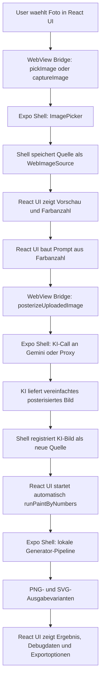

# Technische Architektur: Happy Numbers Paint-by-Numbers

Stand: 2026-07-02

Dieses Dokument beschreibt den aktuellen technischen Aufbau des Projekts, den KI-gestuetzten Bildvorbereitungsschritt, die drei Prompt-Varianten und die lokale Paint-by-Numbers-Pipeline. Es ist als Arbeitsdokument fuer Entwicklung, Agenten und Projektverstaendnis gedacht. Wenn sich Architektur, KI-Call, Prompting, Pipeline-Stufen, Komplexitaetslogik oder Exportvarianten aendern, muss dieses Dokument mit aktualisiert werden.

## 1. Kurzueberblick

Happy Numbers erzeugt aus einem Foto eine ausmalbare Paint-by-Numbers-Vorlage.

Der aktuelle installierte App-Pfad besteht aus zwei Schichten:

1. `react-app/`
   Eine React-Weboberflaeche. Sie rendert Upload-, Konfigurations-, Fortschritts- und Ergebnisansichten. Diese UI laeuft im Browser direkt zur Vorschau oder eingebettet in einer React-Native-WebView.

2. `App/`
   Eine Expo/React-Native-Shell. Sie laedt die lokal gebaute React-App in `react-native-webview`, stellt native Funktionen bereit und fuehrt die rechenintensiven Schritte aus:
   - Fotoauswahl
   - Kameraaufnahme
   - KI-Posterisierung ueber Gemini/Nano Banana oder Proxy
   - lokale Paint-by-Numbers-Generierung
   - Dateisystempersistenz
   - Teilen/Export

Der wichtigste Gesamtfluss lautet:



Wichtig: Die aktuelle iPhone-App ist kein reiner Browser und keine reine native OpenCV-App. Sie ist eine React-Web-UI in einer Expo-WebView-Shell. Die UI sitzt in `react-app/`, der Host und die Pipeline sitzen in `App/`.

## 2. Repository-Landkarte

### Aktueller Produktivpfad

- `react-app/src/ui/App.tsx`
  UI-State-Machine, Screens, Farbanzahl/Komplexitaet, Bridge-Kommunikation, Ergebnisanzeige, Exportbuttons.

- `react-app/src/lib/settings.ts`
  UI-nahe Generator-Settings, Farbanzahlgrenzen und Mapping von Farbanzahl zu Komplexitaet.

- `react-app/src/lib/promptBuilder.ts`
  Baut aus Farbanzahl und Maximalgroesse den finalen Prompt.

- `react-app/src/prompts/paintByNumbersPosterizePrompt.ts`
  Enthalten sind die drei aktuellen Prompt-Varianten: Easy, Medium, Expert.

- `App/App.tsx`
  Expo-Shell, WebView-Lifecycle, native Bridge-Requests, Bildauswahl, Kamera, KI-Posterisierung, lokaler Generatorlauf, Persistenz und Sharing.

- `App/src/features/webview/appWebViewBridgeTypes.ts`
  Gemeinsame Typen fuer Nachrichten zwischen React-WebView-UI und Expo-Shell.

- `App/src/features/imagePosterization/posterizeImageWithNanoBanana.ts`
  KI-Aufruf, Bildvorbereitung, Proxy-Fallback, Gemini-Direktaufruf, Antwortauswertung, Cache-Datei fuer das KI-Bild.

- `App/src/features/imagePosterization/geminiImageRequest.ts`
  Gemini-Request-Body und Extraktion von Inline-Bilddaten aus der Gemini-Antwort.

- `App/src/features/generator/generatePaintByNumbers.ts`
  Einstiegspunkt der lokalen Paint-by-Numbers-Pipeline fuer ein `ImagePickerAsset`.

- `App/src/features/generator/prepareImage.ts`
  Resize, PNG-Normalisierung, Alpha-Flattening auf Weiss und Umwandlung in `ImageData`.

- `App/src/features/generator/pipelineCore.ts`
  Leere ImageData-Erzeugung und Palette-Merge fuer redundante Farben.

- `App/src/features/generator/rasterPaintByNumbers.ts`
  Kern der aktuellen lokalen Raster-/Region-/Render-Pipeline.

- `App/src/vendor/paintbynumbersgenerator/`
  Vendored TypeScript-Code aus dem externen Paint-by-Numbers-Generator, vor allem K-Means, Farbkonvertierung, Facet-Datenstrukturen und Settings.

### Build- und Einbettungspfad

- `react-app/scripts/build-webview-local.mjs`
  Baut die React-WebView-App ohne Vite-Bundle-Runtime in `react-app/dist`. Dabei werden React, React-DOM, CSS und Assets in einfache lokale Dateien gepackt.

- `App/scripts/sync-local-webview.mjs`
  Baut `react-app/dist`, wandelt alle Dateien in Base64-Chunks und schreibt sie in `App/src/features/generator/localWebViewManifest.generated.ts`.

- `App/src/features/generator/localWebViewLoader.ts`
  Materialisiert dieses generierte Manifest beim App-Start in den Expo-Cache und liefert `indexUri` und `rootUri` fuer die WebView.

### Referenz- und Analysepfade

- `paint_by_numbers.py`
  Python-Referenzpipeline und Batch-Exporter. Relevant fuer algorithmische Paritaet, Debug-Artefakte und Vergleichsbilder.

- `docs/pipeline-uebersicht-de.md`
  Aeltere, pipelinefokussierte Uebersicht. Sie beschreibt besonders den Python/Web-Referenzkontext und ist nicht vollstaendig identisch mit dem aktuellen `App/`-Produktivpfad.

- `output/`
  Referenz- und Debugbilder der Python-Pipeline.

- `prompt-lab/`
  Historie und Vergleichsmaterial fuer Prompt-Experimente.

- `pipeline-lab/`
  Analysen zur Pipeline-Verbesserung.

## 3. Laufzeitarchitektur

### 3.1 React-App als WebView-Inhalt

Die React-App in `react-app/` ist die sichtbare Anwendung. Sie laeuft in zwei Modi:

1. Browser-Vorschau
   Wenn `window.ReactNativeWebView` nicht existiert, aktiviert die UI einen eingeschraenkten Browser-Modus. Datei-Auswahl funktioniert ueber `<input type="file">`, aber KI-Posterisierung, Kamera, lokaler Generator und nativer Export funktionieren dort nicht vollstaendig.

2. Native WebView
   In der installierten Expo-App existiert `window.ReactNativeWebView.postMessage`. Die UI sendet JSON-Nachrichten an die Shell und empfaengt Host-Events ueber `message`-Listener.

Die UI-State-Machine hat diese Screen-Zustaende:

- `splash`
- `upload`
- `config`
- `processing`
- `result`

Der normale Ablauf ist:

1. Splash wartet auf `hostReady`.
2. Upload-Screen fordert Galerie oder Kamera an.
3. Config-Screen zeigt Bildvorschau und Farbanzahl-Slider.
4. Processing-Screen zeigt zuerst KI-Posterisierung, danach lokale Pipeline.
5. Result-Screen zeigt Ergebnisvorschau, eine Dropdown-Auswahl fuer Ausgabevarianten, Debugdaten, Timing und Exportoptionen.

### 3.2 Expo-Shell als nativer Host

`App/App.tsx` laedt beim Start das lokale WebView-Bundle:

1. `ensureLocalWebViewBundle()` liest das generierte Manifest.
2. Das Manifest wird in `Paths.cache/local-webview/<buildId>/` materialisiert.
3. Die WebView oeffnet `index.html` aus diesem Cache.
4. `allowingReadAccessToURL` zeigt auf den Build-Ordner, damit CSS, JS und Assets geladen werden koennen.

Die Shell verwaltet intern eine `Map<string, StoredSource>`. Jedes Bild bekommt einen `sourceToken`:

- Originalfoto: `kind: 'uploaded'`
- KI-Bild: `kind: 'posterized'`

Das ist wichtig, weil die WebView aus Sicherheits- und Plattformgruenden nicht direkt mit allen nativen Datei-URIs und Asset-Objekten arbeiten soll. Die UI bekommt eine Vorschau und einen Token. Die Shell behaelt das echte `ImagePickerAsset`.

### 3.3 Bridge-Protokoll

Die WebView sendet `WebViewAppRequest` an die Shell:

- `webAppReady`
  UI ist geladen und erwartet Host-Bereitschaft.

- `webRuntimeError`
  WebView meldet JS-Fehler oder unhandled promise rejection.

- `pickImage`
  Bild aus der Galerie waehlen.

- `captureImage`
  Kamera oeffnen.

- `posterizeUploadedImage`
  Aus einer vorhandenen Quelle ein KI-posterisiertes Bild erzeugen.

- `runPaintByNumbers`
  Lokale Generator-Pipeline auf einer Quelle ausfuehren. Optional kann der Request `debugMode` und `debugStartStage` enthalten. In diesem Fall erzeugt die Shell pro Pipeline-Schritt Debug-Snapshots und versucht, vorhandene native Zwischendaten aus dem Debug-Cache wiederzuverwenden.

- `shareResultSvg`
  SVG-Datei teilen.

- `shareResultFile`
  PNG/SVG-Datei teilen.

- `shareResultSvgFromPng`
  PNG in ein SVG mit eingebettetem PNG verpacken und teilen.

Die Shell sendet `WebViewHostEvent` zurueck:

- `hostReady`
- `sourceReady`
- `processingProgress`
- `runCompleted`

  Enthaelt bei normalen Laeufen das Generatorergebnis mit allen Ausgabevarianten. Bei Debug-Laeufen enthaelt `result.debug` zusaetzlich pro Stage Parameter, Metriken, Timing, Cache-Hit-Status und ein PNG-Snapshot-Bild.

- `shareCompleted`
- `error`

Die Bridge ist request-ID-basiert. Die UI merkt sich aktive Request-IDs fuer Pick, Posterize, Run und Share, damit nur relevante Events den aktuellen Screen veraendern.

## 4. KI-Call und Bildposterisierung

### 4.1 Wo der KI-Call gestartet wird

Der KI-Call startet in der React-UI, aber ausgefuehrt wird er in der Expo-Shell:

1. User waehlt Farbanzahl im Slider.
2. `react-app/src/lib/settings.ts` mappt Farbanzahl auf Komplexitaet.
3. `react-app/src/lib/promptBuilder.ts` baut den finalen Prompt.
4. `react-app/src/ui/App.tsx` sendet `posterizeUploadedImage` an die Shell.
5. `App/App.tsx` ruft `posterizeImageWithNanoBanana()` auf.

Der Request an die Shell enthaelt:

- `sourceToken`
- `complexity`: `simple`, `medium` oder `detailed`
- `colorCount`
- `prompt`

### 4.2 Bildvorbereitung fuer das Modell

`posterizeImageWithNanoBanana.ts` bereitet das Originalbild so vor:

- Maximale Modell-Eingabekante: `1024 px`
- Resize nur, wenn Breite oder Hoehe groesser als 1024 ist
- Format fuer den KI-Input: JPEG
- JPEG-Kompression: `0.92`
- Base64 wird aus `expo-image-manipulator` gelesen
- MIME-Type fuer den Request: `image/jpeg`

Beispiel:

- Foto: `3024 x 4032`
- Ziel: laengste Kante 1024
- Ergebnis: ca. `768 x 1024`
- Dieses JPEG wird zusammen mit dem Prompt ans Modell gesendet.

Wichtig: Diese Begrenzung betrifft nur den KI-Call. Die lokale Generator-Pipeline arbeitet danach mit einer separaten Zielgroesse und kann das KI-Ergebnis lokal hochskalieren, ohne die Modellkosten zu erhoehen.

### 4.3 Modellwahl und Umgebungsvariablen

Das Modell wird mit `getNanoBananaModel()` bestimmt:

1. `EXPO_PUBLIC_NANO_BANANA_MODEL`
2. `EXPO_PUBLIC_GEMINI_IMAGE_MODEL`
3. Fallback: `gemini-3.1-flash-lite-image`

Der API-Key wird so gesucht:

1. `EXPO_PUBLIC_NANO_BANANA_API_KEY`
2. `EXPO_PUBLIC_GEMINI_API_KEY`

Wenn kein API-Key gesetzt ist, wird ein Proxy-Endpunkt verwendet:

- `EXPO_PUBLIC_IMAGE_POSTERIZE_ENDPOINT`

Optionale Seed-Konfiguration:

1. expliziter `seed` im Request
2. `EXPO_PUBLIC_GEMINI_IMAGE_SEED`
3. `EXPO_PUBLIC_NANO_BANANA_SEED`

Seeds werden auf Integer gekuerzt, wenn sie numerisch sind.

### 4.4 Direkter Gemini-Request

Wenn ein API-Key vorhanden ist, geht der Request direkt an:

```text
https://generativelanguage.googleapis.com/v1beta/models/<model>:generateContent
```

Header:

```http
Content-Type: application/json
x-goog-api-key: <api-key>
```

Body-Struktur:

```json
{
  "contents": [
    {
      "parts": [
        { "text": "<finaler Prompt>" },
        {
          "inline_data": {
            "mime_type": "image/jpeg",
            "data": "<base64 ohne data-url-prefix>"
          }
        }
      ]
    }
  ],
  "generationConfig": {
    "responseModalities": ["IMAGE"],
    "temperature": 0.2,
    "seed": 7707
  }
}
```

`seed` ist nur enthalten, wenn ein Seed konfiguriert wurde.

Die Antwort wird in `extractGeminiImage()` gesucht. Akzeptiert werden beide Feldstile:

- `inlineData`
- `inline_data`

Das erste Bild mit `data` wird extrahiert. Falls kein Bild gefunden wird, bricht der Flow mit einem Fehler ab.

### 4.5 Proxy-Request

Wenn kein API-Key vorhanden ist, sendet die App an `EXPO_PUBLIC_IMAGE_POSTERIZE_ENDPOINT`.

Body:

```json
{
  "prompt": "<finaler Prompt>",
  "model": "gemini-3.1-flash-lite-image",
  "colorCount": 12,
  "complexity": "medium",
  "image": {
    "mimeType": "image/jpeg",
    "base64": "<base64>",
    "width": 768,
    "height": 1024
  },
  "seed": 7707
}
```

Akzeptierte Proxy-Antwortformate:

```json
{
  "imageBase64": "<base64>",
  "mimeType": "image/png"
}
```

oder:

```json
{
  "image": {
    "base64": "<base64>",
    "mimeType": "image/png"
  }
}
```

### 4.6 Was nach der KI-Antwort passiert

Nach erfolgreichem KI-Call:

1. Das ausgegebene Bild wird in `Paths.cache/posterized-images/` geschrieben.
2. Dateiname: `posterized-<timestamp>.png` oder `.jpg`.
3. `expo-image-manipulator` normalisiert die Datei und liest Breite/Hoehe.
4. Eine JPEG-Vorschau mit maximaler Kante 1024 wird als Data-URL erzeugt.
5. Die Shell registriert das KI-Bild als neue `WebImageSource`.
6. Die UI startet automatisch `runPaintByNumbers` auf diesem KI-Bild.

Das lokale Paint-by-Numbers-Verfahren arbeitet also nicht auf dem Originalfoto, sondern auf dem durch KI vereinfachten/posterisierten Zwischenbild.

## 5. Die drei aktuellen Prompt-Varianten

Die Prompt-Quelle ist `react-app/src/prompts/paintByNumbersPosterizePrompt.ts`.

Die UI bietet keinen separaten Difficulty-Dropdown. Die Difficulty ergibt sich aus der Farbanzahl:

| Farbanzahl | Preset in UI | Prompt-Difficulty | Label im Prompt-Code |
| --- | --- | --- | --- |
| 8 bis 11 | `simple` | `easy` | `Easy / preschool-friendly large-area version` |
| 12 bis 17 | `medium` | `medium` | `Medium / teenager-level structured posterized version` |
| 18 bis 24 | `detailed` | `expert` | `Expert / high-fidelity 24-color posterized version` |

Der finale Prompt besteht immer aus:

1. Positive Prompt der gewaehlten Variante
2. Abschnitt `Negative prompt:`
3. Negative Prompt der Variante
4. zusaetzlich: `numbers, labels, text, logos, watermarks`
5. Abschnitt `Output constraints:`
6. Bild darf keine Nummern, Buchstaben, Labels oder Wasserzeichen enthalten
7. laengste nutzbare Bildkante soll ungefaehr innerhalb von `1024 px` bleiben

### 5.1 Easy

Default:

- Difficulty: `easy`
- Default-Farbanzahl: `8`
- Empfohlener Bereich: `8`
- Default-Zielgruppe: `a young child around 4 years old`
- UI-Bereich: 8 bis 11 Farben

Ziel:

Easy soll aus dem Foto eine stark vereinfachte, kinderfreundliche, wiedererkennbare Illustration machen. Das Bild soll nicht wie ein Fotofilter aussehen, sondern wie eine einfache Zeichnung mit grossen Flaechen.

Wichtige positive Anforderungen:

- Hauptmotiv, Komposition, Crop und Objektplatzierung beibehalten
- Vordergrund, Mittelgrund, Hintergrund und Horizontstruktur grob erhalten
- Foto stark vereinfachen
- realistische Textur, Licht, Schatten und Reflexionen entfernen
- wenige grosse Regionen pro Material oder Objekt
- keine duennen Splitter, Inseln, Speckles oder Detailmuster
- kindgerecht erkennbare Formen statt abstrakter Farbflecken
- keine schwarzen Outlines
- keine Zahlen, Labels, Buchstaben oder textartigen Markierungen

Motivregeln:

- Landschaften behalten Himmel, Wasser, Gras, Ufer, Wege, Huegel und Baumgruppen an ungefaehr gleicher Position.
- Tiere behalten Pose, Kopfhaltung, Beine, Schwanz und Hauptmarkierungen.
- Voegel behalten Pose, Schnabel, Augenbereich und wichtige Farbmarkierungen.
- Blumen behalten Bluetenkopf, Zentrum, Petalstruktur, Stiel/Vase und Crop.

Negative Prompt verhindert insbesondere:

- unveraendertes Foto oder Fotofilter
- Fotorealismus
- realistische Beleuchtung/Schatten
- kleine Texturen wie Gras, Blaetter, Federn, Fell, Bluetensamen
- viele kleine Regionen und wiederholte Patches
- amorphe gruene Flecken
- abstrakte bedeutungslose Facetten
- schwarze Konturen
- Coloring-Book-Lineart
- Text, Nummern, Logos, Wasserzeichen

Beispielwirkung:

Ein Foto eines Baums am See wird nicht in viele Blaetter und Reflexionslinien zerlegt. Easy soll daraus wenige grosse Bloecke machen: Himmel, Wasser, Ufer, Baumkrone, Stamm, eventuell eine einfache Spiegelungsform. Diese groben Bloecke passen spaeter zur lokalen Pipeline, weil kleine Regionen seltener entstehen und grosse Flaechen leichter nummerierbar sind.

### 5.2 Medium

Default:

- Difficulty: `medium`
- Default-Farbanzahl: `12`
- Empfohlener Bereich: `12`
- Default-Zielgruppe: `teenagers`
- UI-Bereich: 12 bis 17 Farben

Ziel:

Medium soll eine sichtbar stilisierte, flache, posterisierte Illustration erzeugen. Sie soll mehr Struktur als Easy behalten, aber deutlich einfacher als das Originalfoto sein.

Wichtige positive Anforderungen:

- Bild als klare flache Farbregionen neu zeichnen
- Hauptmotiv, Crop und Komposition wiedererkennbar erhalten
- Originale Farbidentitaet und wichtige Kontraste erhalten
- natuerliche Hintergrundmassen als erkennbare stilisierte Objekte vereinfachen
- lebendige, quellbasierte Farben mit staerkerem Kontrast
- Schatten und Highlights als einzelne flache Regionen statt matschiger Tonwerte
- mittlere Regionengroesse
- keine dekorativen Symbole, Sterne, Icons oder neue irrelevante Elemente
- keine schwarzen Outlines
- keine Zahlen oder Labels

Negative Prompt verhindert insbesondere:

- leicht gefiltertes Foto
- photorealistische Oberflaechen
- Gras-/Blatt-/Feder-/Fell-Mikrodetails
- winzige Zellen und duenne Splitter
- graue, blasse, pastellige oder kontrastarme Palette
- abstrakte bedeutungslose Farbfelder
- schwarze Konturen und Skizzenlook
- Text, Nummern, Logos, Wasserzeichen

Beispielwirkung:

Ein Vogel auf einem Ast kann in Medium noch wichtige Feder- und Kopfmarkierungen behalten. Der Hintergrund soll aber als gruppierte Blatt- oder Himmelsbereiche erscheinen, nicht als fotografisches Rauschen. Das passt zur lokalen Pipeline, weil K-Means danach nicht aus jedem Blattpixel eine eigene Kleinstregion machen muss.

### 5.3 Expert

Default:

- Difficulty: `expert`
- Default-Farbanzahl: `24`
- Empfohlener Bereich: `24`
- Default-Zielgruppe: `advanced users or expert-level coloring`
- UI-Bereich: 18 bis 24 Farben

Ziel:

Expert soll ein detailliertes flaches Zellbild erzeugen. Es soll mehr lokale Struktur als Medium behalten, aber weiterhin komplett nicht-fotografisch und aus geschlossenen malbaren Regionen bestehen.

Wichtige positive Anforderungen:

- ganzes Bild als detaillierte flache posterisierte Illustration neu aufbauen
- Transformation gleichmaessig auf Hauptmotiv, Hintergrund, Gras, Wasser, Reflexionen, Himmel, Wolken und Nebenobjekte anwenden
- viele geschlossene malbare Regionen
- mehr Detail und mehr Regionen als Medium
- keine Fototextur, keine Gradienten, keine Rohfoto-Pixel
- Schatten, Highlights, Reflexionen und lokale Strukturen in abgestufte Farbzellen umwandeln
- wichtige Markierungen und Strukturdaten erhalten
- keine schwarzen Outlines
- keine Zahlen, Labels oder Text

Negative Prompt verhindert insbesondere:

- Photo enhancement
- unveraendertes oder leicht gefiltertes Foto
- raw photo pixels
- kontinuierliche Gradienten
- realistische Texturen
- Mikrodetails wie Grasblaetter, Fellhaare, Federn, Samen, Rindenrauschen
- unmalbare Mikrofragmente
- generischen Cartoon- oder Preschool-Stil
- Text, Nummern, Logos, Wasserzeichen

Beispielwirkung:

Ein Blumenfoto darf im Expert-Modus mehr Petalstruktur, Zentrumsschattierung und Hintergrundvariation behalten. Diese Details muessen aber als klare Zellen erscheinen. Die lokale Pipeline bekommt dadurch mehr plausible Regionen, reduziert aber weiterhin zu kleine oder zu duenne Flaechen.

### 5.4 Warum die KI vor der lokalen Pipeline steht

Die lokale Pipeline kann Farben quantisieren und Regionen zusammenfuehren, sie versteht aber keine Semantik. Ein Foto mit Gras, Fell, Blaettern oder Wasser enthaelt oft tausende kleine Texturvariationen. Reines K-Means wuerde diese Variationen zwar farblich reduzieren, aber haeufig bleiben viele unruhige Mini-Regionen.

Der KI-Schritt soll deshalb vorher semantisch vereinfachen:

- "Das ist ein Baum" bleibt als Baum erhalten.
- "Diese tausend Blaetter" werden zu wenigen Baumkronen- oder Blattgruppen.
- "Dieses Wasserrauschen" wird zu groesseren Reflexionsformen.
- "Dieses Fell" wird zu einigen Koerper- und Markierungsflaechen.

Danach kann die algorithmische Pipeline besser arbeiten, weil das Eingabebild schon aus malbaren, absichtlich vereinfachten Flaechen besteht.

## 6. Komplexitaetsgrade und Generator-Settings

Die Komplexitaet wird vollstaendig aus der Farbanzahl abgeleitet.

### 6.1 UI-Grenzen

- Minimum: `8`
- Maximum: `24`
- Default: `12`

### 6.2 Presets

| Preset | Farben | UI-Beschreibung | Pipeline-Absicht |
| --- | ---: | --- | --- |
| Easy | 8-11 | grosse Malflaechen, sehr niedriger Detailgrad | wenige Farben, groessere Mindestregionen, starke KI-Vereinfachung |
| Medium | 12-17 | klare Formen, mittlerer Detailgrad | ausgewogener Standardmodus |
| Expert | 18-24 | mehr Struktur und feinere Flaechen | mehr Farben, kleinere erlaubte Regionen, detailreicherer KI-Prompt |

### 6.3 Settings pro Preset

Alle Presets setzen:

- `kMeansNrOfClusters = colorCount`
- `kMeansMinDeltaDifference = 1`
- `nearIdenticalPaletteMergeLabDistance = 4.25`
- `mergeSimilarAdjacentRegions = false`
- `removeFacetsFromLargeToSmall = true`
- `maximumNumberOfFacets = 0` (kein hartes Maximum)
- `resizeImageWidth = 2048`
- `resizeImageHeight = 2048`
- `randomSeed = 7707`
- `narrowPixelStripCleanupRuns = 0`
- `nrOfTimesToHalveBorderSegments = 0`

Die wichtigsten Unterschiede:

| Preset | `removeFacetsSmallerThanImageRatio` | Beispiel bei 2048 x 2048 |
| --- | ---: | ---: |
| Easy | `0.00012` | Regionen unter ca. 503 Pixeln werden Kandidaten fuer Merge |
| Medium | `0.00006` | Regionen unter ca. 252 Pixeln werden Kandidaten fuer Merge |
| Expert | `0.000025` | Regionen unter ca. 105 Pixeln werden Kandidaten fuer Merge |

Wichtige Konsequenz:

Die Code-Pipeline besitzt Schritte fuer schmale Pixelstreifen und duenne Auslaeufer, aber die aktuellen UI-Defaults setzen beide Durchlaufzahlen auf `0`. Diese Stufen werden also durchlaufen, veraendern mit den aktuellen Settings aber normalerweise nichts. Die Region-Merge-Stufe bleibt aktiv und ist aktuell der wichtigste lokale Saeuberungsschritt nach K-Means und Palette-Merge.

## 7. Lokale Paint-by-Numbers-Pipeline nach der KI

Die lokale Pipeline startet mit dem KI-posterisierten Bild. Einstieg ist:

- `generatePaintByNumbers()`
- danach `buildRasterPaintByNumbers()`

Die Fortschrittsstufen sind:

1. `decode`
2. `kmeans`
3. `colorMap`
4. `narrowCleanup`
5. `borderSegment`
6. `facetBuild`
7. `facetReduce`
8. `borderTrace`
9. `labelPlacement`
10. `svgRender`

### 7.0 Debug Mode und Teil-Reruns

Die React-UI besitzt auf dem Start- und Konfigurationsscreen einen `Debug Mode`-Toggle. Wenn er aktiv ist, bleibt der normale Produktfluss erhalten:

1. Bild wird ausgewaehlt oder aufgenommen.
2. KI-Posterisierung laeuft wie im normalen Flow.
3. Die lokale Pipeline laeuft auf dem KI-Bild, aber mit Debug-Optionen.

Unterschiede im Debug Mode:

- Der `runPaintByNumbers`-Bridge-Request sendet `debugMode: true`.
- Ein Rerun aus dem Debug-Inspector sendet zusaetzlich `debugStartStage`, zum Beispiel `kmeans`, `borderSegment` oder `facetReduce`.
- Die Expo-Shell haelt pro `sourceToken` einen nativen In-Memory-Cache mit Rohdaten fuer Decode, K-Means, ColorMap und Raster-Zwischenstaende. Diese Rohdaten werden nicht ueber die WebView serialisiert.
- Wenn ein Rerun ab einer spaeteren Stage gestartet wird und der Cache noch vorhanden ist, werden vorherige Stufen aus dem Cache uebernommen und nur die gewaehlte Stage plus nachfolgende Stufen neu berechnet.
- Wenn der Cache fehlt, faellt der Lauf automatisch auf die noetigen vorherigen Berechnungen zurueck.
- Die React-UI bekommt nur JSON-sichere Debugdaten: Parameter, Metriken, Timings, Cache-Hit-Flags und kompakte PNG-Snapshots.
- Die Debug-Snapshots koennen in der UI angetippt und in einem Zoom-Overlay genauer betrachtet werden. Das Overlay unterstuetzt UI-Zoom, Pinch-Zoom, Ein-Finger-Pan bei vergroessertem Bild und Doppeltippen zum Zuruecksetzen.
- Jede Stage im Debug-Inspector besitzt einen Info-Button mit einer kurzen Erklaerung des jeweiligen Pipeline-Schritts.
- Am Ende des Debug-Inspectors kann die aktuelle Parameterkonfiguration als JSON erzeugt und, wenn die WebView es erlaubt, in die Zwischenablage kopiert werden.

Die Debug-Parameter sind stage-nah gruppiert:

| Stage | Editierbare Parameter |
| --- | --- |
| `decode` | `resizeImageWidth`, `resizeImageHeight` |
| `kmeans` | `kMeansNrOfClusters`, `kMeansMinDeltaDifference`, `randomSeed` |
| `colorMap` | `nearIdenticalPaletteMergeLabDistance` |
| `narrowCleanup` | `narrowPixelStripCleanupRuns` |
| `borderSegment` | `nrOfTimesToHalveBorderSegments` |
| `facetReduce` | `removeFacetsSmallerThanImageRatio`, `mergeSimilarAdjacentRegions`, `maximumNumberOfFacets` |

Nicht alle Stufen haben aktuell editierbare Produktparameter. `facetBuild`, `borderTrace`, `labelPlacement` und `svgRender` zeigen daher vor allem Metriken und Snapshots.

Die Gewichtung fuer die Fortschrittsanzeige:

| Stufe | Gewicht |
| --- | ---: |
| decode | 6% |
| kmeans | 30% |
| colorMap | 3% |
| narrowCleanup | 10% |
| borderSegment | 7% |
| facetBuild | 12% |
| facetReduce | 16% |
| borderTrace | 6% |
| labelPlacement | 4% |
| svgRender | 6% |

### 7.1 Decode und Prepare

Datei:

- `App/src/features/generator/prepareImage.ts`

Zweck:

Das native `ImagePickerAsset` wird in eine normalisierte RGBA-Pixelmatrix ueberfuehrt.

Schritte:

1. Zielgroesse berechnen: Zielrahmen `2048 x 2048`, Seitenverhaeltnis bleibt erhalten.
2. Das Bild wird lokal auf diese Arbeitsgroesse skaliert; das kann Downscaling oder Upscaling des KI-Ergebnisses sein.
3. Auf Native-Plattformen per `expo-image-manipulator` nach PNG schreiben.
4. PNG per `fast-png` dekodieren.
5. Kanaele normalisieren.
6. Alpha auf weissem Hintergrund flatten:
   - `out = 255 * (1 - alpha) + channel * alpha`
7. Alpha im Ergebnis auf `255` setzen.

Beispiel:

Ein halbtransparenter roter Pixel mit `rgba(200, 0, 0, 128)` wird nicht halbtransparent weitergereicht. Er wird auf Weiss komponiert:

- Rot: ca. `227`
- Gruen: ca. `127`
- Blau: ca. `127`
- Alpha: `255`

Das ist wichtig, weil spaetere K-Means- und Regionenschritte keine Transparenz kennen.

### 7.2 K-Means im LAB-Farbraum

Dateien:

- `App/src/features/generator/generatePaintByNumbers.ts`
- `App/src/vendor/paintbynumbersgenerator/colorreductionmanagement.ts`
- `App/src/features/generator/defaultSettings.ts`

Zweck:

Das Bild wird auf `colorCount` Farbcluster reduziert. Jeder Pixel erhaelt eine Clusterfarbe.

Aktuelles Verhalten:

- Der vendored `ColorReducer.applyKMeansClustering()` wird verwendet.
- Farbraum: LAB (`ClusteringColorSpace.LAB`)
- Zielcluster: gewaehlte Farbanzahl
- Mindest-Delta: `kMeansMinDeltaDifference = 1`
- Random Seed: `7707`

Warum LAB?

LAB ist naeher an menschlicher Farbwahrnehmung als RGB. Zwei RGB-Werte koennen numerisch weit auseinander liegen, aber visuell aehnlich wirken. LAB-Abstaende passen besser zu der Frage: "Wuerde ein Mensch diese Farben als aehnlich wahrnehmen?"

Beispiel:

Wenn das KI-Bild 12 Farben bekommen soll, versucht K-Means alle Pixel in 12 Gruppen zu teilen. Viele leicht unterschiedliche Blautoene im Himmel landen dann in ein bis zwei Blauclustern, statt hunderte Einzelwerte zu behalten.

### 7.3 Color Map und redundante Palette-Merges

Datei:

- `App/src/features/generator/pipelineCore.ts`

Zweck:

Nach K-Means wird aus dem quantisierten Bild eine Farbkarte gebaut und die Palette wird von fast identischen Farben bereinigt.

Schritte:

1. `ColorReducer.createColorMap(kmeansOutput)`
2. `mergeRedundantPaletteColors(...)`

Merge-Regeln:

- Standard-LAB-Abstand fuer nahe identische Farben: `4.25`
- neutrale Farben duerfen bis `9` LAB-Abstand gemerged werden, wenn Chroma niedrig ist
- helle schwach gesaettigte Farben duerfen bis `7` LAB-Abstand gemerged werden

Beispiel:

Zwei fast weisse Hintergrundfarben:

- `rgb(247, 248, 244)`
- `rgb(252, 251, 248)`

Diese koennen fuer eine Malvorlage redundant sein. Der Merge verhindert, dass spaeter zwei getrennte Farbnummern fuer praktisch dieselbe helle Flaeche entstehen.

### 7.4 Narrow Cleanup

Datei:

- `App/src/features/generator/rasterPaintByNumbers.ts`

Funktion:

- `cleanupNarrowPixelStrips()`

Zweck:

Schmale 1-Pixel-Streifen und Kreuzartefakte koennen nach K-Means entstehen. Diese Funktion kann solche Pixel in passendere Nachbarlabels umwandeln.

Muster, die erkannt werden:

- links und rechts sind gleich, Mitte ist anders
- oben und unten sind gleich, Mitte ist anders
- diagonale Gegenseiten sind gleich
- drei Nachbarn bilden eine dominante Umgebung
- isolierter Pixel hat keinen gleichen direkten Nachbarn

Schutzregel:

Eine Ersetzung darf nur passieren, wenn die Quell- und Zielfarbe im LAB-Abstand hoechstens `26` auseinanderliegen. Dadurch sollen harte semantische Kanten nicht versehentlich weggemischt werden.

Aktueller Produktivstatus:

`narrowPixelStripCleanupRuns` ist in allen UI-Presets aktuell `0`. Die Stufe ist im Code vorhanden, aber standardmaessig deaktiviert.

Beispiel:

Labelkarte vor Cleanup:

```text
1 2 1
1 2 1
1 1 1
```

Wenn Farbe 2 visuell nah an Farbe 1 liegt und das Entfernen keine Palette-Farbe komplett loescht, koennen die schmalen `2`-Pixel zu `1` werden.

### 7.5 Border Segment / Auslaeufer-Cleanup

Datei:

- `App/src/features/generator/rasterPaintByNumbers.ts`

Funktion:

- `pruneWeakProtrusionPixels()`

Zweck:

Diese Stufe entfernt einzelne duenne Auslaeuferpixel. Ein Pixel ist ein Kandidat, wenn er nur sehr wenige direkte oder diagonale Nachbarn mit demselben Label hat.

Heuristik:

- Wenn ein Pixel mehr als einen gleichen 4er-Nachbarn hat, bleibt er.
- Wenn er insgesamt mehr als drei gleiche 8er-Nachbarn hat, bleibt er.
- Sonst werden Nachbarlabels als Ersatzkandidaten bewertet.
- Kandidaten mit mehr Nachbarhaeufigkeit und geringerem LAB-Abstand gewinnen.
- Auch hier schuetzt der LAB-Grenzwert `26` harte Kanten.

Aktueller Produktivstatus:

`nrOfTimesToHalveBorderSegments` ist in allen UI-Presets aktuell `0`. Die Stufe ist im Code vorhanden, aber standardmaessig deaktiviert.

Beispiel:

Ein einzelner roter Pixel ragt in eine grosse orange Flaeche. Wenn Rot und Orange nahe genug sind und Rot dadurch nicht als einzige Palettenfarbe verschwindet, kann der rote Pixel zu Orange werden.

### 7.6 Facet Build: verbundene Regionen erkennen

Datei:

- `App/src/features/generator/rasterPaintByNumbers.ts`

Funktion:

- `findConnectedRegions()`

Zweck:

Aus der Labelkarte werden zusammenhaengende Flaechen. Zwei Pixel gehoeren zur selben Region, wenn:

- sie dasselbe Farblabel haben
- sie ueber 4er-Nachbarschaft verbunden sind

Fuer jede Region werden gespeichert:

- `id`
- `colorIndex`
- `area`
- `minX`
- `minY`
- `maxX`
- `maxY`

Beispiel:

Wenn Farbe 3 an zwei getrennten Stellen im Bild vorkommt, entstehen zwei Regionen mit demselben `colorIndex`, aber unterschiedlichen `regionId`s. Das ist fuer Paint-by-Numbers wichtig, weil beide Flaechen separat nummeriert oder zusammengefuehrt betrachtet werden muessen.

### 7.7 Facet Reduce: kleine und schmale Regionen zusammenfuehren

Datei:

- `App/src/features/generator/rasterPaintByNumbers.ts`

Hauptfunktionen:

- `mergeSmallAndThinRegions()`
- optional `mergeSimilarAdjacentRegions()`
- optional `limitMaximumFacelets()`

Zweck:

Sehr kleine oder sehr duenne Regionen sind schlecht ausmalbar. Sie werden in bessere Nachbarregionen gemerged.

Kandidaten:

- Region ist kleiner als `minRegionArea`
- oder Region ist duenn:
  - Area <= `minRegionArea * 2`
  - durchschnittliche Dicke <= `5.5`

Nachbarwahl:

1. Region-Adjacency wird aus gemeinsamen Kanten gebaut.
2. Kandidaten bevorzugen Nachbarn, die selbst keine schlechten Kandidaten sind.
3. Laengere gemeinsame Grenze ist besser.
4. Groessere Nachbarregion ist besser.
5. Geringerer LAB-Abstand ist besser.
6. Harte Kanten werden geschuetzt:
   - normale Grenze: maximal `26` LAB-Abstand
   - duenne Region: weichere Grenze bis `34`
   - winzige Regionen bis `8` Pixel duerfen eher gemerged werden

Aktuelle Besonderheit:

`mergeSimilarAdjacentRegions` ist in den UI-Settings aktuell `false`. Die Hauptreduktion kommt daher ueber kleine/duenne Regionen, nicht ueber generelles Mergen aehnlicher Nachbarfarben.

Beispiel:

Eine 18-Pixel-Region in Medium liegt unter dem 63-Pixel-Schwellenwert. Sie grenzt an eine grosse Region mit aehnlicher Farbe und an eine kleine Region mit anderer Farbe. Die Pipeline merged sie bevorzugt in die grosse, farblich passende Nachbarregion.

### 7.8 Border Trace und Boundary-Informationen

Datei:

- `App/src/features/generator/rasterPaintByNumbers.ts`

Funktionen:

- `buildBoundaryMask()`
- `traceRegionLoops()`
- `buildSvgRegionPaths()`

Zweck:

Die Pipeline muss spaeter Grenzen rendern. Dafuer werden:

- Pixelgrenzen zwischen unterschiedlichen Regionen erkannt
- Regionenumrisse als gerichtete Kanten modelliert
- geschlossene Loops getraced
- Punkte vereinfacht
- SVG-Pfade gebaut

Path-Smoothing:

- Doppelte und kollineare Punkte werden reduziert.
- Ramer-Douglas-Peucker-aehnliche Vereinfachung nutzt `SVG_PATH_SIMPLIFY_TOLERANCE = 1.45`; kleine Loops nutzen `SVG_PATH_SMALL_LOOP_SIMPLIFY_TOLERANCE = 0.95`.
- Ausreichend grosse Loops werden danach per Chaikin-Corner-Cutting geglaettet.
- Pfade werden anschliessend mit quadratischen Kurven (`Q`) gerendert.
- Neben den Region-Pfaden wird ein separater globaler Boundary-Layer aus einzigartigen Nachbarschaftskanten aufgebaut.
- Sichtbare Grenzen werden nur aus diesem Boundary-Layer gerendert. Dadurch wird eine gemeinsame Grenze nicht zweimal als zwei leicht versetzte Region-Strokes gezeichnet.

Beispiel:

Eine rechteckige Region aus 200 Pixeln muss nicht als 200 einzelne Grenzsegmente ins SVG. Sie kann als vereinfachter geschlossener Pfad dargestellt werden. Das reduziert SVG-Groesse und wirkt visuell glatter.

### 7.9 Label Placement

Datei:

- `App/src/features/generator/rasterPaintByNumbers.ts`

Funktionen:

- `computeLabelPlacements()`
- `findRegionLabelPoint()`

Zweck:

Fuer jede finale Region wird eine gute Position fuer Zahl oder Farbpunkt gesucht. Es gibt keinen Mindestflaechen-Filter mehr, der Regionen ohne Marker uebrig laesst. Sehr kleine Regionen bekommen ebenfalls ein Placement; der Renderer skaliert Farbpunkt und Text anhand des gefundenen Innenradius und der Flaechengroesse nach unten.

Algorithmus:

1. Fuer die Region wird ein lokales Bounding-Box-Feld mit 1-Pixel-Padding gebaut.
2. Pixel innerhalb der Region starten mit grossem Abstandswert.
3. Pixel ausserhalb starten mit `0`.
4. Ein Vorwaerts- und Rueckwaertspass approximiert eine Distance Transform.
5. Der Pixel mit groesstem Abstand zur Grenze wird Label-Anker.
6. Der gefundene Abstand bestimmt den maximal sinnvollen Marker-Radius.
7. In den Marker-Varianten wird fuer jedes Placement mindestens ein Farbpunkt gerendert; Text wird nur so gross gezeichnet, wie es die Region sinnvoll erlaubt.

Beispiel:

Bei einer breiten runden Region liegt die Zahl in der Mitte. Bei einer schmalen Banane liegt die Zahl nicht zwingend geometrisch in der Bounding-Box-Mitte, sondern dort, wo innerhalb der Form am meisten Platz ist.

Die Debug-Metrik `Referenzflaeche` zeigt weiterhin den frueheren Orientierungswert aus `max(minRegionArea, width * height * 0.0001)`, steuert aber nicht mehr, ob eine Region markiert wird.

### 7.10 Rendern und Ausgabevarianten

Datei:

- `App/src/features/generator/rasterPaintByNumbers.ts`

Die Pipeline rendert derzeit mehrere Varianten. Jede Variante bekommt:

- PNG-Base64
- PNG-Breite/Hoehe
- optional SVG
- Byte-Laengen
- Label, Beschreibung und ID

Aktuelle Varianten:

| ID | Label | Inhalt |
| --- | --- | --- |
| `brightColorCircles` | Helle Malvorlage | helle Flaechen, schwarze Grenzen, Farbpunkte und Zahlen |
| `colorCircles` | Farbige Vorlage | originale Flaechenfarben, schwarze Grenzen, Farbpunkte und Zahlen |
| `cleanColor` | Farbflaechen | posterisiertes Farbbild ohne schwarze Grenzen |
| `coloredEdges` | Farbige Kanten | weisse Vorlage mit farbigen Grenzen |
| `coloredEdgesWithDots` | Farbige Kanten + Punkte | weisse Vorlage mit farbigen Grenzen und Farbpunkten |
| `circlesOnly` | Nur Farbpunkte | weisse Vorlage mit schwarzen Grenzen und Farbpunkten |
| `numbers` | Nur Zahlen | weisse Vorlage mit schwarzen Grenzen und Zahlen |
| `classic` | Klassisch farbig | posterisiertes Farbbild mit schwarzen Grenzen |
| `debugUnlabeled` | Debug-Regionen | Region-IDs sichtbar eingefaerbt, keine Marker |

Default-Variante:

- `brightColorCircles`

Debug-Mode-Variante:

- Im Debug Mode rendert die Pipeline als finales Ergebnis nur `classic`.
- Vergleichsvarianten `inputImage` und `aiPosterizedImage` werden im Debug Mode nicht an das Ergebnis angehaengt, weil die Stage-Snapshots die Pipeline-Diagnose uebernehmen und die Bridge-Payload kleiner bleiben soll.

Render-Details:

- PNG-Ausgaben werden intern hoeher gerendert und danach auf die Ausgabeaufloesung heruntergerechnet (`PNG_RENDER_SCALE = 3`, `PNG_OUTPUT_SCALE = 2`). Dadurch werden Kanten und Marker lokal antialiasiert.
- PNG-Umrisse werden entlang des globalen Single-Boundary-Layers gezeichnet. Die alte Block-Linie aus direkten Pixelnachbarschaften wird nicht mehr als sichtbarer Umriss gerendert.
- SVG-Ausgaben nutzen Region-Pfade nur fuer die Füllungen. Varianten mit Grenzen, darunter `classic`, `brightColorCircles`, `colorCircles`, `circlesOnly` und `numbers`, zeichnen die sichtbaren Linien danach einmalig aus dem globalen Boundary-Layer.
- Farbige Kanten nutzen dieselben geglaetteten Pfade mit farbabhaengigem Stroke.

Zusaetzliche Vergleichsvarianten:

`App/App.tsx` haengt nach dem Generatorlauf bei KI-Quellen noch Vergleichsbilder an:

- `inputImage`: Originalbild vor KI-Vereinfachung
- `aiPosterizedImage`: KI-Bild vor lokaler Pipeline

Diese Vergleichsbilder helfen, die drei wichtigen Stufen visuell zu verstehen:

1. Originalfoto
2. KI-vereinfachtes Farbbild
3. lokal berechnete Malvorlage

## 8. Export und Persistenz

Nach `runCompleted` persistiert die Shell Ergebnisdateien unter:

```text
<local-webview-cache>/generated/
```

Die Haupt-SVG-Datei bekommt:

```text
happy-numbers-malvorlage-<timestamp>.svg
```

PNG-Varianten bekommen:

```text
happy-numbers-<variantId>-<timestamp>.png
```

SVG-Varianten bekommen:

```text
happy-numbers-<variantId>-<timestamp>.svg
```

Fuer das Teilen nutzt die Shell `expo-sharing`.

Wenn die UI ein SVG aus einer PNG-Variante anfordert, erzeugt die Shell ein SVG, das das PNG als Base64-Image einbettet. Das ist kein echtes Vektor-SVG der Regionen, aber ein kompatibler SVG-Container fuer die PNG-Ausgabe.

## 9. Debugdaten im Result-Screen

Die React-UI zeigt nach einem Lauf:

- Quelle
- aktuelle Ausgabevariante
- gewaehlte Farben
- tatsaechlich verwendete Farben
- ausmalbare Flaechen
- Arbeitsgroesse
- Ausgabegroesse
- Anzahl Ausgabevarianten
- groesste Farbe mit Flaechenanteil
- PNG-Groesse
- SVG-Groesse
- lokale Gesamtzeit

Im normalen Result-Screen werden die verfuegbaren Ausgabevarianten ueber ein Dropdown ausgewaehlt. Vorschau, Debug-Metriken und Exportaktionen beziehen sich immer auf die aktuell gewaehlte Variante.

Wenn der Debug Mode aktiv ist, zeigt der Result-Screen zusaetzlich den Pipeline-Inspector:

- pro Stage sichtbares Output-Bild als PNG-Snapshot
- pro Stage wichtige Metriken wie Palette, Regionenzahl, Mindestflaeche oder Label-Anzahl
- pro Stage die entscheidenden editierbaren Parameter
- Cache-Hit-Status bei Teil-Reruns
- Button `Rerun from here`, der ab dieser Stage neu startet und vorherige Stufen aus dem nativen Cache uebernimmt, wenn moeglich
- Zoom-Overlay fuer Ergebnis- und Stage-Bilder mit Pinch-Zoom und Pan
- Info-Button pro Pipeline-Stufe
- JSON-Export der aktuell eingestellten Parameterkonfiguration

Timing-Stufen:

- Bild vorbereiten
- Farben gruppieren
- Farbkarte
- Streifen-Cleanup
- Auslaeufer-Cleanup
- Regionen erkennen
- Regionen mergen
- Konturen
- Label-Platzierung
- Rendern

Diese Debugdaten sind wichtig, weil visuelle Qualitaet und Laufzeit stark von Motiv, Farbanzahl und Regionenzahl abhaengen.

## 10. Algorithmische Gesamtintention

Die Architektur trennt Semantik und Geometrie:

1. KI-Schritt:
   Semantische Vereinfachung. Das Modell soll verstehen, was im Bild ist, und daraus ein malbares flaches Referenzbild machen.

2. K-Means/Palette:
   Farbquantisierung. Die App reduziert auf die gewuenschte Anzahl Farben und vereinheitlicht fast identische Farben.

3. Region-Analyse:
   Geometrische Ausmalbarkeit. Kleine, schmale oder unpraktische Regionen werden mit geeigneten Nachbarn zusammengefuehrt.

4. Label Placement:
   Lesbarkeit. Zahlen und Farbpunkte werden an moeglichst breiten Stellen platziert.

5. Render:
   Ausgabeformate fuer unterschiedliche Nutzungsfaelle.

Ein gutes Ergebnis entsteht nur, wenn alle Teile zusammenpassen:

- Der Prompt muss Regionen erzeugen, die algorithmisch weiterverarbeitet werden koennen.
- Die Farbanzahl muss zum Motiv passen.
- Region-Merge darf kleine Artefakte entfernen, aber keine wichtigen Motivkanten zerstoeren.
- Label Placement braucht ausreichend grosse Flaechen.
- Render-Varianten muessen druckbar und fuer Kinder/Teenager/Expert-Nutzer verstaendlich sein.

## 11. Bekannte technische Hinweise

### 11.1 Browser-Vorschau ist nicht der volle App-Flow

Die Browser-Vorschau kann UI und Layout zeigen, aber nicht den vollstaendigen nativen Flow. Kamera, Teilen, Expo-Dateisystem und echte KI-/Generatorausfuehrung laufen ueber die Expo-Shell.

### 11.2 Die KI ist bewusst vor der lokalen Pipeline

Die lokale Pipeline ist kein semantischer Segmentierer. Sie arbeitet pixel-, farb- und regionenbasiert. Ohne KI-Vereinfachung waeren Fotos mit natuerlicher Textur deutlich schwerer in saubere Malvorlagen umzuwandeln.

### 11.3 Narrow Cleanup und Auslaeufer-Cleanup sind aktuell deaktiviert

Die Codepfade existieren, aber die UI-Settings setzen die Durchlaufzahlen auf `0`. Wenn kuenftig mehr algorithmische Bereinigung gewuenscht ist, sind diese Settings ein naheliegender Hebel.

### 11.4 Python bleibt Referenz fuer Paritaetsfragen

`paint_by_numbers.py` und die Artefakte in `output/` sind weiterhin wichtig, wenn algorithmische Qualitaet oder Paritaet bewertet wird. Der aktuelle produktive App-Pfad verwendet aber die WebView-Shell-Architektur in `App/` und nicht direkt die aeltere native OpenCV-Portbeschreibung.

## 12. Praktische Entwicklungsregeln

Wenn die React-UI geaendert wird:

1. In `react-app/` arbeiten.
2. Fuer WebView-Bundle testen:
   - `npm run build:webview-local --prefix ./react-app`
3. Fuer die installierte App synchronisieren:
   - `npm run sync:webview-local --prefix ./App`

Wenn die Shell, KI oder Pipeline geaendert wird:

1. In `App/` arbeiten.
2. Typecheck:
   - `npm run typecheck --prefix ./App`
3. Wenn Bridge-Typen betroffen sind, beide Seiten pruefen:
   - `App/src/features/webview/appWebViewBridgeTypes.ts`
   - `react-app/src/lib/webviewBridge.ts`
   - `react-app/src/ui/App.tsx`

Wenn Prompting geaendert wird:

1. `react-app/src/prompts/paintByNumbersPosterizePrompt.ts` aktualisieren.
2. Mapping in `react-app/src/lib/settings.ts` pruefen.
3. KI-Request in `App/src/features/imagePosterization/posterizeImageWithNanoBanana.ts` pruefen, falls neue Felder benoetigt werden.
4. Dieses Dokument aktualisieren.
5. Optional Prompt-Lab-Material in `prompt-lab/` ergaenzen.

Wenn Pipeline-Semantik geaendert wird:

1. `App/src/features/generator/rasterPaintByNumbers.ts` und gegebenenfalls `pipelineCore.ts`, `prepareImage.ts`, `defaultSettings.ts` aktualisieren.
2. Auswirkungen auf Komplexitaetsgrade dokumentieren.
3. Render-Varianten und Result-Screen pruefen.
4. Mit Referenzbildern oder Pipeline-Lab vergleichen.
5. Dieses Dokument aktualisieren.

## 13. Mentales Modell in einem Satz

Die App laesst eine React-WebView-UI ein Foto auswaehlen, laesst die Expo-Shell daraus per KI ein semantisch vereinfachtes flaches Farbbild erzeugen, reduziert dieses Bild lokal per LAB-K-Means und Region-Merge auf ausmalbare Flaechen und rendert daraus mehrere nummerierte, farbige und debugbare Paint-by-Numbers-Ausgaben.
